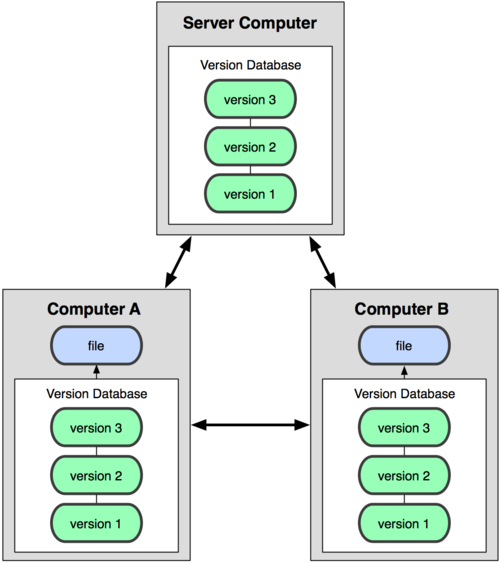

# 使い始める #

この章は、Gitを使い始めることに関してになります。まずはバージョン管理システムの背景に触れ、その後にGitをあなたのシステムで動かす方法、そしてGitで作業を始めるための設定方法について説明します。この章を読み終えるころには、なぜGitが広まっているか、なぜGitを使うべきなのか、それをするための準備が全て整っているだろうということを、あなたはきっと理解しているでしょう。

## バージョン管理に関して ##

バージョン管理とは何でしょうか、また、なぜそれを気にする必要があるのでしょうか？
バージョン管理とは、変更を一つのファイル、もしくは時間を通じたファイルの集合に記録するシステムで、そのため後で特定バージョンを呼び出すことができます。現実にはコンピューター上のほとんどあらゆるファイルのタイプでバージョン管理を行なう事ができますが、本書の中の例では、バージョン管理されるファイルとして、ソフトウェアのソースコードを利用します。

もしあなたが、グラフィックス・デザイナー、もしくはウェブ・デザイナーであって、（あなたが最も確実に望んでいるであろう）画像もしくはレイアウトの全てのバージョンを管理したいのであれば、バージョン管理システム（VCS）はとても賢く利用できるものです｡VCSを使ってできることとしては、ファイルを以前の状態まで戻したり、プロジェクト丸ごとを以前の状態に戻したり、過去の変更を見直したり、誰が最後に問題を引き起こすだろう何かを修正したか、誰が、何時、課題を導入したかを確認したりといった様々なことがあります。VCSを使うということはまた、一般的に、何かをもみくちゃにするか、ファイルを失うとしても、簡単に復活させることができることを意味します。加えて、とても僅かな諸経費で、それら全てを得ることができます。

### ローカル・バージョン管理システム ###

多くの人々の選り抜きのバージョン管理手法は、他のディレクトリ（もし彼らが賢いのであれば、恐らく日時が書かれたディレクトリ）にファイルをコピーするというものです。このアプローチは、とても単純なためにすごく一般的ですが、信じられない間違い傾向もあります。どのディレクトリにいるのか忘れやすいですし、偶然に間違ったファイルに書き込んだり、意図しないファイルに上書きしたりします。

この問題を扱うため、大昔にプログラマは、バージョン管理下で全ての変更をファイルに保持するシンプルなデータベースを持つ、ローカルなバージョン管理システムを開発しました（図1-1参照）。

<small>図1-1. ローカル・バージョン管理図解</small>

もっとも有名なVCSツールの一つが、RCSと呼ばれるシステムでした。今日でも依然として多くのコンピューターに入っています。人気のMac OS Xオペレーティング・システムさえも、開発者ツールをインストールしたときは、rcsコマンドを含みます。このツールは基本的に、ディスク上に特殊フォーマットで、一つのリビジョンからもう一つのリビジョンへのパッチ（これはファイル間の差分です）の集合を保持することで稼動します。そういうわけで、全てのパッチを積み上げることで、いつかは、あらゆる時点の、あらゆるファイルのように見えるものを再生成する事ができます。

### 集中バージョン管理システム ###

次に人々が遭遇した大きな問題は、他のシステムの開発者と共同制作をする必要があることです。この問題に対処するために、集中バージョン管理システム（CVCSs）が開発されました。CVSやSubversion、Perforceのような、これらのシステムは、全てのバージョン管理されたファイルと、その中央の場所からファイルをチェック・アウトする多数のクライアントを含む単一のサーバーを持ちます。長年の間、これはバージョン管理の標準となって来ました（図1-2参照）。

<small>図1-2. 集中バージョン管理図解</small>

この構成は、特にローカルVCSと比較して、多くの利点を提供します。例えば、全ての人は、プロジェクトのその他の全ての人々が何をしているのか、一定の程度は知っています。管理者は、誰が何をできるのかについて、きめ細かい統制手段を持ちます。このため、一つのCVCSを管理するということは、全てのクライアントのローカル・データベースを取り扱うより、はるかに容易です。

しかしながら、この構成はまた、深刻な不利益も持ちます。もっとも明白なのは、中央サーバーで発生する単一障害点です。もし、そのサーバーが1時間の間停止すると、その1時間の間は誰も全く、共同作業や、彼らが作業を進めている全てに対してバージョン変更の保存をすることができなくなります。もし中央データベースがのっているハードディスクが破損し、適切なバックアップが保持されていないとすると、人々が偶然にローカル・マシンに持っていた幾らかの単一スナップショット（訳者注：ある時点のファイル、ディレクトリなどの編集対象の状態）を除いた、プロジェクト全体の履歴を失うことになります。ローカルVCSシステムも、これと同じ問題に悩まされます。つまり、単一の場所にプロジェクトの全体の履歴を持っているときはいつでも、全てを失う事を覚悟することになります。

### 分散バージョン管理システム ###

ここから分散バージョン管理システム(DVCs)に入ります。DVCS(Git、Mercurial、Bazaar、Darcsのようなもの)では、クライアントはファイルの最新スナップショットをチェックアウト（訳者注：バージョン管理システムから、作業ディレクトリにファイルやディレクトリをコピーすること）するだけではありません。リポジトリ（訳者注：バージョン管理の対象になるファイル、ディレクトリ、更新履歴などの一群）全体をミラーリングします。故にどのサーバーが故障したとして、故障したサーバーを介してそれらのDVCSが共同作業をしていたとしても、あらゆるクライアント・リポジトリは修復のためにサーバーにコピーして戻す事ができます。そのサーバーを介してコラボレーションしていたシステムは, どれか一つのクライアントのリポジトリからサーバー復旧の為バックアップをコピーすることができます. 全てのチェックアウトは、実は全データの完全バックアップなのです(図1-3を参照)。

<small>図1-3. 分散バージョン管理システムの図解</small>

そのうえ、これらのDVCSの多くは、 連携する複数のリモート・リポジトリを扱いながら大変よく機能するため、同一のプロジェクト内において、同時に異なった方法で、異なる人々のグループと共同作業が可能です。このことは、集中システムでは不可能であった階層モデルのような、幾つかの様式のワークフローを始めることを許します。

## Git略史 ##

人生における多くの素晴らしい出来事のように、Gitはわずかな創造的破壊と熱烈な論争から始まりました。Linuxカーネルは、非常に巨大な範囲のオープンソース・ソフトウェア・プロジェクトの一つです。Linuxカーネル保守の大部分の期間（1991-2002）の間は、このソフトウェアに対する変更は、パッチとアーカイブしたファイルとして次々にまわされていました。2002年に、Linuxカーネル・プロジェクトはプロプライエタリのDVCSであるBitKeeperを使い始めました。

2005年に、Linuxカーネルを開発していたコミュニティと、BitKeeperを開発していた営利企業との間の協力関係が崩壊して、課金無しの状態が取り消されました。これは、Linux開発コミュニティ（と、特にLinuxの作者のLinus Torvalds）に、BitKeeperを利用している間に学んだ幾つかの教訓を元に、彼ら独自のツールの開発を促しました。新しいシステムの目標の幾つかは、次の通りでした：

*	スピード
*	シンプルな設計
*	ノンリニア開発(数千の並列ブランチ)への強力なサポート
*	完全な分散
*	Linux カーネルのような大規模プロジェクトを(スピードとデータサイズで)効率的に取り扱い可能

2005年のその誕生から、Gitは使いやすく発展・成熟してきており、さらにその初期の品質を維持しています。とても高速で、巨大プロジェクトではとても効率的で、ノンリニア開発のためのすごい分岐システム（branching system）を備えています（第3章参照）。

## Gitの基本 ##

では、要するにGitとは何なのでしょうか。これは、Gitを吸収するには重要な節です。なぜならば、もしGitが何かを理解し、Gitがどうやって稼動しているかの根本を理解できれば、Gitを効果的に使う事が恐らくとても容易になるからです。
Gitを学ぶときは、SubversionやPerforceのような他のVCSsに関してあなたが恐らく知っていることは、意識しないでください。このツールを使うときに、ちょっとした混乱を回避することに役立ちます。Gitは、ユーザー・インターフェイスがとてもよく似ているのにも関わらず、それら他のシステムとは大きく異なって、情報を格納して取り扱います（訳者注：「取り扱う」の部分はthinksなので、「見なします」と訳す方が原語に近い）。これらの相違を理解する事は、Gitを扱っている間の混乱を、防いでくれるでしょう。

### スナップショットで、差分ではない ###

Gitと他のVCS (Subversionとその類を含む)の主要な相違は、Gitのデータについての考え方です。概念的には、他のシステムのほとんどは、情報をファイルを基本とした変更のリストとして格納します。これらのシステム（CVS、Subversion、Perforce、Bazaar等々）は、図1-4に描かれているように、システムが保持しているファイルの集合と、時間を通じてそれぞれのファイルに加えられた変更の情報を考えます。

<small>図1-4. 他のシステムは、データをそれぞれのファイルの基本バージョンへの変更として格納する傾向があります。</small>

Gitは、この方法ではデータを考えたり、格納しません。代わりに、Gitはデータをミニ・ファイルシステムのスナップショットの集合のように考えます。Gitで全てのコミット（訳注：commitとは変更を記録・保存するGitの操作。詳細は後の章を参照）をするとき、もしくはプロジェクトの状態を保存するとき、Gitは基本的に、その時の全てのファイルの状態のスナップショットを撮り（訳者注：意訳）、そのスナップショットへの参照を格納するのです。効率化のため、ファイルに変更が無い場合は、Gitはファイルを再格納せず、既に格納してある、以前の同一のファイルへのリンクを格納します。Gitは、むしろデータを図1-5のように考えます。

<small>図1-5. Gitは時間を通じたプロジェクトのスナップショットとしてデータを格納します。</small>

これが、Gitと類似の全ての他のVCSsとの間の重要な違いです。ほとんどの他のシステムが以前の世代から真似してきた、ほとんど全てのバージョン管理のやり方（訳者注：aspectを意訳）を、Gitに見直させます。これは、Gitを、単純にVCSと言うより、その上に組み込まれた幾つかの途方も無くパワフルなツールを備えたミニ・ファイルシステムにしています。このやり方でデータを考えることで得られる利益の幾つかを、第3章のGit branchingを扱ったときに探求します。

### ほとんど全ての操作がローカル ###

Gitのほとんどの操作は、ローカル・ファイルと操作する資源だけ必要とします。大体はネットワークの他のコンピューターからの情報は必要ではありません。ほとんどの操作がネットワーク遅延損失を伴うCVCSに慣れているのであれば、もっさりとしたCVCSに慣れているのであれば、このGitの速度は神業のように感じるでしょう（訳者注：直訳は「このGitの側面はスピードの神様がこの世のものとは思えない力でGitを祝福したと考えさせるでしょう」）。プロジェクトの履歴は丸ごとすぐそこのローカル・ディスクに保持しているので、大概の操作はほぼ瞬時のように見えます。

例えば、プロジェクトの履歴を閲覧するために、Gitはサーバーに履歴を取得しに行って表示する必要がありません。直接にローカル・データベースからそれを読むだけです。これは、プロジェクトの履歴をほとんど即座に知るということです。もし、あるファイルの現在のバージョンと、そのファイルの1ヶ月前の間に導入された変更点を知りたいのであれば、Gitは、遠隔のサーバーに差分を計算するように問い合わせたり、ローカルで差分を計算するために遠隔サーバーからファイルの古いバージョンを持ってくる代わりに、1か月前のファイルを調べてローカルで差分の計算を行なえます。

これはまた、オフラインであるか、VPNから切り離されていたとしても、出来ない事は非常に少ないことを意味します。もし、飛行機もしくは列車にに乗ってちょっとした仕事をしたいとしても、アップロードするためにネットワーク接続し始めるまで、楽しくコミットできます。もし、帰宅してVPNクライアントを適切に作動させられないとしても、さらに作業ができます。多くの他のシステムでは、それらを行なう事は、不可能であるか苦痛です。例えばPerforceにおいては、サーバーに接続できないときは、多くの事が行なえません。SubversionとCVSにおいては、ファイルの編集はできますが、データベースに変更をコミットできません（なぜならば、データベースがオフラインだからです）。このことは巨大な問題に思えないでしょうが、実に大きな違いを生じうることに驚くでしょう。

### Gitは完全性を持つ ###

Gitの全てのものは、格納される前にチェックサムが取られ、その後、そのチェックサムで照合されます。これは、Gitがそれに関して感知することなしに、あらゆるファイルの内容を変更することが不可能であることを意味します。この機能は、Gitの最下層に組み込まれ、またGitの哲学に不可欠です。Gitがそれを感知できない状態で、転送中に情報を失う、もしくは壊れたファイルを取得することはありません。

Gitがチェックサム生成に用いる機構は、SHA-1ハッシュと呼ばれます。これは、16進数の文字（0-9とa-f）で構成された40文字の文字列で、ファイルの内容もしくはGit内のディレクトリ構造を元に計算されます。SHA-1ハッシュは、このようなもののように見えます:

	24b9da6552252987aa493b52f8696cd6d3b00373

Gitはハッシュ値を大変よく利用するので、Gitのいたるところで、これらのハッシュ値を見ることでしょう。事実、Gitはファイル名ではなく、ファイル内容のハッシュ値によってアドレスが呼び出されるGitデータベースの中に全てを格納しています。

### Gitは通常はデータを追加するだけ ###

Gitで行動するとき、ほとんど全てはGitデータベースにデータを追加するだけです。システムにいかなる方法でも、UNDO不可能なこと、もしくはデータを消させることをさせるのは、大変難しいです。あらゆるVCSと同様に、まだコミットしていない変更は失ったり、台無しにできたりします。しかし、スナップショットをGitにコミットした後は、特にもし定期的にデータベースを他のリポジトリにプッシュ（訳注：pushはGitで管理するあるリポジトリのデータを、他のリポジトリに転送する操作。詳細は後の章を参照）していれば、変更を失うことは大変難しくなります。

激しく物事をもみくちゃにする危険なしに試行錯誤を行なえるため、これはGitの利用を喜びに変えます。Gitがデータをどのように格納しているのかと失われたように思えるデータをどうやって回復できるのかについての、より詳細な解説に関しては、第9章を参照してください。

### 三つの状態 ###

今、注意してください。もし学習プロセスの残りをスムーズに進めたいのであれば、これはGitに関して覚えておく主要な事です。Gitは、ファイルが帰属する、コミット済、修正済、ステージ済の、三つの主要な状態を持ちます。コミット済は、ローカル・データベースにデータが安全に格納されていることを意味します。修正済は、ファイルに変更を加えていますが、データベースにそれがまだコミットされていないことを意味します。ステージ済は、次のスナップショットのコミットに加えるために、現在のバージョンの修正されたファイルに印をつけている状態を意味します。

このことは、Gitプロジェクト（訳者注：ディレクトリ内）の、Gitディレクトリ、作業ディレクトリ、ステージング・エリアの三つの主要な部分（訳者注：の理解）に導きます。

<small>図1-6. 作業ディレクトリ、ステージング・エリア、Gitディレクトリ</small>

Gitディレクトリは、プロジェクトのためのメタデータ（訳者注：Gitが管理するファイルやディレクトリなどのオブジェクトの要約）とオブジェクトのデータベースがあるところです。これは、Gitの最も重要な部分で、他のコンピューターからリポジトリをクローン（訳者注：コピー元の情報を記録した状態で、Gitリポジトリをコピーすること）したときに、コピーされるものです。

作業ディレクトリは、プロジェクトの一つのバージョンの単一チェックアウトです。これらのファイルはGitディレクトリの圧縮されたデータベースから引き出されて、利用するか修正するためにディスクに配置されます。

ステージング・エリアは、普通はGitディレクトリに含まれる、次のコミットに何が含まれるかに関しての情報を蓄えた一つの単純なファイルです。ときどきインデックスのように引き合いにだされますが、ステージング・エリアとして呼ばれることが基本になりつつあります。

基本的なGitのワークフローは、このような風に進みます：

1. 作業ディレクトリのファイルを修正します。
2. 修正されたファイルのスナップショットをステージング・エリアに追加して、ファイルをステージします。
3. コミットします。（訳者注：Gitでは）これは、ステージング・エリアにあるファイルを取得し、永久不変に保持するスナップショットとしてGitディレクトリに格納することです。

もしファイルの特定のバージョンがGitディレクトリの中にあるとしたら、コミット済だと見なされます。もし修正されていて、ステージング・エリアに加えられていれば、ステージ済です。そして、チェックアウトされてから変更されましたが、ステージされていないとするなら、修正済です。第2章では、これらの状態と、どうやってこれらを利用をするか、もしくは完全にステージ化部分を省略するかに関してより詳しく学習します。

## Gitのインストール ##

少しGitを使う事に入りましょう。何よりも最初に、Gitをインストールしなければなりません。幾つもの経路で入手することができ、主要な二つの方法のうちの一つはソースからインストールすることで、もう一つはプラットフォームに応じて存在するパッケージをインストールすることです。

### ソースからのインストール ###

もし可能であれば、もっとも最新のバージョンを入手できるので、一般的にソースからGitをインストールするのが便利です。Gitのそれぞれのバージョンは、実用的なユーザー・インターフェイスの向上が含まれており、もしソースからソフトウェアをコンパイルすることに違和感を感じないのであれば、最新バージョンを入手することは、大抵は最も良い経路になります。また、多くのLinuxディストリビューションがとても古いパッケージを収録している事は良くあることであり、最新のディストリビューションを使っているか、バックポート（訳者注：最新のパッケージを古いディストリビューションで使えるようにする事）をしていない限りは、ソースからのインストールがベストな選択になるでしょう。

Gitをインストールするためには、Gitが依存するライブラリーである、curl、zlib、openssl、expat、libiconvを入手する必要があります。例えば、もし（Fedoraなどで）yumか（Debianベースのシステムなどで）apt-getが入ったシステムを使っているのであれば、これらのコマンドの一つを依存対象の全てをインストールするのに使う事ができます：

	$ yum install curl-devel expat-devel gettext-devel \
	  openssl-devel zlib-devel

	$ apt-get install libcurl4-gnutls-dev libexpat1-dev gettext \
	  libz-dev libssl-dev
	
全ての必要な依存対象を持っているのであれば、先に進んでGitのウェブサイトから最新版のスナップショットを持ってくる事ができます：

	http://git-scm.com/download
	
そして、コンパイルしてインストールします：

	$ tar -zxf git-1.7.2.2.tar.gz
	$ cd git-1.7.2.2
	$ make prefix=/usr/local all
	$ sudo make prefix=/usr/local install

また、Gitのインストール後、アップデートでGitを通して最新版のGitを得ることができます。

	$ git clone git://git.kernel.org/pub/scm/git/git.git
	
### Linuxにインストール ###

バイナリのインストーラーを通じてLinux上にGitをインストールしたいのであれば、大抵はディストリビューションに付属する基本的なパッケージ・マネジメント・ツールを使って、それを行なう事ができます。もしFedoraを使っているのであれば、yumを使う事が出来ます：

	$ yum install git-core

もしくは、もしUbuntuのようなDebianベースのディストリュビューションを使っているのであれば、apt-getをやってみましょう：

	$ apt-get install git

### Macにインストール ###

MacにGitをインストールするには2つの簡単な方法があります。もっとも簡単な方法は、グラフィカルなGitインストーラーを使うことで、このGitインストーラーはGoogle Codeのページ（図1-7参照）からダウンロードすることができます：

	http://code.google.com/p/git-osx-installer

<small>図 1-7. Git OS X installer</small>

もう一つの主要な方法は、MacPorts (`http://www.macports.org`) からGitをインストールすることです。MacPortsをインストールした状態であれば、Gitを以下のようにインストールできます。

	$ sudo port install git-core +svn +doc +bash_completion +gitweb

全てのvariantsを追加する必要はありませんが、SubversionのリポジトリでGitを使う必要がまだあるなら、恐らく+svnを含めないといけないでしょう（第8章参照）。

### Windowsにインストール ###

WindowsにGitをインストールするのはとても簡単です。msysGitプロジェクトは、より簡単なインストール手続きの一つを備えています。GitHubのページから、単純にインストーラーのexeファイルをダウンロードをし、実行してください：

	http://msysgit.github.com/

インストール後、コマンドライン版（後で役に立つSSHクライアントを含む）とスタンダードGUI版の両方を使う事ができます。

Windows利用時の注意点: この本で紹介されている複雑なコマンドを使えるので､GitはmsysGit shell(Unixスタイル)で使うようにしましょう｡Windowsのシェル/コマンドラインコンソールを使わざるを得ない場合､空白を含むパラメーターを囲むための記号はダブルクオーテーション(シングルクォーテーションは使えない)を使用する必要があります｡同様に､サーカムフレックス記号(^)が行末に来る場合はダブルクオーテーションで囲まなければなりません｡同記号はWindowsにおいて｢次行に続く｣を意味する記号だからです｡

## 最初のGitの構成 ##

今や、Gitがシステムにあります。Git環境をカスタマイズするためにしたい事が少しはあることでしょう。アップグレードの度についてまわるので、たった一度でそれらを終わらすべきでしょう。またそれらは、またコマンドを実行することによっていつでも変更することができます。

Gitには、git configと呼ばれるツールが付属します。これで、どのようにGitが見えて機能するかの全ての面を制御できる設定変数を取得し、設定することができます。これらの変数は三つの異なる場所に格納されうります：

*	`/etc/gitconfig` file: システム上の全てのユーザーと全てのリポジトリに対する設定値を保持します。もし`--system`オプションを`git config`に指定すると、明確にこのファイルに読み書きを行ないます。
*	`~/.gitconfig` file: 特定のユーザーに対する設定値を保持します. `--global`オプションを指定することで、Gitに、明確にこのファイルに読み書きを行なわせることができます。
*	現在使っている、あらゆるリポジトリのGitディレクトリの設定ファイル(`.git/config`のことです): 特定の単一リポジトリに対する設定値を保持します。それぞれのレベルの値は以前のレベルの値を上書きするため、`.git/config`の中の設定値は`/etc/gitconfig`の設定値に優先されます。

Windows環境下では､Gitは`$HOME`ディレクトリ（環境変数`USERPROFILE`で指定)の中の`.gitconfig`ファイルを検索に行きます。`$HOME`ディレクトリはほとんどの場合 `C:\Documents and Settings\$USER` か `C:\Users\$USER` のいずれかです($USERは環境変数`USERNAME`で指定)｡また、インストーラー時にWindowsシステムにGitをインストールすると決めたところにある、MSysのルートとの相対位置であったとしても、 /etc/gitconfigも見に行きます。

### 個人の識別情報 ###

Gitをインストールしたときに最初にすべきことは、ユーザー名とE-mailアドレスを設定することです。全てのGitのコミットはこの情報を用いるため、これは重要で、次々とまわすコミットに永続的に焼き付けられます：

	$ git config --global user.name "John Doe"
	$ git config --global user.email johndoe@example.com

また、もし`--global`オプションを指定するのであれば、Gitはその後、そのシステム上で行なう（訳者注：あるユーザーの）全ての操作に対して常にこの情報を使うようになるため、この操作を行なう必要はたった一度だけです。もし、違う名前とE-mailアドレスを特定のプロジェクトで上書きしたいのであれば、そのプロジェクトの（訳者注：Gitディレクトリの）中で、`--global`オプション無しでこのコマンドを実行することができます。

### エディター ###

今や、個人の識別情報が設定され、Gitがメッセージのタイプをさせる必要があるときに使う、標準のテキストエディターを設定できます。標準では、Gitはシステムのデフォルト・エディターを使います。これは大抵の場合、ViかVimです。Emacsのような違うテキスト・エディターを使いたい場合は、次のようにします：

	$ git config --global core.editor emacs
	
### diffツール ###

設定したいと思われる、その他の便利なオプションは、マージ（訳者注：複数のリポジトリを併合すること）時の衝突を解決するために使う、標準のdiffツールです。vimdiffを使いたいとします：

	$ git config --global merge.tool vimdiff

Gitはkdiff3、tkdiff、meld、xxdiff、emerge、vimdiff、gvimdiff、ecmerge、opendiffを確かなマージ・ツールとして扱えます。カスタム・ツールもまた設定できますが、これをする事に関しての詳細な情報は第7章を参照してください。

### 設定の確認 ###

設定を確認したい場合は、その時点でGitが見つけられる全ての設定を一覧するコマンドである`git config --list`を使う事ができます：

	$ git config --list
	user.name=Scott Chacon
	user.email=schacon@gmail.com
	color.status=auto
	color.branch=auto
	color.interactive=auto
	color.diff=auto
	...

Gitは異なったファイル(例えば`/etc/gitconfig`と`~/.gitconfig`)から同一のキーを読み込むため、同一のキーを1度以上見ることになるでしょう。この場合、Gitは見つけたそれぞれ同一のキーに対して最後の値を用います。

また、Gitに設定されている特定のキーの値を、`git config {key}`をタイプすることで確認することができます：

	$ git config user.name
	Scott Chacon

## ヘルプを見る ##

もし、Gitを使っている間は助けがいつも必要なら、あらゆるGitコマンドのヘルプのマニュアル・ページ（manpage）を参照する3種類の方法があります。

	$ git help <verb>
	$ git <verb> --help
	$ man git-<verb>

例えば、configコマンドのヘルプのmanpageを次のコマンドを走らせることで見ることができます。

	$ git help config

これらのコマンドは、オフラインのときでさえ、どこでも見る事ができるので、すばらしいです。
もしmanpageとこの本が十分でなく、人の助けが必要であれば、フリーノードIRCサーバー（irc.freenode.net）の`#git`もしくは`#github`チャンネルにアクセスしてみてください。これらのチャンネルはいつも、全員がGitに関してとても知識があり、よく助けてくれようとする数百人の人々でいっぱいです。

## まとめ ##

Gitとは何か、どのように今まで使われてきた他のCVCSと異なるのかについて、基本的な理解ができたはずです。また、今や個人情報の設定ができた、システムに稼動するバージョンのGitがあるはずです。今や、本格的にGitの基本を学習するときです。
