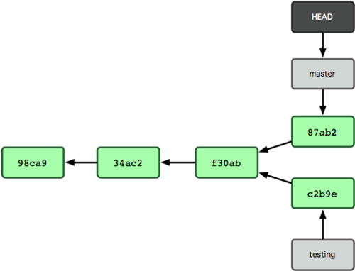
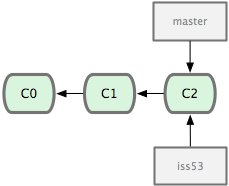
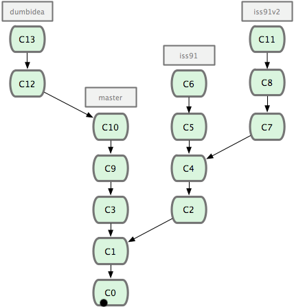
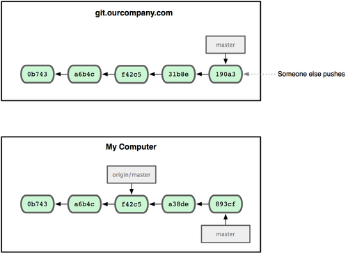
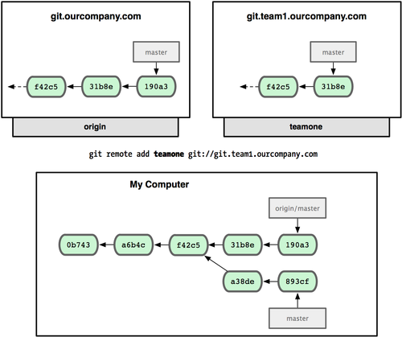
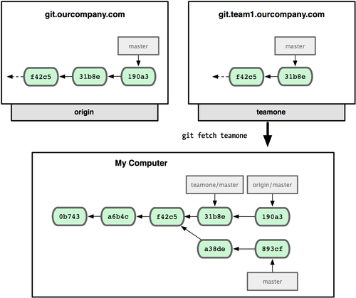
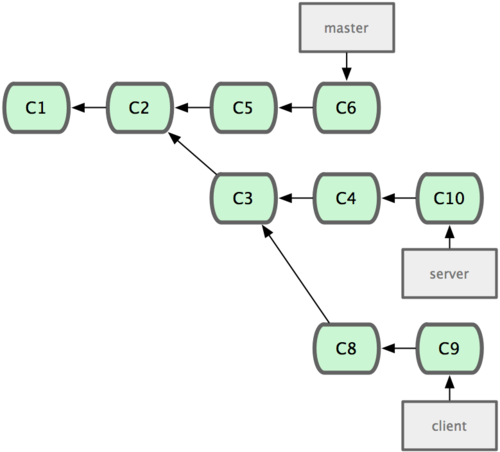
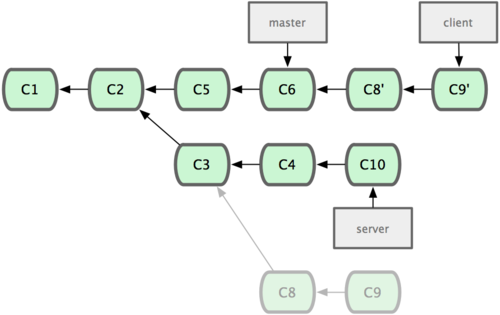
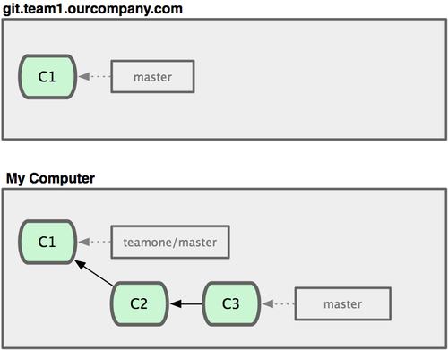
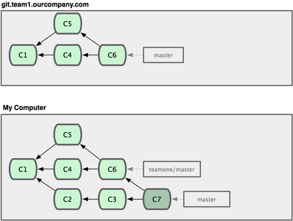

# Git のブランチ機能 #

ほぼすべてと言っていいほどの VCS が、何らかの形式でブランチ機能に対応しています。ブランチとは、開発の本流から分岐し、本流の開発を邪魔することなく作業を続ける機能のことです。多くの VCS ツールでは、これは多少コストのかかる処理になっています。ソースコードディレクトリを新たに作る必要があるなど、巨大なプロジェクトでは非常に時間がかかってしまうことがよくあります。

Git のブランチモデルは、Git の機能の中でもっともすばらしいものだという人もいるほどです。そしてこの機能こそが Git を他の VCS とは一線を画すものとしています。何がそんなにすばらしいのでしょう? Git のブランチ機能は圧倒的に軽量です。ブランチの作成はほぼ一瞬で完了しますし、ブランチの切り替えも高速に行えます。その他大勢の VCS とは異なり、Git では頻繁にブランチ作成とマージを繰り返すワークフローを推奨しています。一日に複数のブランチを切ることさえ珍しくありません。この機能を理解して身につけることで、あなたはパワフルで他に類を見ないツールを手に入れることになります。これは、あなたの開発手法を文字通り一変させてくれるでしょう。

## ブランチとは ##

Git のブランチの仕組みについてきちんと理解するには、少し後戻りして Git がデータを格納する方法を知っておく必要があります。第 1 章で説明したように、Git はチェンジセットや差分としてデータを保持しているのではありません。そうではなく、スナップショットとして保持しています。

Git にコミットすると、Git はコミットオブジェクトを作成して格納します。このオブジェクトには、あなたがステージしたスナップショットへのポインタや作者・メッセージのメタデータ、そしてそのコミットの直接の親となるコミットへのポインタが含まれています。最初のコミットの場合は親はいません。通常のコミットの場合は親がひとつ存在します。複数のブランチからマージした場合は、親も複数となります。

これを視覚化して考えるために、ここに 3 つのファイルを含むディレクトリがあると仮定しましょう。3 つのファイルをすべてステージしてコミットしたところです。ステージしたファイルについてチェックサム (第 1 章で説明した SHA-1 ハッシュ) を計算し、そのバージョンのファイルを Git ディレクトリに格納し (Git はファイルを blob として扱います)、そしてそのチェックサムをステージングエリアに追加します。

	$ git add README test.rb LICENSE
	$ git commit -m 'initial commit of my project'

`git commit` を実行してコミットを作成すると、Git は各サブディレクトリ (この場合はプロジェクトのルートディレクトリのみ) のチェックサムを計算し、ツリーオブジェクトを Git リポジトリに格納します。それから、メタデータおよびルートオブジェクトツリーへのポインタを含むコミットオブジェクトを作成します。これで、必要に応じてこのスナップショットを再作成できるようになります。

この時点で、Git リポジトリには 5 つのオブジェクトが含まれています。3 つのファイルそれぞれの中身をあらわす blob オブジェクト、ディレクトリの中身の一覧とどのファイルがどの blob に対応するかをあらわすツリーオブジェクト、そしてそのルートツリーおよびすべてのメタデータへのポインタを含むコミットオブジェクトです。Git リポジトリ内のデータを概念図であらわすと、図 3-1 のようになります。

<small>図 3-1. ひとつのコミットをあらわすリポジトリ上のデータ</small>

なんらかの変更を終えて再びコミットすると、次のコミットには直近のコミットへのポインタが格納されます。さらに 2 回のコミットを終えた後の履歴は、図 3-2 のようになるでしょう。

<small>図 3-2. 複数のコミットに対応する Git オブジェクト</small>

Git におけるブランチとは、単にこれら三つのコミットを指す軽量なポインタに過ぎません。Git のデフォルトのブランチ名は master です。最初にコミットした時点で、直近のコミットを指す `master` ブランチが作られます。その後コミットを繰り返すたびに、このポインタは自動的に進んでいきます。

<small>図 3-3. コミットデータの歴史を指すブランチ</small>

新しいブランチを作成したら、いったいどうなるのでしょうか? 単に新たな移動先を指す新しいポインタが作られるだけです。では、新しい testing ブランチを作ってみましょう。次の `git branch` コマンドを実行します。

	$ git branch testing

これで、新しいポインタが作られます。現時点ではふたつのポインタは同じ位置を指しています (図 3-4 を参照ください)。

<small>図 3-4. 複数のブランチがコミットデータの履歴を指す例</small>

Git は、あなたが今どのブランチで作業しているのかをどうやって知るのでしょうか? それを保持する特別なポインタが HEAD と呼ばれるものです。これは、Subversion や CVS といった他の VCS における HEAD の概念とはかなり違うものであることに注意しましょう。Git では、HEAD はあなたが作業しているローカルブランチへのポインタとなります。今回の場合は、あなたはまだ master ブランチにいます。git branch コマンドは新たにブランチを作成するだけであり、そのブランチに切り替えるわけではありません (図 3-5 を参照ください)。

<small>図 3-5. 現在作業中のブランチを指す HEAD</small>

ブランチを切り替えるには `git checkout` コマンドを実行します。それでは、新しい testing ブランチに移動してみましょう。

	$ git checkout testing

これで、HEAD は testing ブランチを指すようになります (図 3-6 を参照ください)。

<small>図 3-6. ブランチを切り替えると、HEAD の指す先が移動する</small>

それがどうしたって? では、ここで別のコミットをしてみましょう。

	$ vim test.rb
	$ git commit -a -m 'made a change'

<small>図 3-7 にその結果を示します。</small>

<small>図 3-7. HEAD が指すブランチが、コミットによって移動する</small>

興味深いことに、testing ブランチはひとつ進みましたが `master` ブランチは変わっていません。`git checkout` でブランチを切り替えたときの状態のままです。それでは `master` ブランチに戻ってみましょう。

	$ git checkout master

<small>図 3-8 にその結果を示します。</small>

<small>図 3-8. チェックアウトによって HEAD が別のブランチに移動する</small>

このコマンドは二つの作業をしています。まず HEAD ポインタが指す先を `master` ブランチに戻し、そして作業ディレクトリ内のファイルを `master` が指すスナップショットの状態に戻します。つまり、この時点以降に行った変更は、これまでのプロジェクトから分岐した状態になるということです。これは、testing ブランチで一時的に行った作業を巻き戻したことになります。ここから改めて別の方向に進めるということになります。

それでは、ふたたび変更を加えてコミットしてみましょう。

	$ vim test.rb
	$ git commit -a -m 'made other changes'

これで、プロジェクトの歴史が二つに分かれました (図 3-9 を参照ください)。新たなブランチを作成してそちらに切り替え、何らかの作業を行い、メインブランチに戻って別の作業をした状態です。どちらの変更も、ブランチごとに分離しています。ブランチを切り替えつつそれぞれの作業を進め、必要に応じてマージすることができます。これらをすべて、シンプルに `branch` コマンドと `checkout` コマンドで行えるのです。

<small>図 3-9. ブランチの歴史が分裂した</small>

Git におけるブランチとは、実際のところ特定のコミットを指す 40 文字の SHA-1 チェックサムだけを記録したシンプルなファイルです。したがって、ブランチを作成したり破棄したりするのは非常にコストの低い作業となります。新たなブランチの作成は、単に 41 バイト (40 文字と改行文字) のデータをファイルに書き込むのと同じくらい高速に行えます。

これが他の大半の VCS ツールのブランチと対照的なところです。他のツールでは、プロジェクトのすべてのファイルを新たなディレクトリにコピーしたりすることになります。プロジェクトの規模にもよりますが、これには数秒から数分の時間がかかることでしょう。Git ならこの処理はほぼ瞬時に行えます。また、コミットの時点で親オブジェクトを記録しているので、マージの際にもどこを基準にすればよいのかを自動的に判断してくれます。そのためマージを行うのも非常に簡単です。これらの機能のおかげで、開発者が気軽にブランチを作成して使えるようになっています。

では、なぜブランチを切るべきなのかについて見ていきましょう。

## ブランチとマージの基本 ##

実際の作業に使うであろう流れを例にとって、ブランチとマージの処理を見てみましょう。次の手順で進めます。

1. ウェブサイトに関する作業を行っている
2. 新たな作業用にブランチを作成する
3. そのブランチで作業を行う

ここで、重大な問題が発生したので至急対応してほしいという連絡を受けました。その後の流れは次のようになります。

1. 実運用環境用のブランチに戻る
2. 修正を適用するためのブランチを作成する
3. テストをした後で修正用ブランチをマージし、実運用環境用のブランチにプッシュする
4. 元の作業用ブランチに戻り、作業を続ける

### ブランチの基本 ###

まず、すでに数回のコミットを済ませた状態のプロジェクトで作業をしているものと仮定します (図 3-10 を参照ください)。

<small>図 3-10. 短くて単純なコミットの歴史</small>

ここで、あなたの勤務先で使っている何らかの問題追跡システムに登録されている問題番号 53 への対応を始めることにしました。念のために言っておくと、Git は何かの問題追跡システムと連動しているわけではありません。しかし、今回の作業はこの問題番号 53 に対応するものであるため、作業用に新しいブランチを作成します。ブランチの作成と新しいブランチへの切り替えを同時に行うには、`git checkout` コマンドに `-b` スイッチをつけて実行します。

	$ git checkout -b iss53
	Switched to a new branch "iss53"

これは、次のコマンドのショートカットです。

	$ git branch iss53
	$ git checkout iss53

<small>図 3-11 に結果を示します。</small>

<small>図 3-11. 新たなブランチポインタの作成</small>

ウェブサイト上で何らかの作業をしてコミットします。そうすると `iss53` ブランチが先に進みます。このブランチをチェックアウトしているからです (つまり、HEAD が iss53 ブランチを指しているということです。図 3-12 を参照ください)。

	$ vim index.html
	$ git commit -a -m 'added a new footer [issue 53]'

<small>図 3-12. 作業した結果、iss53 ブランチが移動した</small>

ここで、ウェブサイトに別の問題が発生したという連絡を受けました。そっちのほうを優先して対応する必要があるとのことです。Git を使っていれば、ここで `iss53` に関する変更をリリースしてしまう必要はありません。また、これまでの作業をいったん元に戻してから改めて優先度の高い作業にとりかかるなどという大変な作業も不要です。ただ単に、master ブランチに戻るだけでよいのです。

しかしその前に注意すべき点があります。作業ディレクトリやステージングエリアに未コミットの変更が残っている場合、それがもしチェックアウト先のブランチと衝突する内容ならブランチの切り替えはできません。ブランチを切り替える際には、クリーンな状態にしておくのが一番です。これを回避する方法もあります (stash およびコミットの amend という処理です) が、また後ほど説明します。今回はすべての変更をコミットし終えているので、master ブランチに戻ることができます。

	$ git checkout master
	Switched to branch "master"

作業ディレクトリは問題番号 53 の対応を始める前とまったく同じ状態に戻りました。これで、緊急の問題対応に集中できます。ここで覚えておくべき重要な点は、Git が作業ディレクトリの状態をリセットし、チェックアウトしたブランチが指すコミットの時と同じ状態にするということです。そのブランチにおける直近のコミットと同じ状態にするため、ファイルの追加・削除・変更を自動的に行います。

次に、緊急の問題対応を行います。緊急作業用に hotfix ブランチを作成し、作業をそこで進めるようにしましょう (図 3-13 を参照ください)。

	$ git checkout -b hotfix
	Switched to a new branch "hotfix"
	$ vim index.html
	$ git commit -a -m 'fixed the broken email address'
	[hotfix]: created 3a0874c: "fixed the broken email address"
	 1 files changed, 0 insertions(+), 1 deletions(-)

<small>図 3-13. master ブランチから新たに作成した hotfix ブランチ</small>

テストをすませて修正がうまくいったことを確認したら、master ブランチにそれをマージしてリリースします。ここで使うのが `git merge` コマンドです。

	$ git checkout master
	$ git merge hotfix
	Updating f42c576..3a0874c
	Fast forward
	 README |    1 -
	 1 files changed, 0 insertions(+), 1 deletions(-)

このマージ処理で "Fast forward" というフレーズが登場したのにお気づきでしょうか。マージ先のブランチが指すコミットがマージ元のコミットの直接の親であるため、Git がポインタを前に進めたのです。言い換えると、あるコミットに対してコミット履歴上で直接到達できる別のコミットをマージしようとした場合、Git は単にポインタを前に進めるだけで済ませます。マージ対象が分岐しているわけではないからです。この処理のことを "fast forward" と言います。

変更した内容が、これで `master` ブランチの指すスナップショットに反映されました。これで変更をリリースできます (図 3-14 を参照ください)。

<small>図 3-14. マージした結果、master ブランチの指す先が hotfix ブランチと同じ場所になった</small>

超重要な修正作業が終わったので、横やりが入る前にしていた作業に戻ることができます。しかしその前に、まずは `hotfix` ブランチを削除しておきましょう。`master` ブランチが同じ場所を指しているので、もはやこのブランチは不要だからです。削除するには `git branch` で `-d` オプションを指定します。

	$ git branch -d hotfix
	Deleted branch hotfix (3a0874c).

では、先ほどまで問題番号 53 の対応をしていたブランチに戻り、作業を続けましょう (図 3-15 を参照ください)。

	$ git checkout iss53
	Switched to branch "iss53"
	$ vim index.html
	$ git commit -a -m 'finished the new footer [issue 53]'
	[iss53]: created ad82d7a: "finished the new footer [issue 53]"
	 1 files changed, 1 insertions(+), 0 deletions(-)

<small>図 3-15. iss53 ブランチは独立して進めることができる</small>

ここで、`hotfix` ブランチ上で行った作業は `iss53` ブランチには含まれていないことに注意しましょう。もしそれを取得する必要があるのなら、方法はふたつあります。ひとつは `git merge master` で `master` ブランチの内容を `iss53` ブランチにマージすること。そしてもうひとつはそのまま作業を続け、いつか `iss53` ブランチの内容を `master` に適用することになった時点で統合することです。

### マージの基本 ###

問題番号 53 の対応を終え、`master` ブランチにマージする準備ができたとしましょう。`iss53` ブランチのマージは、先ほど `hotfix` ブランチをマージしたときとまったく同じような手順でできます。つまり、マージ先のブランチに切り替えてから `git merge` コマンドを実行するだけです。

	$ git checkout master
	$ git merge iss53
	Merge made by recursive.
	 README |    1 +
	 1 files changed, 1 insertions(+), 0 deletions(-)

先ほどの `hotfix` のマージとはちょっとちがう感じですね。今回の場合、開発の歴史が過去のとある時点で分岐しています。マージ先のコミットがマージ元のコミットの直系の先祖ではないため、Git 側でちょっとした処理が必要だったのです。ここでは、各ブランチが指すふたつのスナップショットとそれらの共通の先祖との間で三方向のマージを行いました。図 3-16 に、今回のマージで使用した三つのスナップショットを示します。

<small>図 3-16. Git が共通の先祖を自動的に見つけ、ブランチのマージに使用する</small>

単にブランチのポインタを先に進めるのではなく、Git はこの三方向のマージ結果から新たなスナップショットを作成し、それを指す新しいコミットを自動作成します (図 3-17 を参照ください)。これはマージコミットと呼ばれ、複数の親を持つ特別なコミットとなります。

マージの基点として使用する共通の先祖を Git が自動的に判別するというのが特筆すべき点です。CVS や Subversion (バージョン 1.5 より前のもの) は、マージの基点となるポイントを自分で見つける必要があります。これにより、他のシステムに比べて Git のマージが非常に簡単なものとなっているのです。

<small>図 3-17. マージ作業の結果から、Git が自動的に新しいコミットオブジェクトを作成する</small>

これで、今までの作業がマージできました。もはや `iss53` ブランチは不要です。削除してしまい、問題追跡システムのチケットもクローズしておきましょう。

	$ git branch -d iss53

### マージ時のコンフリクト ###

物事は常にうまくいくとは限りません。同じファイルの同じ部分をふたつのブランチで別々に変更してそれをマージしようとすると、Git はそれをうまくマージする方法を見つけられないでしょう。問題番号 53 の変更が仮に `hotfix` ブランチと同じところを扱っていたとすると、このようなコンフリクトが発生します。

	$ git merge iss53
	Auto-merging index.html
	CONFLICT (content): Merge conflict in index.html
	Automatic merge failed; fix conflicts and then commit the result.

Git は新たなマージコミットを自動的には作成しませんでした。コンフリクトを解決するまで、処理は中断されます。コンフリクトが発生してマージできなかったのがどのファイルなのかを知るには `git status` を実行します。

	[master*]$ git status
	index.html: needs merge
	# On branch master
	# Changes not staged for commit:
	#   (use "git add <file>..." to update what will be committed)
	#   (use "git checkout -- <file>..." to discard changes in working directory)
	#
	#	unmerged:   index.html
	#

コンフリクトが発生してまだ解決されていないものについては unmerged として表示されます。Git は、標準的なコンフリクトマーカーをファイルに追加するので、ファイルを開いてそれを解決することにします。コンフリクトが発生したファイルの中には、このような部分が含まれています。

	<<<<<<< HEAD:index.html
	
contact : email.support@github.com

	=======
	

	  please contact us at support@github.com
	

	>>>>>>> iss53:index.html

これは、HEAD (merge コマンドを実行したときにチェックアウトしていたブランチなので、ここでは master となります) の内容が上の部分 (`=======` の上にある内容)、そして `iss53` ブランチの内容が下の部分であるということです。コンフリクトを解決するには、どちらを採用するかをあなたが判断することになります。たとえば、ひとつの解決法としてブロック全体を次のように書き換えます。

	

	please contact us at email.support@github.com
	

このような解決を各部分に対して行い、`<<<<<<<` や `=======` そして `>>>>>>>` の行をすべて除去します。そしてすべてのコンフリクトを解決したら、各ファイルに対して `git add` を実行して解決済みであることを通知します。ファイルをステージすると、Git はコンフリクトが解決されたと見なします。コンフリクトの解決をグラフィカルに行いたい場合は `git mergetool` を実行します。これは、適切なビジュアルマージツールを立ち上げてコンフリクトの解消を行います。

	$ git mergetool
	merge tool candidates: kdiff3 tkdiff xxdiff meld gvimdiff opendiff emerge vimdiff
	Merging the files: index.html

	Normal merge conflict for 'index.html':
	  {local}: modified
	  {remote}: modified
	Hit return to start merge resolution tool (opendiff):

デフォルトのツール (Git は `opendiff` を選びました。私がこのコマンドを Mac で実行したからです) 以外のマージツールを使いたい場合は、“merge tool candidates”にあるツール一覧を見ましょう。そして、使いたいツールの名前を打ち込みます。第 7 章で、環境にあわせてこのデフォルトを変更する方法を説明します。

マージツールを終了させると、マージに成功したかどうかを Git が聞いてきます。成功したと伝えると、ファイルを自動的にステージしてコンフリクトが解決したことを示します。

再び `git status` を実行すると、すべてのコンフリクトが解決したことを確認できます。

	$ git status
	# On branch master
	# Changes to be committed:
	#   (use "git reset HEAD <file>..." to unstage)
	#
	#	modified:   index.html
	#

結果に満足し、すべてのコンフリクトがステージされていることが確認できたら、`git commit` を実行してマージコミットを完了させます。デフォルトのコミットメッセージは、このようになります。

	Merge branch 'iss53'

	Conflicts:
	  index.html
	#
	# It looks like you may be committing a MERGE.
	# If this is not correct, please remove the file
	# .git/MERGE_HEAD
	# and try again.
	#

このメッセージを変更して、どのようにして衝突を解決したのかを詳しく説明しておくのもよいでしょう。後から他の人がそのマージを見たときに、あなたがなぜそのようにしたのかがわかりやすくなります。

## ブランチの管理 ##

これまでにブランチの作成、マージ、そして削除を行いました。ここで、いくつかのブランチ管理ツールについて見ておきましょう。今後ブランチを使い続けるにあたって、これらのツールが便利に使えるでしょう。

`git branch` コマンドは、単にブランチを作ったり削除したりするだけのものではありません。何も引数を渡さずに実行すると、現在のブランチの一覧を表示します。

	$ git branch
	  iss53
	* master
	  testing

`*` という文字が `master` ブランチの先頭についていることに注目しましょう。これは、現在チェックアウトされているブランチを意味します。つまり、ここでコミットを行うと、`master` ブランチがひとつ先に進むということです。各ブランチにおける直近のコミットを調べるには `git branch -v` を実行します。

	$ git branch -v
	  iss53   93b412c fix javascript issue
	* master  7a98805 Merge branch 'iss53'
	  testing 782fd34 add scott to the author list in the readmes

各ブランチの状態を知るために便利なもうひとつの機能として、現在作業中のブランチにマージ済みかそうでないかによる絞り込みができるようになっています。Git には､そのための便利なオプション `--merged` と `--no-merged` があります。現在作業中のブランチにマージ済みのブランチを調べるには `git branch --merged` を実行します。

	$ git branch --merged
	  iss53
	* master

すでに先ほど `iss53` ブランチをマージしているので、この一覧に表示されています。このリストにあがっているブランチのうち先頭に `*` がついていないものは、通常は `git branch -d` で削除してしまって問題ないブランチです。すでにすべての作業が別のブランチに取り込まれているので、もはや何も失うことはありません。

まだマージされていない作業を持っているすべてのブランチを知るには、`git branch --no-merged` を実行します。

	$ git branch --no-merged
	  testing

先ほどのブランチとは別のブランチが表示されます。まだマージしていない作業が残っているので、このブランチを `git branch -d` で削除しようとしても失敗します。

	$ git branch -d testing
	error: The branch 'testing' is not an ancestor of your current HEAD.
	If you are sure you want to delete it, run 'git branch -D testing'.

本当にそのブランチを消してしまってよいのなら `-D` で強制的に消すこともできます。……と、親切なメッセージで教えてくれていますね。

## ブランチでの作業の流れ ##

ブランチとマージの基本操作はわかりましたが、ではそれを実際にどう使えばいいのでしょう? このセクションでは、気軽にブランチを切れることでどういった作業ができるようになるのかを説明します。みなさんのふだんの開発サイクルにうまく取り込めるかどうかの判断材料としてください。

### 長期稼働用ブランチ ###

Git では簡単に三方向のマージができるので、あるブランチから別のブランチへのマージを長期間にわたって繰り返すのも簡単なことです。つまり、複数のブランチを常にオープンさせておいて、それぞれ開発サイクルにおける別の場面用に使うということもできます。定期的にブランチ間でのマージを行うことが可能です。

Git 開発者の多くはこの考え方にもとづいた作業の流れを採用しています。つまり、完全に安定したコードのみを `master` ブランチに置き、いつでもリリースできる状態にしているのです。それ以外に並行して develop や next といった名前のブランチを持ち、安定性をテストするためにそこを使用します。常に安定している必要はありませんが、安定した状態になったらそれを `master` にマージすることになります。また、時にはトピックブランチ (先ほどの例の `iss53` ブランチのような短期間のブランチ) を作成し、すべてのテストに通ることやバグが発生していないことを確認することもあります。

実際のところ今話している内容は、一連のコミットの中のどの部分をポインタが指しているかということです。安定版のブランチはコミット履歴上の奥深くにあり、最前線のブランチは履歴上の先端にいます (図 3-18 を参照ください)。

<small>図 3-18. 安定したブランチほど、一般的にコミット履歴の奥深くに存在する</small>

各ブランチを作業用のサイロと考えることもできます。一連のコミットが、完全にテストを通るようになった時点でより安定したサイロに移動するのです (図 3-19 を参照ください)。

<small>図 3-19. ブランチをサイロとして考えるとわかりやすいかも</small>

同じようなことを、安定性のレベルを何段階かにして行うこともできます。大規模なプロジェクトでは、`proposed` あるいは `pu` (proposed updates) といったブランチを用意して、`next` ブランチあるいは `master` ブランチに投入する前にそこでいったんブランチを統合するというようにしています。安定性のレベルに応じて何段階かのブランチを作成し、安定性が一段階上がった時点で上位レベルのブランチにマージしていくという考え方です。念のために言いますが、このように複数のブランチを常時稼働させることは必須ではありません。しかし、巨大なプロジェクトや複雑なプロジェクトに関わっている場合は便利なことでしょう。

### トピックブランチ ###

一方、トピックブランチはプロジェクトの規模にかかわらず便利なものです。トピックブランチとは、短期間だけ使うブランチのことで、何か特定の機能やそれに関連する作業を行うために作成します。これは、今までの VCS では実現不可能に等しいことでした。ブランチを作成したりマージしたりという作業が非常に手間のかかることだったからです。Git では、ブランチを作成して作業をし、マージしてからブランチを削除するという流れを一日に何度も繰り返すことも珍しくありません。

先ほどのセクションで作成した `iss53` ブランチや `hotfix` ブランチが、このトピックブランチにあたります。ブランチ上で数回コミットし、それをメインブランチにマージしたらすぐに削除しましたね。この方法を使えば、コンテキストの切り替えを手早く完全に行うことができます。それぞれの作業が別のサイロに分離されており、そのブランチ内の変更は特定のトピックに関するものだけなのですから、コードレビューなどの作業が容易になります。一定の間ブランチで保持し続けた変更は、マージできるようになった時点で (ブランチを作成した順や作業した順に関係なく) すぐにマージしていきます。

次のような例を考えてみましょう。まず (`master` で) 何らかの作業をし、問題対応のために (`iss91` に) ブランチを移動し、そこでなにがしかの作業を行い、「あ、こっちのほうがよかったかも」と気づいたので新たにブランチを作成 (`iss91v2`) して思いついたことをそこで試し、いったん master ブランチに戻って作業を続け、うまくいくかどうかわからないちょっとしたアイデアを試すために新たなブランチ (`dumbidea` ブランチ) を切りました。この時点で、コミットの歴史は図 3-20 のようになります。

<small>図 3-20. 複数のトピックブランチを作成した後のコミットの歴史</small>

最終的に、問題を解決するための方法としては二番目 (`iss91v2`) のほうがよさげだとわかりました。また、ちょっとした思いつきで試してみた `dumbidea` ブランチが意外とよさげで、これはみんなに公開すべきだと判断しました。最初の `iss91` ブランチは放棄してしまい (コミット C5 と C6 の内容は失われます)、他のふたつのブランチをマージしました。この時点で、歴史は図 3-21 のようになっています。

<small>図 3-21. dumbidea と iss91v2 をマージした後の歴史</small>

ここで重要なのは、これまで作業してきたブランチが完全にローカル環境に閉じていたということです。ブランチを作ったりマージしたりといった作業は、すべてみなさんの Git リポジトリ内で完結しており、サーバーとのやりとりは発生していません。

## リモートブランチ ##

リモートブランチは、リモートリポジトリ上のブランチの状態を指すものです。ネットワーク越しの操作をしたときに自動的に移動します。リモートブランチは、前回リモートリポジトリに接続したときにブランチがどの場所を指していたかを示すブックマークのようなものです。

ブランチ名は `(remote)/(branch)` のようになります。たとえば、`origin` サーバーに最後に接続したときの `master` ブランチの状態を知りたければ `origin/master` ブランチをチェックします。誰かほかの人と共同で問題に対応しており、相手が `iss53` ブランチにプッシュしたとしましょう。あなたの手元にはローカルの `iss53` ブランチがあります。しかし、サーバー側のブランチは `origin/iss53` のコミットを指しています。

……ちょっと混乱してきましたか? では、具体例で考えてみましょう。ネットワーク上の `git.ourcompany.com` に Git サーバーがあるとします。これをクローンすると、Git はそれに `origin` という名前をつけ、すべてのデータを引き出し、`master` ブランチを指すポインタを作成し、そのポインタにローカルで `origin/master` という名前をつけます。それを自分で移動させることはできません。Ｇit はまた、`master` というブランチも作成します。これは origin の `master` ブランチと同じ場所を指しており、ここから何らかの作業を始めます (図 3-22 を参照ください)。

<small>図 3-22. git clone により、ローカルの master ブランチのほかに origin の master ブランチを指す origin/master が作られる</small>

ローカルの master ブランチで何らかの作業をしている間に、誰かが `git.ourcompany.com` にプッシュして master ブランチを更新したとしましょう。この時点であなたの歴史とはことなる状態になってしまいます。また、origin サーバーと再度接続しない限り、`origin/master` が指す先は移動しません (図 3-23 を参照ください)。

<small>図 3-23. ローカルで作業している間に誰かがリモートサーバーにプッシュすると、両者の歴史が異なるものとなる</small>

手元での作業を同期させるには、`git fetch origin` コマンドを実行します。このコマンドは、まず origin が指すサーバー (今回の場合は `git.ourcompany.com`) を探し、まだ手元にないデータをすべて取得し、ローカルデータベースを更新し、`origin/master` が指す先を最新の位置に変更します (図 3-24 を参照ください)。

<small>図 3-24. git fetch コマンドによるリモートへの参照の更新</small>

複数のリモートサーバーがあった場合にリモートのブランチがどのようになるのかを知るために、もうひとつ Git サーバーがあるものと仮定しましょう。こちらのサーバーは、チームの一部のメンバーが開発目的にのみ使用しています。このサーバーは `git.team1.ourcompany.com` にあるものとしましょう。このサーバーをあなたの作業中のプロジェクトから参照できるようにするには、第 2 章で紹介した `git remote add` コマンドを使用します。このリモートに `teamone` という名前をつけ、URL ではなく短い名前で参照できるようにします (図 3-25 を参照ください)。

<small>図 3-25. 別のサーバーをリモートとして追加</small>

`git fetch teamone` を実行すれば、まだ手元にないデータをリモートの `teamone` サーバーからすべて取得できるようになりました。今回､このサーバーが保持してるデータは `origin` サーバーが保持するデータの一部なので、Gitは何のデータも取得しません。代わりに､ `teamone/master` というリモートブランチが指すコミットを、`teamone` サーバーの `master` ブランチが指すコミットと同じにします｡ (図 3-26 を参照ください)。

<small>図 3-26. teamone の master ブランチの位置をローカルに取得する</small>

### プッシュ ###

ブランチの内容をみんなと共有したくなったら、書き込み権限を持つどこかのリモートにそれをプッシュしなければなりません。ローカルブランチの内容が自動的にリモートと同期されることはありません。共有したいブランチは、明示的にプッシュする必要があります。たとえば、共有したくない内容はプライベートなブランチで作業を進め、共有したい内容だけのトピックブランチを作成してそれをプッシュするということもできます。

手元にある `serverfix` というブランチを他人と共有したい場合は、最初のブランチをプッシュしたときと同様の方法でそれをプッシュします。つまり `git push (remote) (branch)` を実行します。

	$ git push origin serverfix
	Counting objects: 20, done.
	Compressing objects: 100% (14/14), done.
	Writing objects: 100% (15/15), 1.74 KiB, done.
	Total 15 (delta 5), reused 0 (delta 0)
	To git@github.com:schacon/simplegit.git
	 * [new branch]      serverfix -> serverfix

これは、ちょっとしたショートカットです。Git はまずブランチ名 `serverfix` を `refs/heads/serverfix:refs/heads/serverfix` に展開します。これは「手元のローカルブランチ serverfix をプッシュして、リモートの serverfix ブランチを更新しろ」という意味です。`refs/heads/` の部分の意味については第 9 章で詳しく説明しますが、これは一般的に省略可能です。`git push origin serverfix:serverfix` とすることもできます。これも同じことで、「こっちの serverfix で、リモートの serverfix を更新しろ」という意味になります。この方式を使えば、ローカルブランチの内容をリモートにある別の名前のブランチにプッシュすることができます。リモートのブランチ名を `serverfix` という名前にしたくない場合は、`git push origin serverfix:awesomebranch` とすればローカルの `serverfix` ブランチをリモートの `awesomebranch` という名前のブランチ名でプッシュすることができます。

次に誰かがサーバーからフェッチしたときには、その人が取得するサーバー上の `serverfix` はリモートブランチ `origin/serverfix` となります。

	$ git fetch origin
	remote: Counting objects: 20, done.
	remote: Compressing objects: 100% (14/14), done.
	remote: Total 15 (delta 5), reused 0 (delta 0)
	Unpacking objects: 100% (15/15), done.
	From git@github.com:schacon/simplegit
	 * [new branch]      serverfix    -> origin/serverfix

注意すべき点は、新しいリモートブランチを取得したとしても、それが自動的にローカルで編集可能になるわけではないというところです。言い換えると、この場合に新たに `serverfix` ブランチができるわけではないということです。できあがるのは `origin/serverfix` ポインタだけであり、これは変更することができません。

この作業を現在の作業ブランチにマージするには、`git merge origin/serverfix` を実行します。ローカル環境に `serverfix` ブランチを作ってそこで作業を進めたい場合は、リモートブランチからそれを作成します。

	$ git checkout -b serverfix origin/serverfix
	Branch serverfix set up to track remote branch refs/remotes/origin/serverfix.
	Switched to a new branch "serverfix"

これで、`origin/serverfix` が指す先から作業を開始するためのローカルブランチができあがりました。

### 追跡ブランチ ###

リモートブランチからローカルブランチにチェックアウトすると、_追跡ブランチ (tracking branch)_ というブランチが自動的に作成されます。追跡ブランチとは、リモートブランチと直接のつながりを持つローカルブランチのことです。追跡ブランチ上で `git push` を実行すると、Git は自動的にプッシュ先のサーバーとブランチを判断します。また、追跡ブランチ上で `git pull` を実行すると、リモートの参照先からすべてのデータを取得し、対応するリモートブランチの内容を自動的にマージします。

あるリポジトリをクローンしたら、自動的に `master` ブランチを作成し、`origin/master` を追跡するようになります。これが、`git push` や `git pull` が引数なしでもうまく動作する理由です。しかし、必要に応じてそれ以外の追跡ブランチを作成し、`origin` 以外にあるブランチや `master` 以外のブランチを追跡させることも可能です。シンプルな方法としては、`git checkout -b [branch] [remotename]/[branch]` を実行します。Git バージョン 1.6.2 以降では、より簡単に `--track` を使うことができます。

	$ git checkout --track origin/serverfix
	Branch serverfix set up to track remote branch refs/remotes/origin/serverfix.
	Switched to a new branch "serverfix"

ローカルブランチをリモートブランチと違う名前にしたい場合は、最初に紹介した方法でローカルブランチに別の名前を指定します。

	$ git checkout -b sf origin/serverfix
	Branch sf set up to track remote branch refs/remotes/origin/serverfix.
	Switched to a new branch "sf"

これで、ローカルブランチ sf が自動的に origin/serverfix を追跡するようになりました。

### リモートブランチの削除 ###

リモートブランチでの作業が終わったとしましょう。つまり、あなたや他のメンバーが一通りの作業を終え、それをリモートの `master` ブランチ (あるいは安定版のコードラインとなるその他のブランチ) にマージし終えたということです。リモートブランチを削除するコマンドは、少しわかりにくい構文ですが `git push [remotename] :[branch]` となります。サーバーの `serverfix` ブランチを削除したい場合は次のようになります。

	$ git push origin :serverfix
	To git@github.com:schacon/simplegit.git
	 - [deleted]         serverfix

ドッカーン。これでブランチはサーバーから消えてしまいました。このページの端を折っておいたほうがいいかもしれませんね。実際にこのコマンドが必要になったときには、おそらくこの構文を忘れてしまっているでしょうから。このコマンドを覚えるコツは、少し前に説明した構文 `git push [remotename] [localbranch]:[remotebranch]` を思い出すことです。`[localbranch]` の部分をそのまま残して考えると、これは基本的に「こっちの (何もなし) で、向こうの `[remotebranch]` を更新しろ」と言っていることになります。

## リベース ##

Git には、あるブランチの変更を別のブランチに統合するための方法が大きく分けて二つあります。`merge` と `rebase` です。このセクションでは、リベースについて「どういう意味か」「どのように行うのか」「なぜそんなにもすばらしいのか」「どんなときに使うのか」を説明します。

### リベースの基本 ###

マージについての説明で使用した例を振り返ってみましょう (図 3-27 を参照ください)。作業が二つに分岐しており、それぞれのブランチに対してコミットされていることがわかります。

<small>図 3-27. 分岐したコミットの歴史</small>

このブランチを統合する最も簡単な方法は、先に説明したように `merge` コマンドを使うことです。これは、二つのブランチの最新のスナップショット (C3 と C4) とそれらの共通の祖先 (C2) による三方向のマージを行い、新しいスナップショットを作成 (そしてコミット) します。その結果は図 3-28 のようになります。

<small>図 3-28. 分岐した作業履歴をひとつに統合する</small>

しかし、別の方法もあります。C3 で行った変更のパッチを取得し、それを C4 の先端に適用するのです。Git では、この作業のことを _リベース (rebasing)_ と呼んでいます。`rebase` コマンドを使用すると、一方のブランチにコミットされたすべての変更をもう一方のブランチで再現することができます。

今回の例では、次のように実行します。

	$ git checkout experiment
	$ git rebase master
	First, rewinding head to replay your work on top of it...
	Applying: added staged command

これは、まずふたつのブランチ (現在いるブランチとリベース先のブランチ) の共通の先祖に移動し、現在のブランチ上の各コミットの diff を取得して一時ファイルに保存し、現在のブランチの指す先をリベース先のブランチと同じコミットに移動させ、そして先ほどの変更を順に適用していきます。図 3-29 にこの手順をまとめました。

<small>図 3-29. C3 での変更の C4 へのリベース</small>

この時点で、master ブランチに戻って fast-forward マージができるようになりました (図 3-30 を参照ください)。

<small>図 3-30. master ブランチの Fast-forward</small>

これで、C3' が指しているスナップショットの内容は、先ほどのマージの例で C5 が指すスナップショットと全く同じものになりました。最終的な統合結果には差がありませんが、リベースのほうがよりすっきりした歴史になります。リベース後のブランチのログを見ると、まるで一直線の歴史のように見えます。元々平行稼働していたにもかかわらず、それが一連の作業として見えるようになるのです。

リモートブランチ上での自分のコミットをすっきりさせるために、よくこの作業を行います。たとえば、自分がメンテナンスしているのではないプロジェクトに対して貢献したいと考えている場合などです。この場合、あるブランチ上で自分の作業を行い、プロジェクトに対してパッチを送る準備ができたらそれを `origin/master` にリベースすることになります。そうすれば、メンテナは特に統合作業をしなくても単に fast-forward するだけで済ませられるのです。

あなたが最後に行ったコミットが指すスナップショットは、リベースした結果の最後のコミットであってもマージ後の最終のコミットであっても同じものとなることに注意しましょう。違ってくるのは、そこに至る歴史だけです。リベースは、一方のラインの作業内容をもう一方のラインに順に適用しますが、マージの場合はそれぞれの最終地点を統合します。

### さらに興味深いリベース ###

リベース先のブランチ以外でもそのリベースを再現することができます。たとえば図 3-31 のような歴史を考えてみましょう。トピックブランチ (`server`) を作成してサーバー側の機能をプロジェクトに追加し、それをコミットしました。その後、そこからさらにクライアント側の変更用のブランチ (`client`) を切って数回コミットしました。最後に、server ブランチに戻ってさらに何度かコミットを行いました。

<small>図 3-31. トピックブランチからさらにトピックブランチを作成した歴史</small>

クライアント側の変更を本流にマージしてリリースしたいけれど、サーバー側の変更はまだそのままテストを続けたいという状況になったとします。クライアント側の変更のうちサーバー側にはないもの (C8 と C9) を master ブランチで再現するには、`git rebase` の `--onto` オプションを使用します。

	$ git rebase --onto master server client

これは「client ブランチに移動して `client` ブランチと `server` ブランチの共通の先祖からのパッチを取得し、`master` 上でそれを適用しろ」という意味になります。ちょっと複雑ですが、その結果は図 3-32 に示すように非常にクールです。

<small>図 3-32. 別のトピックブランチから派生したトピックブランチのリベース</small>

これで、master ブランチを fast-forward することができるようになりました (図 3-33 を参照ください)。

	$ git checkout master
	$ git merge client

<small>図 3-33. master ブランチを fast-forward し、client ブランチの変更を含める</small>

さて、いよいよ server ブランチのほうも取り込む準備ができました。server ブランチの内容を master ブランチにリベースする際には、事前にチェックアウトする必要はなく `git rebase [basebranch] [topicbranch]` を実行するだけでだいじょうぶです。このコマンドは、トピックブランチ (ここでは `server`) をチェックアウトしてその変更をベースブランチ (`master`) 上に再現します。

	$ git rebase master server

これは、`server` での作業を `master` の作業に続け、結果は図 3-34 のようになります。

<small>図 3-34. server ブランチを master ブランチ上にリベースする</small>

これで、ベースブランチ (`master`) を fast-forward することができます。

	$ git checkout master
	$ git merge server

ここで `client` ブランチと `server` ブランチを削除します。すべての作業が取り込まれたので、これらのブランチはもはや不要だからです。これらの処理を済ませた結果、最終的な歴史は図 3-35 のようになりました。

	$ git branch -d client
	$ git branch -d server

<small>図 3-35. 最終的なコミット履歴</small>

### ほんとうは怖いリベース ###

あぁ、このすばらしいリベース機能。しかし、残念ながら欠点もあります。その欠点はほんの一行でまとめることができます。

**公開リポジトリにプッシュしたコミットをリベースしてはいけない**

この指針に従っている限り、すべてはうまく進みます。もしこれを守らなければ、あなたは嫌われ者となり、友人や家族からも軽蔑されることになるでしょう。

リベースをすると、既存のコミットを破棄して新たなコミットを作成することになります。新たに作成したコミットは破棄したものと似てはいますが別物です。あなたがどこかにプッシュしたコミットを誰かが取得してその上で作業を始めたとしましょう。あなたが `git rebase` でそのコミットを書き換えて再度プッシュすると、相手は再びマージすることになります。そして相手側の作業を自分の環境にプルしようとするとおかしなことになってしまします。

いったん公開した作業をリベースするとどんな問題が発生するのか、例を見てみましょう。中央サーバーからクローンした環境上で何らかの作業を進めたものとします。現在のコミット履歴は図 3-36 のようになっています。

<small>図 3-36. リポジトリをクローンし、なんらかの作業をすませた状態</small>

さて、誰か他の人が、マージを含む作業をしてそれを中央サーバーにプッシュしました。それを取得し、リモートブランチの内容を作業環境にマージすると、図 3-37 のような状態になります。

<small>図 3-37. さらなるコミットを取得し、作業環境にマージした状態</small>

次に、さきほどマージした作業をプッシュした人が、気が変わったらしく新たにリベースし直したようです。なんと `git push --force` を使ってサーバー上の歴史を上書きしてしまいました。あなたはもう一度サーバーにアクセスし、新しいコミットを手元に取得します。

<small>図 3-38. 誰かがリベースしたコミットをプッシュし、あなたの作業環境の元になっているコミットが破棄された</small>

ここであなたは、新しく取得した内容をまたマージしなければなりません。すでにマージ済みのはずであるにもかかわらず。リベースを行うとコミットの SHA-1 ハッシュが変わってしまうので、Git はそれを新しいコミットと判断します。実際のところ C4 の作業は既に取り込み済みなのですが (図 3-39 を参照ください)。

<small>図 3-39. 同じ作業を再びマージして新たなマージコミットを作成する</small>

今後の他の開発者の作業を追いかけていくために、今回のコミットもマージする必要があります。そうすると、あなたのコミット履歴には C4 と C4' の両方のコミットが含まれることになります。これらは SHA-1 ハッシュが異なるだけで、作業内容やコミットメッセージは同じものです。このような状態の歴史の上で `git log` を実行すると、同じ人による同じ日付で同じメッセージのコミットがふたつ登場することになり、混乱します。さらに、この歴史をサーバーにプッシュすると、リベースしたコミットを再び中央サーバーに戻すことになってしまい、混乱する人がさらに増えます。

リベースはあくまでもプッシュする前のコミットをきれいにするための方法であるととらえ、リベースするのはまだ公開していないコミットのみに限定するようにしている限りはすべてがうまく進みます。もしいったんプッシュした後のコミットをリベースしてしまい、どこか他のところでそのコミットを元に作業を進めている人がいたとすると、やっかいなトラブルに巻き込まれることになるでしょう。

## まとめ ##

本章では、Git におけるブランチとマージの基本について取り上げました。新たなブランチの作成、ブランチの切り替え、ローカルブランチのマージなどの作業が気軽にできるようになったことでしょう。また、ブランチを共有サーバーにプッシュして公開したり他の共有ブランチ上で作業をしたり、公開する前にブランチをリベースしたりする方法を身につけました。
