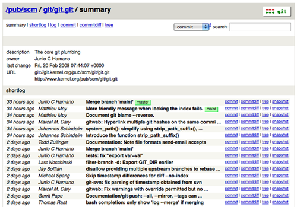
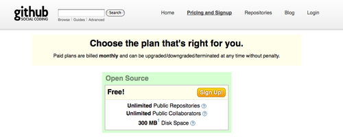
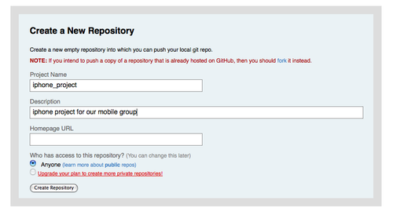
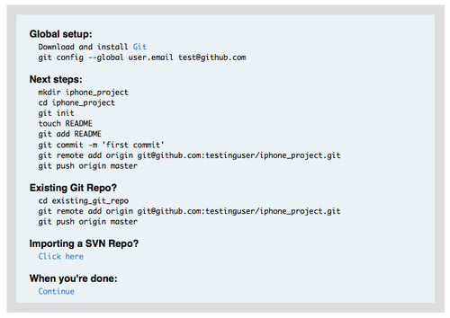
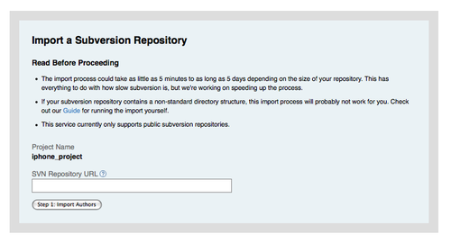
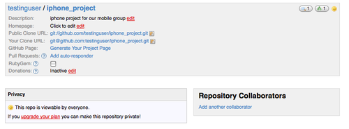
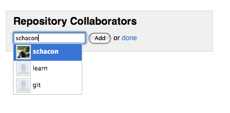

# Git サーバー #

ここまで読んだみなさんは、ふだん Git を使う上で必要になるタスクのほとんどを身につけたことでしょう。しかし、Git で何らかの共同作業をしようと思えばリモートの Git リポジトリを持つ必要があります。個人リポジトリとの間でのプッシュやプルも技術的には可能ですが、お勧めしません。よっぽど気をつけておかないと、ほかの人がどんな作業をしているのかをすぐに見失ってしまうからです。さらに、自分のコンピューターがオフラインのときにもほかの人が自分のリポジトリにアクセスできるようにしたいとなると、共有リポジトリを持つほうがずっと便利です。というわけで、他のメンバーとの共同作業をするときには、中間リポジトリをどこかに用意してみんながそこにアクセスできるようにし、プッシュやプルを行うようにすることをお勧めします。本書ではこの手のリポジトリのことを "Git サーバー" と呼ぶことにします。しかし、一般的に Git リポジトリをホストするのに必要なリソースはほんの少しだけです。それ専用のサーバーをわざわざ用意する必要はまずありません。

Git サーバーを立ち上げるのは簡単です。まず、サーバーとの通信にどのプロトコルを使うのかを選択します。この章の最初のセクションで、どんなプロトコルが使えるのかとそれぞれのプロトコルの利点・欠点を説明します。その次のセクションでは、それぞれのプロトコルを使用したサーバーの設定方法とその動かし方を説明します。最後に、ホスティングサービスについて紹介します。他人のサーバー上にコードを置くのが気にならない、そしてサーバーの設定だの保守だのといった面倒なことはやりたくないという人のためのものです。

自前でサーバーを立てることには興味がないという人は、この章は最後のセクションまで読み飛ばし、ホスティングサービスに関する情報だけを読めばよいでしょう。そして次の章に進み、分散ソース管理環境での作業について学びます。

リモートリポジトリは、一般的に _ベアリポジトリ_ となります。これは、作業ディレクトリをもたない Git リポジトリのことです。このリポジトリは共同作業の中継地点としてのみ用いられるので、ディスク上にスナップショットをチェックアウトする必要はありません。単に Git のデータがあればそれでよいのです。端的に言うと、ベアリポジトリとはそのプロジェクトの `.git` ディレクトリだけで構成されるもののことです。

## プロトコル ##

Git では、データ転送用のネットワークプロトコルとして Local、Secure Shell (SSH)、Git そして HTTP の四つを使用できます。ここでは、それぞれがどんなものなのかとどんな場面で使うべきか (使うべきでないか) を説明します。

注意すべき点として、HTTP 以外のすべてのプロトコルは、サーバー上に Git がインストールされている必要があります。

### Local プロトコル ###

一番基本的なプロトコルが _Local プロトコル_, です。これは、リモートリポジトリをディスク上の別のディレクトリに置くものです。これがよく使われるのは、たとえばチーム全員がアクセスできる共有ファイルシステム (NFS など) がある場合です。あるいは、あまりないでしょうが全員が同じコンピューターにログインしている場合にも使えます。後者のパターンはあまりお勧めできません。すべてのコードリポジトリが同じコンピューター上に存在することになるので、何か事故が起こったときに何もかも失ってしまう可能性があります。

共有ファイルシステムをマウントしているのなら、それをローカルのファイルベースのリポジトリにクローンしたりお互いの間でプッシュやプルをしたりすることができます。この手のリポジトリをクローンしたり既存のプロジェクトのリモートとして追加したりするには、リポジトリへのパスを URL に指定します。たとえば、ローカルリポジトリにクローンするにはこのようなコマンドを実行します。

	$ git clone /opt/git/project.git

あるいは次のようにすることもできます。

	$ git clone file:///opt/git/project.git

URL の先頭に `file://` を明示するかどうかで、Git の動きは微妙に異なります。単にパスを指定した場合は、Git はハードリンクを行うか、必要に応じて直接ファイルをコピーします。`file://` を指定した場合は、Git がプロセスを立ち上げ、そのプロセスが (通常は) ネットワーク越しにデータを転送します。一般的に、直接のコピーに比べてこれは非常に非効率的です。`file://` プレフィックスをつける最も大きな理由は、(他のバージョン管理システムからインポートしたときなどにあらわれる) 関係のない参照やオブジェクトを除いたクリーンなコピーがほしいということです。本書では通常のパス表記を使用します。そのほうがたいていの場合に高速となるからです。

ローカルのリポジトリを既存の Git プロジェクトに追加するには、このようなコマンドを実行します。

	$ git remote add local_proj /opt/git/project.git

そうすれば、このリモートとの間のプッシュやプルを、まるでネットワーク越しにあるのと同じようにすることができます。

#### 利点 ####

ファイルベースのリポジトリの利点は、シンプルであることと既存のファイルアクセス権やネットワークアクセスを流用できることです。チーム全員がアクセスできる共有ファイルシステムがすでに存在するのなら、リポジトリを用意するのは非常に簡単です。ベアリポジトリのコピーをみんながアクセスできるどこかの場所に置き、読み書き可能な権限を与えるという、ごく普通の共有ディレクトリ上での作業です。この作業のために必要なベアリポジトリをエクスポートする方法については次のセクション「Git サーバーの取得」で説明します。

もうひとつ、ほかの誰かの作業ディレクトリの内容をすばやく取り込めるのも便利なところです。同僚と作業しているプロジェクトで相手があなたに作業内容を確認してほしい言ってきたときなど、わざわざリモートのサーバーにプッシュしてもらってそれをプルするよりは単に `git pull /home/john/project` のようなコマンドを実行するほうがずっと簡単です。

#### 欠点 ####

この方式の欠点は、メンバーが別の場所にいるときに共有アクセスを設定するのは一般的に難しいということです。自宅にいるときに自分のラップトップからプッシュしようとしたら、リモートディスクをマウントする必要があります。これはネットワーク越しのアクセスに比べて困難で遅くなるでしょう。

また、何らかの共有マウントを使用している場合は、必ずしもこの方式が最高速となるわけではありません。ローカルリポジトリが高速だというのは、単にデータに高速にアクセスできるからというだけの理由です。NFS 上に置いたリポジトリは、同じサーバーで稼動しているリポジトリに SSH でアクセスしたときよりも遅くなりがちです。SSH でアクセスしたときは、各システムのローカルディスクにアクセスすることになるからです。

### SSH プロトコル ###

Git の転送プロトコルのうちもっとも一般的なのが SSH でしょう。SSH によるサーバーへのアクセスは、ほとんどの場面で既に用意されているからです。仮にまだ用意されていなかったとしても、導入するのは容易なことです。また SSH は、ネットワークベースの Git 転送プロトコルの中で、容易に読み書き可能な唯一のものです。その他のネットワークプロトコル (HTTP および Git) は一般的に読み込み専用で用いるものです。不特定多数向けにこれらのプロトコルを開放したとしても、書き込みコマンドを実行するためには SSH が必要となります。SSH は認証付きのネットワークプロトコルでもあります。あらゆるところで用いられているので、環境を準備するのも容易です。

Git リポジトリを SSH 越しにクローンするには、次のように ssh:// URL を指定します。

	$ git clone ssh://user@server/project.git

あるいは、SCPコマンドのような省略形を使うこともできます｡

	$ git clone user@server:project.git

ユーザー名も省略することもできます。その場合、Git は現在ログインしているユーザーでの接続を試みます。

#### 利点 ####

SSH を使う利点は多数あります。まず、ネットワーク越しでのリポジトリへの書き込みアクセスで認証が必要となる場面では、基本的にこのプロトコルを使わなければなりません。次に、一般的に SSH 環境の準備は容易です。SSH デーモンはごくありふれたツールなので、ネットワーク管理者の多くはその使用経験があります。また、多くの OS に標準で組み込まれており、管理用ツールが付属しているものもあります。さらに、SSH 越しのアクセスは安全です。すべての転送データは暗号化され、信頼できるものとなります。最後に、Git プロトコルや Local プロトコルと同程度に効率的です。転送するデータを可能な限りコンパクトにすることができます。

#### 欠点 ####

SSH の欠点は、リポジトリへの匿名アクセスを許可できないということです。たとえ読み込み専用であっても、リポジトリにアクセスするには SSH 越しでのマシンへのアクセス権限が必要となります。つまり、オープンソースのプロジェクトにとっては SSH はあまりうれしくありません。特定の企業内でのみ使用するのなら、SSH はおそらく唯一の選択肢となるでしょう。あなたのプロジェクトに読み込み専用の匿名アクセスを許可したい場合は、リポジトリへのプッシュ用に SSH を用意するのとは別にプル用の環境として別のプロトコルを提供する必要があります。

### Git プロトコル ###

次は Git プロトコルです。これは Git に標準で付属する特別なデーモンです。専用のポート (9418) をリスンし、SSH プロトコルと同様のサービスを提供しますが、認証は行いません。Git プロトコルを提供するリポジトリを準備するには、`git-export-daemon-ok` というファイルを作らなければなりません (このファイルがなければデーモンはサービスを提供しません)。ただ、このままでは一切セキュリティはありません。Git リポジトリをすべての人に開放し、クローンさせることができます。しかし、一般に、このプロトコルでプッシュさせることはありません。プッシュアクセスを認めることは可能です。しかし認証がないということは、その URL を知ってさえいればインターネット上の誰もがプロジェクトにプッシュできるということになります。これはありえない話だと言っても差し支えないでしょう。

#### 利点 ####

Git プロトコルは、もっとも高速な転送プロトコルです。公開プロジェクトで大量のトラフィックをさばいている場合、あるいは巨大なプロジェクトで読み込みアクセス時のユーザー認証が不要な場合は、Git デーモンを用いてリポジトリを公開するとよいでしょう。このプロトコルは SSH プロトコルと同様のデータ転送メカニズムを使いますが、暗号化と認証のオーバーヘッドがないのでより高速です。

#### 欠点 ####

Git プロトコルの弱点は、認証の仕組みがないことです。Git プロトコルだけでしかプロジェクトにアクセスできないという状況は、一般的に望ましくありません。SSH と組み合わせ、プッシュ (書き込み) 権限を持つ一部の開発者には SSH を使わせてそれ以外の人には `git://` での読み込み専用アクセスを用意することになるでしょう。また、Git プロトコルは準備するのがもっとも難しいプロトコルでもあります。まず、独自のデーモンを起動しなければなりません (この章の“Gitosis”のところで詳しく説明します)。そのためには `xinetd` やそれに類するものの設定も必要になりますが、これはそんなにお手軽にできるものではありません。また、ファイアウォールでポート 9418 のアクセスを許可する必要もあります。これは標準のポートではないので、企業のファイアウォールでは許可されなていないかもしれません。大企業のファイアウォールでは、こういったよくわからないポートは普通ブロックされています。

### HTTP/S プロトコル ###

最後は HTTP プロトコルです。HTTP あるいは HTTPS のうれしいところは、準備するのが簡単だという点です。基本的に、必要な作業といえば Git リポジトリを HTTP のドキュメントルート以下に置いて `post-update` フックを用意することだけです (Git のフックについては第 7 章で詳しく説明します)。これで、ウェブサーバー上のその場所にアクセスできる人ならだれでもリポジトリをクローンできるようになります。リポジトリへの HTTP での読み込みアクセスを許可するには、こんなふうにします。

	$ cd /var/www/htdocs/
	$ git clone --bare /path/to/git_project gitproject.git
	$ cd gitproject.git
	$ mv hooks/post-update.sample hooks/post-update
	$ chmod a+x hooks/post-update

これだけです。Git に標準でついてくる `post-update` フックは、適切なコマンド (`git update-server-info`) を実行して HTTP でのフェッチとクローンをうまく動くようにします。このコマンドが実行されるのは、このリポジトリに対して SSH 越しでのプッシュがあったときです。その他の人たちがクローンする際には次のようにします。

	$ git clone http://example.com/gitproject.git

今回の例ではたまたま `/var/www/htdocs` (一般的な Apache の標準設定) を使用しましたが、別にそれに限らず任意のウェブサーバーを使うことができます。単にベアリポジトリをそのパスに置けばよいだけです。Git のデータは、普通の静的ファイルとして扱われます (実際のところどのようになっているかの詳細は第 9 章を参照ください)。

HTTP 越しの Git のプッシュを行うことも可能ですが、あまり使われていません。また、これには複雑な WebDAV の設定が必要です。めったに使われることがないので、本書では取り扱いません。HTTP でのプッシュに興味があるかたのために、それ用のリポジトリを準備する方法が `http://www.kernel.org/pub/software/scm/git/docs/howto/setup-git-server-over-http.txt` で公開されています。HTTP 越しでの Git のプッシュに関して、よいお知らせがひとつあります。どんな WebDAV サーバーでも使うことが可能で、特に Git ならではの機能は必要ありません。つまり、もしプロバイダが WebDAV によるウェブサイトの更新に対応しているのなら、それを使用することができます。

#### 利点 ####

HTTP を使用する利点は、簡単にセットアップできるということです。便利なコマンドで、Git リポジトリへの読み取りアクセスを全世界に公開できます。ものの数分で用意できることでしょう。また、HTTP はサーバー上のリソースを激しく使用することはありません。すべてのデータは HTTP サーバー上の静的なファイルとして扱われます。普通の Apache サーバーは毎秒数千ファイルぐらいは余裕でさばくので、小規模サーバーであったとしても (Git リポジトリへのへのアクセスで) サーバーが過負荷になることはないでしょう。

HTTPS で読み込み専用のリポジトリを公開することもできます。これで、転送されるコンテンツを暗号化したりクライアント側で特定の署名つき SSL 証明書を使わせたりすることができるようになります。そこまでやるぐらいなら SSH の公開鍵を使うほうが簡単ではありますが、場合によっては署名入り SSL 証明書やその他の HTTP ベースの認証方式を使った HTTPS での読み込み専用アクセスを使うこともあるでしょう。

もうひとつの利点としてあげられるのは、HTTP が非常に一般的なプロトコルであるということです。たいていの企業のファイアウォールはこのポートを通すように設定されています。

#### 欠点 ####

HTTP によるリポジトリの提供の問題点は、クライアント側から見て非効率的だということです。リポジトリのフェッチやクローンには非常に時間がかかります。また、他のネットワークプロトコルにくらべてネットワークのオーバーヘッドや転送量が非常に増加します。必要なデータだけをやりとりするといった賢い機能はない (サーバー側で転送時になんらかの作業をすることができない) ので、HTTP はよく _ダム (dumb)_ プロトコルなどと呼ばれています。HTTP とその他のプロトコルの間の効率の違いに関する詳細な情報は、第 9 章を参照ください。

## サーバー用の Git の取得 ##

Git サーバーを立ち上げるには、既存のリポジトリをエクスポートして新たなベアリポジトリ (作業ディレクトリを持たないリポジトリ) を作らなければなりません。これは簡単にできます。リポジトリをクローンして新たにベアリポジトリを作成するには、clone コマンドでオプション `--bare` を指定します。慣例により、ベアリポジトリのディレクトリ名の最後は `.git` とすることになっています。

	$ git clone --bare my_project my_project.git
	Initialized empty Git repository in /opt/projects/my_project.git/

このコマンドを実行したときの出力はちょっとわかりにくいかもしれません。`clone` は基本的に `git init` をしてから `git fetch` をするのと同じことなので、`git init` の部分の部分の出力も見ることになります。そのメッセージは「空のディレクトリを作成しました」というものです。実際にどんなオブジェクトの転送が行われたのかは何も表示されませんが、きちんと転送は行われています。これで、`my_project.git` ディレクトリに Git リポジトリのデータができあがりました。

これは、おおざっぱに言うと次の操作と同じようなことです。

	$ cp -Rf my_project/.git my_project.git

設定ファイルにはちょっとした違いもありますが、ほぼこんなものです。作業ディレクトリなしで Git リポジトリを受け取り、それ単体のディレクトリを作成しました。

### ベアリポジトリのサーバー上への設置 ###

ベアリポジトリを取得できたので、あとはそれをサーバー上においてプロトコルを準備するだけです。ここでは、`git.example.com` というサーバーがあってそこに SSH でアクセスできるものと仮定しましょう。Git リポジトリはサーバー上の `/opt/git` ディレクトリに置く予定です。新しいリポジトリを作成するには、ベアリポジトリを次のようにコピーします。

	$ scp -r my_project.git user@git.example.com:/opt/git

この時点で、同じサーバーに SSH でアクセスできてかつ `/opt/git` ディレクトリへの読み込みアクセス権限がある人なら、次のようにしてこのリポジトリをクローンできるようになりました。

	$ git clone user@git.example.com:/opt/git/my_project.git

ユーザーが SSH でアクセスでき、かつ `/opt/git/my_project.git` ディレクトリへの書き込みアクセス権限があれば、すでにプッシュもできる状態になっています。`git init` コマンドで `--shared` オプションを指定すると、リポジトリに対するグループ書き込みパーミッションを自動的に追加することができます。

	$ ssh user@git.example.com
	$ cd /opt/git/my_project.git
	$ git init --bare --shared

既存の Git リポジトリからベアリポジトリを作成し、メンバーが SSH でアクセスできるサーバーにそれを配置するだけ。簡単ですね。これで、そのプロジェクトでの共同作業ができるようになりました。

複数名が使用する Git サーバーをたったこれだけの作業で用意できるというのは特筆すべきことです。サーバー SSH アクセス可能なアカウントを作成し、ベアリポジトリをサーバーのどこかに置き、そこに読み書き可能なアクセス権を設定する。これで準備OK。他には何もいりません。

次のいくつかのセクションでは、より洗練された環境を作るための方法を説明します。いちいちユーザーごとにアカウントを作らなくて済む方法、一般向けにリポジトリへの読み込みアクセスを開放する方法、ウェブ UI の設定、Gitosis の使い方などです。しかし、数名のメンバーで閉じたプロジェクトでの作業なら、SSH サーバーとベアリポジトリ _さえ_ あれば十分なことは覚えておきましょう。

### ちょっとしたセットアップ ###

小規模なグループ、あるいは数名の開発者しかいない組織で Git を使うなら、すべてはシンプルに進められます。Git サーバーを準備する上でもっとも複雑なことのひとつは、ユーザー管理です。同一リポジトリに対して「このユーザーは読み込みのみが可能、あのユーザーは読み書きともに可能」などと設定したければ、アクセス権とパーミッションの設定は多少難しくなります。

#### SSH アクセス ####

開発者全員が SSH でアクセスできるサーバーがすでにあるのなら、リポジトリを用意するのは簡単です。先ほど説明したように、ほとんど何もする必要はないでしょう。より複雑なアクセス制御をリポジトリ上で行いたい場合は、そのサーバーの OS 上でファイルシステムのパーミッションを設定するとよいでしょう。

リポジトリに対する書き込みアクセスをさせたいメンバーの中にサーバーのアカウントを持っていない人がいる場合は、新たに SSH アカウントを作成しなければなりません。あなたがサーバーにアクセスできているということは、すでに SSH サーバーはインストールされているということです。

その状態で、チームの全員にアクセス権限を与えるにはいくつかの方法があります。ひとつは全員分のアカウントを作成すること。直感的ですがすこし面倒です。ひとりひとりに対して `adduser` を実行して初期パスワードを設定するという作業をしなければなりません。

もうひとつの方法は、'git' ユーザーをサーバー上に作成し、書き込みアクセスが必要なユーザーには SSH 公開鍵を用意してもらってそれを 'git' ユーザーの `~/.ssh/authorized_keys` に追加します。これで、全員が 'git' ユーザーでそのマシンにアクセスできるようになりました。これがコミットデータに影響を及ぼすことはありません。SSH で接続したときのユーザーとコミットするときに記録されるユーザーとは別のものだからです。

あるいは、SSH サーバーの認証を LDAP サーバーやその他の中央管理形式の仕組みなど既に用意されているものにするとこもできます。各ユーザーがサーバー上でシェルへのアクセスができさえすれば、どんな仕組みの SSH 認証であっても動作します。

## SSH 公開鍵の作成 ##

多くの Git サーバーでは、SSH の公開鍵認証を使用しています。この方式を使用するには、各ユーザーが自分の公開鍵を作成しなければなりません。公開鍵のつくりかたは、OS が何であってもほぼ同じです。まず、自分がすでに公開鍵を持っていないかどうか確認します。デフォルトでは、各ユーザーの SSH 鍵はそのユーザーの `~/.ssh` ディレクトリに置かれています。自分が鍵を持っているかどうかを確認するには、このディレクトリに行ってその中身を調べます。

	$ cd ~/.ssh
	$ ls
	authorized_keys2  id_dsa       known_hosts
	config            id_dsa.pub

そして「○○」「○○.pub」というファイル名の組み合わせを探します。「○○」の部分は、通常は `id_dsa` あるいは `id_rsa` となります。もし見つかったら、`.pub` がついているほうのファイルがあなたの公開鍵で、もう一方があなたの秘密鍵です。そのようなファイルがない (あるいはそもそも `.ssh` ディレクトリがない) 場合は、`ssh-keygen` というプログラムを実行してそれを作成します。このプログラムは Linux/Mac なら SSH パッケージに含まれており、Windows では MSysGit パッケージに含まれています。

	$ ssh-keygen
	Generating public/private rsa key pair.
	Enter file in which to save the key (/Users/schacon/.ssh/id_rsa):
	Enter passphrase (empty for no passphrase):
	Enter same passphrase again:
	Your identification has been saved in /Users/schacon/.ssh/id_rsa.
	Your public key has been saved in /Users/schacon/.ssh/id_rsa.pub.
	The key fingerprint is:
	43:c5:5b:5f:b1:f1:50:43:ad:20:a6:92:6a:1f:9a:3a schacon@agadorlaptop.local

まず、鍵の保存先 (`.ssh/id_rsa`) を指定し、それからパスフレーズを二回入力するよう求められます。鍵を使うときにパスフレーズを入力したくない場合は、パスフレーズを空のままにしておきます。

さて、次に各ユーザーは自分の公開鍵をあなた (あるいは Git サーバーの管理者である誰か) に送らなければなりません (ここでは、すでに公開鍵認証を使用するように SSH サーバーが設定済みであると仮定します)。公開鍵を送るには、`.pub` ファイルの中身をコピーしてメールで送ります (訳注: メールなんかで送っていいの? とツッコミたいところだ……)。公開鍵は、このようなファイルになります。

	$ cat ~/.ssh/id_rsa.pub
	ssh-rsa AAAAB3NzaC1yc2EAAAABIwAAAQEAklOUpkDHrfHY17SbrmTIpNLTGK9Tjom/BWDSU
	GPl+nafzlHDTYW7hdI4yZ5ew18JH4JW9jbhUFrviQzM7xlELEVf4h9lFX5QVkbPppSwg0cda3
	Pbv7kOdJ/MTyBlWXFCR+HAo3FXRitBqxiX1nKhXpHAZsMciLq8V6RjsNAQwdsdMFvSlVK/7XA
	t3FaoJoAsncM1Q9x5+3V0Ww68/eIFmb1zuUFljQJKprrX88XypNDvjYNby6vw/Pb0rwert/En
	mZ+AW4OZPnTPI89ZPmVMLuayrD2cE86Z/il8b+gw3r3+1nKatmIkjn2so1d01QraTlMqVSsbx
	NrRFi9wrf+M7Q== schacon@agadorlaptop.local

各種 OS 上での SSH 鍵の作り方については、GitHub の `http://github.com/guides/providing-your-ssh-key` に詳しく説明されています。

## サーバーのセットアップ ##

それでは、サーバー側での SSH アクセスの設定について順を追って見ていきましょう。この例では `authorized_keys` 方式でユーザーの認証を行います。また、Ubuntu のような標準的な Linux ディストリビューションを動かしているものと仮定します。まずは 'git' ユーザーを作成し、そのユーザーの `.ssh` ディレクトリを作りましょう。

	$ sudo adduser git
	$ su git
	$ cd
	$ mkdir .ssh

次に、開発者たちの SSH 公開鍵をそのユーザーの `authorized_keys` に追加していきましょう。受け取った鍵が一時ファイルとして保存されているものとします。先ほどもごらんいただいたとおり、公開鍵の中身はこのような感じになっています。

	$ cat /tmp/id_rsa.john.pub
	ssh-rsa AAAAB3NzaC1yc2EAAAADAQABAAABAQCB007n/ww+ouN4gSLKssMxXnBOvf9LGt4L
	ojG6rs6hPB09j9R/T17/x4lhJA0F3FR1rP6kYBRsWj2aThGw6HXLm9/5zytK6Ztg3RPKK+4k
	Yjh6541NYsnEAZuXz0jTTyAUfrtU3Z5E003C4oxOj6H0rfIF1kKI9MAQLMdpGW1GYEIgS9Ez
	Sdfd8AcCIicTDWbqLAcU4UpkaX8KyGlLwsNuuGztobF8m72ALC/nLF6JLtPofwFBlgc+myiv
	O7TCUSBdLQlgMVOFq1I2uPWQOkOWQAHukEOmfjy2jctxSDBQ220ymjaNsHT4kgtZg2AYYgPq
	dAv8JggJICUvax2T9va5 gsg-keypair

これを `authorized_keys` に追加していきましょう。

	$ cat /tmp/id_rsa.john.pub >> ~/.ssh/authorized_keys
	$ cat /tmp/id_rsa.josie.pub >> ~/.ssh/authorized_keys
	$ cat /tmp/id_rsa.jessica.pub >> ~/.ssh/authorized_keys

さて、彼らが使うための空のリポジトリを作成しましょう。`git init` に `--bare` オプションを指定して実行すると、作業ディレクトリのない空のリポジトリを初期化します。

	$ cd /opt/git
	$ mkdir project.git
	$ cd project.git
	$ git --bare init

これで、John と Josie そして Jessica はプロジェクトの最初のバージョンをプッシュできるようになりました。このリポジトリをリモートとして追加し、ブランチをプッシュすればいいのです。何か新しいプロジェクトを追加しようと思ったら、そのたびに誰かがサーバーにログインし、ベアリポジトリを作らなければならないことに注意しましょう。'git' ユーザーとリポジトリを作ったサーバーのホスト名を `gitserver` としておきましょう。`gitserver` がそのサーバーを指すように DNS を設定しておけば、このようなコマンドを使えます。

	# John のコンピューターで
	$ cd myproject
	$ git init
	$ git add .
	$ git commit -m 'initial commit'
	$ git remote add origin git@gitserver:/opt/git/project.git
	$ git push origin master

これで、他のメンバーがリポジトリをクローンして変更内容を書き戻せるようになりました。

	$ git clone git@gitserver:/opt/git/project.git
	$ cd project
	$ vim README
	$ git commit -am 'fix for the README file'
	$ git push origin master

この方法を使えば、小規模なチーム用の読み書き可能な Git サーバーをすばやく立ち上げることができます。

万一の場合に備えて 'git' ユーザーができることを制限するのも簡単で、Git に関する作業しかできない制限付きシェル `git-shell` が Git に付属しています。これを 'git' ユーザーのログインシェルにしておけば、'git' ユーザーはサーバーへの通常のシェルアクセスができなくなります。これを使用するには、ユーザーのログインシェルとして bash や csh ではなく `git-shell` を指定します。そのためには `/etc/passwd` ファイルを編集しなければなりません。

	$ sudo vim /etc/passwd

いちばん最後に、このような行があるはずです。

	git:x:1000:1000::/home/git:/bin/sh

ここで `/bin/sh` を `/usr/bin/git-shell` (`which git-shell` を実行してインストール先を探し、それを指定します) に変更します。変更後はこのようになるでしょう。

	git:x:1000:1000::/home/git:/usr/bin/git-shell

これで、'git' ユーザーは Git リポジトリへのプッシュやプル以外のシェル操作ができなくなりました。それ以外の操作をしようとすると、このように拒否されます。

	$ ssh git@gitserver
	fatal: What do you think I am? A shell?
	Connection to gitserver closed.

## 一般公開 ##

匿名での読み込み専用アクセス機能を追加するにはどうしたらいいでしょうか? 身内に閉じたプロジェクトではなくオープンソースのプロジェクトを扱うときに、これを考えることになります。あるいは、自動ビルドや継続的インテグレーション用に大量のサーバーが用意されており、それがしばしば入れ替わるという場合など。単なる読み込み専用の匿名アクセスのためだけに毎回 SSH 鍵を作成しなければならないのは大変です。

おそらく一番シンプルな方法は、静的なウェブサーバーを立ち上げてそのドキュメントルートに Git リポジトリを置き、本章の最初のセクションで説明した `post-update` フックを有効にすることです。先ほどの例を続けてみましょう。リポジトリが `/opt/git` ディレクトリにあり、マシン上で Apache が稼働中であるものとします。念のために言いますが、別に Apache に限らずどんなウェブサーバーでも使えます。しかしここでは、Apache の設定を例にして何が必要なのかを説明していきます。

まずはフックを有効にします。

	$ cd project.git
	$ mv hooks/post-update.sample hooks/post-update
	$ chmod a+x hooks/post-update

この `post-update` は、いったい何をするのでしょうか? その中身はこのようになります。

	$ cat .git/hooks/post-update
	#!/bin/sh
	exec git-update-server-info

SSH 経由でサーバーへのプッシュが行われると、Git はこのコマンドを実行し、HTTP 経由での取得に必要なファイルを更新します。

次に、Apache の設定に VirtualHost エントリを追加して Git プロジェクトのディレクトリをドキュメントルートに設定します。ここでは、ワイルドカード DNS を設定して `*.gitserver` へのアクセスがすべてこのマシンに来るようになっているものとします。

	<VirtualHost *:80>
	    ServerName git.gitserver
	    DocumentRoot /opt/git
	    <Directory /opt/git/>
	        Order allow, deny
	        allow from all
	    </Directory>
	</VirtualHost>

また、`/opt/git` ディレクトリの所有グループを `www-data` にし、ウェブサーバーがこのリポジトリにアクセスできるようにしなければなりません。CGI スクリプトを実行する Apache インスタンスのユーザー権限で動作することになるからです。

	$ chgrp -R www-data /opt/git

Apache を再起動すれば、プロジェクトの URL を指定してリポジトリのクローンができるようになります。

	$ git clone http://git.gitserver/project.git

この方法を使えば、多数のユーザーに HTTP での読み込みアクセス権を与える設定がたった数分でできあがります。多数のユーザーに認証なしでのアクセスを許可するためのもうひとつの方法として、Git デーモンを立ち上げることもできます。しかし、その場合はプロセスをデーモン化させなければなりません。その方法については次のセクションで説明します。

## GitWeb ##

これで、読み書き可能なアクセス方法と読み込み専用のアクセス方法を用意できるようになりました。次にほしくなるのは、ウェブベースでの閲覧方法でしょうか。Git には標準で GitWeb という CGI スクリプトが付属しており、これを使うことができます。GitWeb の使用例は、たとえば `http://git.kernel.org` で確認できます (図 4-1 を参照ください)。

<small>図 4-1. GitWeb のユーザーインターフェイス</small>

自分のプロジェクトでためしに GitWeb を使ってみようという人のために、一時的なインスタンスを立ち上げるためのコマンドが Git に付属しています。これを実行するには `lighttpd` や `webrick` といった軽量なサーバーが必要です。Linux マシンなら、たいてい `lighttpd` がインストールされています。これを実行するには、プロジェクトのディレクトリで `git instaweb` と打ち込みます。Mac の場合なら、Leopard には Ruby がプレインストールされています。したがって `webrick` が一番よい選択肢でしょう。`instaweb` を lighttpd 以外で実行するには、`--httpd` オプションを指定します。

	$ git instaweb --httpd=webrick
	[2009-02-21 10:02:21] INFO  WEBrick 1.3.1
	[2009-02-21 10:02:21] INFO  ruby 1.8.6 (2008-03-03) [universal-darwin9.0]

これは、HTTPD サーバーをポート 1234 で起動させ、自動的にウェブブラウザーを立ち上げてそのページを表示させます。非常にお手軽です。ひととおり見終えてサーバーを終了させたくなったら、同じコマンドに `--stop` オプションをつけて実行します。

	$ git instaweb --httpd=webrick --stop

ウェブインターフェイスをチーム内で常時立ち上げたりオープンソースプロジェクト用に公開したりする場合は、CGI スクリプトを設定して通常のウェブサーバーに配置しなければなりません。Linux のディストリビューションの中には、`apt` や `yum` などで `gitweb` パッケージが用意されているものもあります。まずはそれを探してみるとよいでしょう。手動での GitWeb のインストールについて、さっと流れを説明します。まずは Git のソースコードを取得しましょう。その中に GitWeb が含まれており、CGI スクリプトを作ることができます。

	$ git clone git://git.kernel.org/pub/scm/git/git.git
	$ cd git/
	$ make GITWEB_PROJECTROOT="/opt/git" \
	        prefix=/usr gitweb
	$ sudo cp -Rf gitweb /var/www/

コマンドを実行する際に、Git リポジトリの場所 `GITWEB_PROJECTROOT` 変数で指定しなければならないことに注意しましょう。さて、次は Apache にこのスクリプトを処理させるようにしなければなりません。VirtualHost に次のように追加しましょう。

	<VirtualHost *:80>
	    ServerName gitserver
	    DocumentRoot /var/www/gitweb
	    <Directory /var/www/gitweb>
	        Options ExecCGI +FollowSymLinks +SymLinksIfOwnerMatch
	        AllowOverride All
	        order allow,deny
	        Allow from all
	        AddHandler cgi-script cgi
	        DirectoryIndex gitweb.cgi
	    </Directory>
	</VirtualHost>

GitWeb は、CGI に対応したウェブサーバーならどんなものを使っても動かすことができます。何か別のサーバーのほうがよいというのなら、そのサーバーで動かすのもたやすいことでしょう。これで、`http://gitserver/` にアクセスすればリポジトリをオンラインで見られるようになりました。また `http://git.gitserver` で、HTTP 越しのクローンやフェッチもできます。

## Gitosis ##

ユーザーの公開鍵を `authorized_keys` にまとめてアクセス管理する方法は、しばらくの間はうまくいくでしょう。しかし、何百人ものユーザーを管理する段階になると、この方式はとても面倒になります。サーバーのシェルでの操作が毎回発生するわけですし、またアクセス制御が皆無な状態、つまり公開鍵を登録した人はすべてのプロジェクトのすべてのファイルを読み書きできる状態になってしまいます。

ここで、よく使われている Gitosis というソフトウェアについて紹介しましょう。Gitosis は、`authorized_keys` ファイルを管理したりちょっとしたアクセス制御を行ったりするためのスクリプト群です。ユーザーを追加したりアクセス権を定義したりするための UI に、ウェブではなく独自の Git リポジトリを採用しているというのが興味深い点です。プロジェクトに関する情報を準備してそれをプッシュすると、その情報に基づいて Gitosis がサーバーを設定するというクールな仕組みになっています。

Gitosis のインストールは簡単だとはいえませんが、それほど難しくもありません。Linux サーバー上で運用するのがいちばん簡単でしょう。今回の例では、ごく平凡な Ubuntu 8.10 サーバーを使います。

Gitosis は Python のツールを使います。まずは Python の setuptools パッケージをインストールしなければなりません。Ubuntu なら python-setuptools というパッケージがあります。

	$ apt-get install python-setuptools

次に、プロジェクトのメインサイトから Gitosis をクローンしてインストールします。

	$ git clone git://eagain.net/gitosis.git
	$ cd gitosis
	$ sudo python setup.py install

これで、Gitosis が使う実行ファイル群がインストールされました。Gitosis は、リポジトリが `/home/git` にあることが前提となっています。しかしここではすでに `/opt/git` にリポジトリが存在するので、いろいろ設定しなおすのではなくシンボリックリンクを作ってしまいましょう。

	$ ln -s /opt/git /home/git/repositories

Gitosis は鍵の管理も行うので、まず現在の鍵ファイルを削除してあとでもう一度鍵を追加し、Gitosis に `authorized_keys` を自動管理させなければなりません。ここではまず `authorized_keys` を別の場所に移動します。

	$ mv /home/git/.ssh/authorized_keys /home/git/.ssh/ak.bak

次は 'git' ユーザーのシェルをもし `git-shell` コマンドに変更していたのなら、元に戻さなければなりません。人にログインさせるのではなく、かわりに Gitosis に管理してもらうのです。`/etc/passwd` ファイルにある

	git:x:1000:1000::/home/git:/usr/bin/git-shell

の行を、次のように戻しましょう。

	git:x:1000:1000::/home/git:/bin/sh

いよいよ Gitosis の初期設定です。自分の秘密鍵を使って `gitosis-init` コマンドを実行します。サーバー上に自分の公開鍵をおいていない場合は、まず公開鍵をコピーしましょう。

	$ sudo -H -u git gitosis-init < /tmp/id_dsa.pub
	Initialized empty Git repository in /opt/git/gitosis-admin.git/
	Reinitialized existing Git repository in /opt/git/gitosis-admin.git/

これで、指定した鍵を持つユーザーが Gitosis 用の Git リポジトリを変更できるようになりました。次に、新しいリポジトリの `post-update` スクリプトに実行ビットを設定します。

	$ sudo chmod 755 /opt/git/gitosis-admin.git/hooks/post-update

これで準備完了です。きちんと設定できていれば、Gitosis の初期設定時に登録した公開鍵を使って SSH でサーバーにログインできるはずです。結果はこのようになります。

	$ ssh git@gitserver
	PTY allocation request failed on channel 0
	fatal: unrecognized command 'gitosis-serve schacon@quaternion'
	  Connection to gitserver closed.

これは「何も Git のコマンドを実行していないので、接続を拒否した」というメッセージです。では、実際に何か Git のコマンドを実行してみましょう。Gitosis 管理リポジトリをクローンします。

	# on your local computer
	$ git clone git@gitserver:gitosis-admin.git

`gitosis-admin` というディレクトリができました。次のような内容になっています。

	$ cd gitosis-admin
	$ find .
	./gitosis.conf
	./keydir
	./keydir/scott.pub

`gitosis.conf` が、ユーザーやリポジトリそしてパーミッションを指定するためのファイルです。`keydir` ディレクトリには、リポジトリへの何らかのアクセス権を持つ全ユーザーの公開鍵ファイルを格納します。ユーザーごとにひとつのファイルとなります。`keydir` ディレクトリ内のファイル名 (この例では `scott.pub`) は人によって異なるでしょう。これは、`gitosis-init` スクリプトでインポートした公開鍵の最後にある説明をもとにして Gitosis がつけた名前です。

`gitosis.conf` ファイルを見ると、今のところは先ほどクローンした `gitosis-admin` プロジェクトについての情報しか書かれていません。

	$ cat gitosis.conf
	[gitosis]

	[group gitosis-admin]
	writable = gitosis-admin
	members = scott

これは、'scott' ユーザー（Gitosis の初期化時に公開鍵を指定したユーザー）だけが `gitosis-admin` プロジェクトにアクセスできるという意味です。

では、新しいプロジェクトを追加してみましょう。`mobile` という新しいセクションを作成し、モバイルチームのメンバーとモバイルチームがアクセスするプロジェクトを書き入れます。今のところ存在するユーザーは 'scott' だけなので、とりあえずは彼をメンバーとして追加します。そして、新しいプロジェクト `iphone_project` を作ることにしましょう。

	[group mobile]
	writable = iphone_project
	members = scott

`gitosis-admin` プロジェクトに手を入れたら、それをコミットしてサーバーにプッシュしないと変更が反映されません。

	$ git commit -am 'add iphone_project and mobile group'
	[master]: created 8962da8: "changed name"
	 1 files changed, 4 insertions(+), 0 deletions(-)
	$ git push
	Counting objects: 5, done.
	Compressing objects: 100% (2/2), done.
	Writing objects: 100% (3/3), 272 bytes, done.
	Total 3 (delta 1), reused 0 (delta 0)
	To git@gitserver:/opt/git/gitosis-admin.git
	   fb27aec..8962da8  master -> master

新しい `iphone_project` プロジェクトにプッシュするには、ローカル側のプロジェクトに、このサーバーをリモートとして追加します。サーバー側でわざわざベアリポジトリを作る必要はありません。先ほどプッシュした地点で、Gitosis が自動的にベアリポジトリの作成を済ませています。

	$ git remote add origin git@gitserver:iphone_project.git
	$ git push origin master
	Initialized empty Git repository in /opt/git/iphone_project.git/
	Counting objects: 3, done.
	Writing objects: 100% (3/3), 230 bytes, done.
	Total 3 (delta 0), reused 0 (delta 0)
	To git@gitserver:iphone_project.git
	 * [new branch]      master -> master

パスを指定する必要がないことに注目しましょう (実際、パスを指定しても動作しません)。コロンの後にプロジェクト名を指定するだけで、Gitosis がプロジェクトを見つけてくれます。

このプロジェクトに新たなメンバーを迎え入れることになりました、公開鍵を追加しなければなりません。しかし、今までのようにサーバー上の `~/.ssh/authorized_keys` に追記する必要はありません。ユーザー単位の鍵ファイルを `keydir` ディレクトリ内に置くだけです。鍵ファイルにつけた名前が、`gitosis.conf` でその人を指定するときの名前となります。では、John と Josie そして Jessica の公開鍵を追加しましょう。

	$ cp /tmp/id_rsa.john.pub keydir/john.pub
	$ cp /tmp/id_rsa.josie.pub keydir/josie.pub
	$ cp /tmp/id_rsa.jessica.pub keydir/jessica.pub

そして彼らを 'mobile' チームに追加し、`iphone_project` を読み書きできるようにします。

	[group mobile]
	writable = iphone_project
	members = scott john josie jessica

この変更をコミットしてプッシュすると、この四人のユーザーがプロジェクトへの読み書きをできるようになります。

Gitosis にはシンプルなアクセス制御機能もあります。John には読み込み専用のアクセス権を設定したいという場合は、このようにします。

	[group mobile]
	writable = iphone_project
	members = scott josie jessica

	[group mobile_ro]
	readonly = iphone_project
	members = john

John はプロジェクトをクローンして変更内容を受け取れます。しかし、手元での変更をプッシュしようとすると Gitosis に拒否されます。このようにして好きなだけのグループを作成し、それぞれに個別のユーザーとプロジェクトを含めることができます。また、グループのメンバーとして別のグループを指定し (その場合は先頭に `@` をつけます)、メンバーを自動的に継承することもできます。

	[group mobile_committers]
	members = scott josie jessica

	[group mobile]
	writable  = iphone_project
	members   = @mobile_committers

	[group mobile_2]
	writable  = another_iphone_project
	members   = @mobile_committers john

何か問題が発生した場合には、`[gitosis]` セクションの下に `loglevel=DEBUG` を書いておくと便利です。設定ミスでプッシュ権限を奪われてしまった場合は、サーバー上の `/home/git/.gitosis.conf` を直接編集して元に戻します。Gitosis は、このファイルから情報を読み取っています。`gitosis.conf` ファイルへの変更がプッシュされてきたときに、その内容をこのファイルに書き出します。このファイルを手動で変更しても、次に `gitosis-admin` プロジェクトへのプッシュが成功した時点でその内容が書き換えられることになります。

## Gitolite ##

このセクションでは､Gitoliteの紹介およびインストールと初期設定の方法を解説します｡しかし、完全な状態ではなく、Gitolite に付属する大量のドキュメントに取って代わるものというわけでもありません。また､このセクションは時々更新される可能性があるので､[最新の情報][gldpg]も確認しておくとよいでしょう｡

[gldpg]: http://sitaramc.github.com/gitolite/progit.html
[gltoc]: http://sitaramc.github.com/gitolite/master-toc.html

GitoliteはGitに認可機能を与えるもので､認証には`sshd`か`httpd`を使用します(復習: 認証とはユーザーが誰かを確認することで､認可とはユーザーがアクセスを許可されているかどうかを確認することです)｡

Gitolite は、単なるリポジトリ単位の権限付与だけではなくリポジトリ内のブランチやタグ単位で権限を付与することができます。つまり、特定の人 (あるいはグループ) にだけ特定の "refs" (ブランチあるいはタグ) に対するプッシュ権限を与えて他の人には許可しないといったことができるのです。

### インストール ###

Gitolite のインストールは非常に簡単で、豊富な付属ドキュメントを読まなくてもインストールできます。必要なものは、何らかの Unix 系サーバのアカウントです。root アクセス権は不要です。Git や Perl、そして OpenSSH 互換の SSH サーバは既にインストールされているものとします。以下の例では、`gitserver` というホストにあるアカウント `git` を使います。

Gitolite は、いわゆる "サーバー" ソフトウェアとしては少し変わっています。アクセスは SSH 経由で行うので、サーバー上のすべての userid が "gitolite host" となり得ます。もっともシンプルなインストール方法をこれから解説していきますので､その他の方法についてはドキュメントを確認してください｡

まずは､ユーザー`git`をインストール先のサーバー上に作成し､そのユーザーでログインします｡sshの公開鍵(デフォルト設定で`ssh-keygen`を実行している場合は､`~/.ssh/id_rsa.pub`がそれに当たります)をあなたのワークステーションからコピーし､ファイル名を`<yourname>.pub` (以下の例では`scott.pub`を使用します)に変更しておきます｡次に､以下のコマンドを実行します:

    git clone git://github.com/sitaramc/gitolite
    gitolite/install -ln
        # $HOME/bin が存在し､かつPATHが通っているものとします
    gitolite setup -pk $HOME/scott.pub

`gitolite-admin`という名前のGitリポジトリが､最後のコマンドにより作成されます｡

最後に､あなたのワークステーションに戻って､`git clone git@gitserver:gitolite-admin`を実行します｡これで完了です! Gitolite はサーバにインストールされ、`gitolite-admin` という新しいリポジトリがあなたのワークステーションにできあがりました。Gitolite の設定を管理するには、このリポジトリに変更を加えてプッシュします。

### インストールのカスタマイズ ###

デフォルトのインストールは素早く済ませられ、たいていの人にとってはこれで十分でしょう。しかし、必要に応じてインストール方法をカスタマイズすることもできます。rcファイルを変更してカスタマイズすることも可能ですし､もしそれ以上を望むのであれば､gitoliteのカスタマイズについてのドキュメントを確認してください｡

### 設定ファイルおよびアクセス制御ルール ###

インストールが終わったら、あなたのワークステーションにクローンしたばかりの`gitolite-admin` リポジトリに移動して､中をのぞいてみましょう。

	$ cd ~/gitolite-admin/
	$ ls
	conf/  keydir/
	$ find conf keydir -type f
	conf/gitolite.conf
	keydir/scott.pub
	$ cat conf/gitolite.conf

	repo gitolite-admin
	    RW+                 = scott

	repo testing
	    RW+                 = @all

"scott" (先ほどの `gitolite setup` コマンドで、指定した公開鍵の名前です) が、`gitolite-admin` リポジトリおよび同名の公開鍵ファイルへの読み書き権限を持っていることに注目しましょう。

ユーザーを追加するのは簡単です｡"alice"というユーザーを追加するなら､彼女の公開鍵を取得し､`alice.pub`に名前を変更､そしてそれをあなたのワークステーションにクローンされたgitolite-adminレポジトリ内の`keydir`ディレクトリにコピーします｡変更を追加し､コミットし､プッシュすれば､ユーザーの追加は完了です｡

Gitolite の設定ファイルの構文はドキュメントに詳しく書かれているので、ここでは大事なところに絞って説明します。

ユーザやリポジトリをグループにまとめることもできます。グループ名は単なるマクロのようなものです。グループを定義する際には、それがユーザであるかプロジェクトであるかは無関係です。実際にその「マクロ」を *使う* 段階になって初めてそれらを区別することになります。

	@oss_repos      = linux perl rakudo git gitolite
	@secret_repos   = fenestra pear

	@admins         = scott
	@interns        = ashok
	@engineers      = sitaram dilbert wally alice
	@staff          = @admins @engineers @interns

パーミッションは、"ref" レベルで設定することができます。次の例では、インターン (@interns) は "int" ブランチにしかプッシュできないように設定しています。エンジニア (@engineers) は名前が "eng-" で始まるすべてのブランチにプッシュでき、また "rc" のあとに一桁の数字が続く名前のタグにもプッシュできます。また、管理者 (@admins) はすべての ref に対してあらゆることができます。

	repo @oss_repos
	    RW  int$                = @interns
	    RW  eng-                = @engineers
	    RW  refs/tags/rc[0-9]   = @engineers
	    RW+                     = @admins

`RW` や `RW+` の後に書かれている式は正規表現 (regex) で、これにマッチする refname (ref) が対象となります。なので、これに "refex" と名付けました! もちろん、refex はこの例で示したよりずっと強力なものです。Perl の正規表現になじめない人は、あまりやりすぎないようにしましょう。

また、すでにお気づきかもしれませんが、`refs/` で始まらない refex を指定すると、Gitolite はその先頭に `refs/heads/` がついているものとみなします。これは構文上の利便性を意識したものです。

設定ファイルの構文の中でも重要なのは、ひとつのリポジトリに対するルールをすべてひとまとめにしなくてもよいということです。共通の設定をひとまとめにして上の例のように `oss_repos` に対してルールを設定し、その後で個々の場合について個別のルールを追加していくこともできます。

	repo gitolite
	    RW+                     = sitaram

このルールは、`gitolite` リポジトリのルール群に追加されます。

で、実際のアクセス制御ルールはどのように書けばいいの? と思われたことでしょう。簡単に説明します。

Gitolite のアクセス制御には二段階のレベルがあります。まず最初はリポジトリレベルのアクセス制御です。あるリポジトリへの読み込み (書き込み) アクセス権を持っているということは、そのリポジトリの *すべての* ref に対する読み込み (書き込み) 権限を持っていることを意味します。Gitosisにはこのレベルのアクセス制御しかありませんでした｡

もうひとつのレベルは "書き込み" アクセス権だけを制御するものですが、リポジトリ内のブランチやタグ単位で設定できます。ユーザ名、試みられるアクセス (`W` あるいは `+`)、そして更新される refname が既知となります。アクセスルールのチェックは、設定ファイルに書かれている順に行われ、この組み合わせにマッチ (単なる文字列マッチではなく正規表現によるマッチであることに注意しましょう) するものを探していきます。マッチするものが見つかったら、プッシュが成功します。マッチしなかった場合は、アクセスが拒否されます。

### "拒否" ルールによる高度なアクセス制御 ###

これまでに見てきた権限は `R`、`RW` あるいは `RW+` だけでした。しかし、Gitolite にはそれ以外の権限もあります。それが `-` で、"禁止" をあらわすものです。これを使えばより強力なアクセス制御ができるようになりますが、少し設定は複雑になります。マッチしなければアクセスを拒否するというだけでなく、ルールを書く順番もからんでくることになるからです。

上の例で、エンジニアは master と integ *以外* のすべてのブランチを巻き戻せるように設定しようとすると、次のようになります。

	    RW  master integ    = @engineers
	    -   master integ    = @engineers
	    RW+                 = @engineers

この場合も上から順にルールを適用し、最初にマッチしたアクセス権をあてはめます。何もマッチしなければアクセスは拒否されます。master や integ に対する巻き戻し以外のプッシュは、最初のルールにマッチするので許可されます。これらのブランチに対する巻き戻しのプッシュは最初のルールにマッチしません。そこで二番目のルールに移動し、この時点で拒否されます。master と integ 以外への (巻き戻しを含む) 任意のプッシュは最初の二つのルールのいずれにもマッチしないので、三番目のルールが適用されます。

### ファイル単位でのプッシュの制限 ###

変更をプッシュすることのできるブランチを制限するだけでなく、変更できるファイルを制限することも可能です。たとえば、Makefile (あるいはその他のプログラム) などは誰もが変更できるというものではないでしょう。このファイルはさまざまなものに依存しており、変更によっては壊れてしまうことがあるかもしれないからです。そんな場合は次のように設定します。

    repo foo
        RW                      =   @junior_devs @senior_devs

        -   VREF/NAME/Makefile  =   @junior_devs

この機能には大幅な変更が加えられているので､Gitoliteの旧バージョンから移行してきたユーザーは気をつけてください｡移行の手引きを確認してください｡

### 個人ブランチ ###

Gitolite には "個人ブランチ" ("個人的なブランチ用の名前空間" と言ったほうがいいでしょうか) という機能があります。これは、法人の環境では非常に便利なものです。

Git の世界では、いわゆる「プルリクエスト」によるコードのやりとりが頻繁に発生します。しかし法人の環境では、権限のない人によるアクセスは厳禁です。開発者のワークステーションにはそんな権限はありません。そこで、まず一度中央サーバにプッシュして、そこからプルしてもらうよう誰かにお願いすることになります。

これを中央管理型の VCS でやろうとすると、同じ名前のブランチが乱造されることになってしまいます。また、これらのアクセス権限を設定するのは管理者にとって面倒な作業です。

Gitolite では、開発者ごとに "personal" あるいは "scratch" といった名前空間プレフィックス (たとえば `refs/personal/<devname>/*`) を定義できます。詳細は､ドキュメントを確認してください｡

### "ワイルドカード" リポジトリ ###

Gitolite では、ワイルドカード (実際のところは Perl の正規表現です) を使ってリポジトリを指定することができます。たとえば `assignments/s[0-9][0-9]/a[0-9][0-9]` のようにします。この機能を使うと、新たな権限モード (`C`) が用意されます。これは、ワイルドカードにマッチするリポジトリの作成を許可するモードです。新たに作成したリポジトリの所有者は自動的にそのユーザに設定され、他のユーザに `R` あるいは `RW` の権限を付与できるようになります。この機能についても､詳細はドキュメントを確認してください｡

### その他の機能 ###

最後にその他の機能の例を紹介しましょう。これらについての詳しい説明は、ドキュメントにあります。

**ログ記録**: Gitolite は、成功したアクセスをすべてログに記録します。巻き戻し権限 (`RW+`) を与えているときに、誰かが `master` を吹っ飛ばしてしまったとしましょう。そんなときにはログファイルが救世主となります。ログを見れば、問題を起こした SHA をすぐに発見できるでしょう。

**アクセス権の報告**: もうひとつの便利な機能は、サーバに ssh で接続したときに起こります。gitolite はあなたがアクセスするリポジトリとどのようなアクセスができるかを表示します。たとえばこんな感じです。

        hello scott, this is git@git running gitolite3 v3.01-18-g9609868 on git 1.7.4.4

             R     anu-wsd
             R     entrans
             R  W  git-notes
             R  W  gitolite
             R  W  gitolite-admin
             R     indic_web_input
             R     shreelipi_converter

**委譲**: 大規模な環境では、特定のリポジトリのグループに対する責任を委譲して個別に管理させることもできます。こうすれば主管理者の負荷が軽減され、主管理者がボトルネックとなることも少なくなります。

**ミラーリング**: Gitolite は、複数のミラーを保守したり、プライマリサーバーが落ちたときに簡単にミラーに切り替えたりすることができます。

## Git デーモン ##

認証の不要な読み取り専用アクセスを一般に公開する場合は、HTTP を捨てて Git プロトコルを使うことを考えることになるでしょう。主な理由は速度です。Git プロトコルのほうが HTTP に比べてずっと効率的で高速です。Git プロトコルを使えば、ユーザーの時間を節約することになります。

Git プロトコルは、認証なしで読み取り専用アクセスを行うためのものです。ファイアウォールの外にサーバーがあるのなら、一般に公開しているプロジェクトにのみ使うようにしましょう。ファイアウォール内で使うのなら、たとえば大量のメンバーやコンピューター (継続的インテグレーションのビルドサーバーなど) に対して SSH の鍵なしで読み取り専用アクセスを許可するという使い方もあるでしょう。

いずれにせよ、Git プロトコルは比較的容易にセットアップすることができます。デーモン化するためには、このようなコマンドを実行します。

	git daemon --reuseaddr --base-path=/opt/git/ /opt/git/

`--reuseaddr` は、前の接続がタイムアウトするのを待たずにサーバーを再起動させるオプションです。`--base-path` オプションを指定すると、フルパスをしていしなくてもプロジェクトをクローンできるようになります。そして最後に指定したパスは、Git デーモンに公開させるリポジトリの場所です。ファイアウォールを使っているのなら、ポート 9418 に穴を開けなければなりません。

プロセスをデーモンにする方法は、OS によってさまざまです。Ubuntu の場合は Upstart スクリプトを使います。

	/etc/event.d/local-git-daemon

のようなファイルを用意して、このようなスクリプトを書きます。

	start on startup
	stop on shutdown
	exec /usr/bin/git daemon \
	    --user=git --group=git \
	    --reuseaddr \
	    --base-path=/opt/git/ \
	    /opt/git/
	respawn

セキュリティを考慮して、リポジトリに対する読み込み権限しかないユーザーでこのデーモンを実行させるようにしましょう。新しいユーザー 'git-ro' を作り、このユーザーでデーモンを実行させるとよいでしょう。ここでは、説明を簡単にするために Gitosis と同じユーザー 'git' で実行させることにします。

マシンを再起動すれば Git デーモンが自動的に立ち上がり、終了させても再び起動するようになります。再起動せずに実行させるには、次のコマンドを実行します。

	initctl start local-git-daemon

その他のシステムでは、`xinetd` や `sysvinit` システムのスクリプトなど、コマンドをデーモン化して監視できる仕組みを使います。

次に、どのプロジェクトに対して Git プロトコルでの認証なしアクセスを許可するのかを Gitosis に指定します。各リポジトリ用のセクションを追加すれば、Git デーモンからの読み込みアクセスを許可するように指定することができます。Git プロトコルでのアクセスを `iphone_project`に許可したい場合は、`gitosis.conf` の最後に次のように追加します。

	[repo iphone_project]
	daemon = yes

この変更をコミットしてプッシュすると、デーモンがこのプロジェクトへのアクセスを受け付けるようになります。

Gitosis を使わずに Git デーモンを設定したい場合は、Git デーモンで公開したいプロジェクトに対してこのコマンドを実行しなければなりません。

	$ cd /path/to/project.git
	$ touch git-daemon-export-ok

このファイルが存在するプロジェクトについては、Git は認証なしで公開してもよいものとみなします。

Gitosis を使うと、どのプロジェクトを GitWeb で見せるのかを指定することもできます。まずは次のような行を `/etc/gitweb.conf` に追加しましょう。

	$projects_list = "/home/git/gitosis/projects.list";
	$projectroot = "/home/git/repositories";
	$export_ok = "git-daemon-export-ok";
	@git_base_url_list = ('git://gitserver');

GitWeb でどのプロジェクトを見せるのかを設定するには、Gitosis の設定ファイルで `gitweb` を指定します。たとえば、`iphone_project`を GitWeb で見せたい場合は、`repo` の設定は次のようになります。

	[repo iphone_project]
	daemon = yes
	gitweb = yes

これをコミットしてプッシュすると、GitWeb で `iphone_project`が自動的に表示されるようになります。

## Git のホスティング ##

Git サーバーを立ち上げる作業が面倒なら、外部の専用ホスティングサイトに Git プロジェクトを置くという選択肢があります。この方法には多くの利点があります。ホスティングサイトでプロジェクトを立ち上げるのは簡単ですし、サーバーのメンテナンスや日々の監視も不要です。自前のサーバーを持っているとしても、オープンソースのコードなどはホスティングサイトで公開したいこともあるかもしれません。そのほうがオープンソースコミュニティのメンバーに見つけてもらいやすく、そして支援を受けやすくなります。

今ではホスティングの選択肢が数多くあり、それぞれ利点もあれば欠点もあります。最新の情報を知るには、次のページを調べましょう。

	https://git.wiki.kernel.org/index.php/GitHosting

これらすべてについて網羅することは不可能ですし、たまたま私自身がこの中のひとつで働いていることもあるので、ここでは GitHub を使ってアカウントの作成からプロジェクトの立ち上げまでの手順を説明します。どのような流れになるのかを見ていきましょう。

GitHub は最大のオープンソース Git ホスティングサイトで、公開リポジトリだけでなく非公開のリポジトリもホスティングできる数少ないサイトのひとつです。つまり、オープンソースのコードと非公開のコードを同じ場所で管理できるのです。実際、本書に関する非公開の共同作業についても GitHub を使っています。

### GitHub ###

GitHub がその他多くのコードホスティングサイトと異なるのは、プロジェクトの位置づけです。プロジェクトを主体に考えるのではなく、GitHub ではユーザー主体の構成になっています。私が GitHub に `grit` プロジェクトを公開したとして、それは `github.com/grit` ではなく `github.com/schacon/grit` となります。どのプロジェクトにも「正式な」バージョンというものはありません。たとえ最初の作者がプロジェクトを放棄したとしても、それをユーザーからユーザーへと自由に移動することができます。

GitHub は営利企業なので、非公開のリポジトリについては料金をとって管理しています。しかし、フリーのアカウントを取得すればオープンソースのプロジェクトを好きなだけ公開することができます。その方法についてこれから説明します。

### ユーザーアカウントの作成 ###

まずはフリー版のユーザーアカウントを作成しましょう。Pricing and Signup のページ `http://github.com/plans` で、フリーアカウントの "Sign Up" ボタンを押すと (図 4-2 を参照ください)、新規登録ページに移動します。

<small>図 4-2. GitHub のプラン説明ページ</small>

ユーザー名を選び、メールアドレスを入力します。アカウントとパスワードがこのメールアドレスに関連づけられます (図 4-3 を参照ください)。

<small>図 4-3. GitHub のユーザー登録フォーム</small>

それが終われば、次に SSH の公開鍵を追加しましょう。新しい鍵を作成する方法については、さきほど「ちょっとしたセットアップ」のところで説明しました。公開鍵の内容をコピーし、SSH Public Key のテキストボックスに貼り付けます。"explain ssh keys" のリンクをクリックすると、主要 OS 上での公開鍵の作成手順を詳しく説明してくれます。"I agree, sign me up" ボタンをクリックすると、あなたのダッシュボードに移動します (図 4-4 を参照ください)。

<small>図 4-4. GitHub のユーザーダッシュボード</small>

では次に、新しいリポジトリの作成に進みましょう。

### 新しいリポジトリの作成 ###

ダッシュボードで、Your Repositories の横にあるリンク "create a new one" をクリックしましょう。新規リポジトリの作成フォームに進みます (図 4-5 を参照ください)。

<small>図 4-5. GitHub での新しいリポジトリの作成</small>

ここで必要なのはプロジェクト名を決めることだけです。ただ、それ以外に説明文を追加することもできます。ここで "Create Repository" ボタンを押せば、GitHub 上での新しいリポジトリのできあがりです (図 4-6 を参照ください)。

<small>図 4-6. GitHub でのプロジェクトのヘッダ情報</small>

まだ何もコードが追加されていないので、ここでは「新しいプロジェクトを作る方法」「既存の Git プロジェクトをプッシュする方法」「Subversion の公開リポジトリからインポートする方法」が説明されています (図 4-7 を参照ください)。

<small>図 4-7. 新しいリポジトリに関する説明</small>

この説明は、本書でこれまでに説明してきたものとほぼ同じです。まだ Git プロジェクトでないプロジェクトを初期化するには、次のようにします。

	$ git init
	$ git add .
	$ git commit -m 'initial commit'

ローカルにある Git リポジトリを使用する場合は、GitHub をリモートに登録して master ブランチをプッシュします。

	$ git remote add origin git@github.com:testinguser/iphone_project.git
	$ git push origin master

これで GitHub 上でリポジトリが公開され、だれもがプロジェクトにアクセスできるような URL ができあがりました。この例の場合は `http://github.com/testinguser/iphone_project` です。各プロジェクトのページのヘッダには、ふたつの Git URL が表示されています (図 4-8 を参照ください)。

<small>図 4-8. 公開 URL とプライベート URL が表示されたヘッダ</small>

Public Clone URL は、読み込み専用の公開 URL で、これを使えば誰でもプロジェクトをクローンできます。この URL は、あなたのウェブサイトをはじめとしたお好みの場所で紹介することができます。

Your Clone URL は、読み書き可能な SSH の URL で、先ほどアップロードした公開鍵に対応する SSH 秘密鍵を使った場合にのみアクセスできます。他のユーザーがこのプロジェクトのページを見てもこの URL は表示されず、公開 URL のみが見えるようになっています。

### Subversion からのインポート ###

GitHub では、Subversion で公開しているプロジェクトを Git にインポートすることもできます。先ほどの説明ページの最後のリンクをクリックすると、Subversion からのインポート用ページに進みます。このページにはインポート処理についての情報が表示されており、公開 Subversion リポジトリの URL を入力するテキストボックスが用意されています。

<small>図 4-9. Subversion からのインポート</small>

もしそのプロジェクトが非常に大規模なものであったり標準とは異なるものであったり、あるいは公開されていないものであったりした場合は、この手順ではうまくいかないでしょう。第 7 章で、手動でのプロジェクトのインポート手順について詳しく説明します。

### 共同作業者の追加 ###

では、チームの他のメンバーを追加しましょう。John、Josie そして Jessica は全員すでに GitHub のアカウントを持っており、彼らもこのリポジトリにプッシュできるようにしたければ、プロジェクトの共同作業者として登録します。そうすれば、彼らの公開鍵をつかったプッシュも可能となります。

プロジェクトのヘッダにある "edit" ボタンをクリックするかプロジェクトの上の Admin タブを選択すると、GitHub プロジェクトの管理者用ページに移動します (図 4-10 を参照ください)。

<small>図 4-10. GitHub の管理者用ページ</small>

別のユーザーにプロジェクトへの書き込み権限を付与するには、“Add another collaborator”リンクをクリックします。新しいテキストボックスがあらわれるので、そこにユーザー名を記入します。何か入力すると、マッチするユーザー名の候補がポップアップ表示されます。ユーザーが見つかれば、Add ボタンをクリックすればそのユーザーを共同作業者に追加できます (図 4-11 を参照ください)。

<small>図 4-11. プロジェクトへの共同作業者の追加</small>

対象者を全員追加し終えたら、Repository Collaborators のところにその一覧が見えるはずです (図 4-12 を参照ください)。

<small>図 4-12. プロジェクトの共同作業者一覧</small>

誰かのアクセス権を剥奪したい場合は、"revoke" リンクをクリックすればそのユーザーはプッシュできなくなります。また、今後新たにプロジェクトを作ったときに、この共同作業者一覧をコピーして使うこともできます。

### あなたのプロジェクト ###

プロジェクトをプッシュするか、あるいは Subversion からのインポートを済ませると、プロジェクトのメインページは図 4-13 のようになります。

<small>図 4-13. GitHub プロジェクトのメインページ</small>

他の人がこのプロジェクトにアクセスしたときに見えるのがこのページとなります。このページには、さまざまな情報を見るためのタブが用意されています。Commits タブに表示されるのはコミットの一覧で、`git log` コマンドの出力と同様にコミット時刻が新しい順に表示されます。Network タブには、このプロジェクトをフォークして何か貢献してくれた人の一覧が表示されます。Downloads タブには、プロジェクト内でタグが打たれている任意の点について tar や zip でまとめたものをアップロードすることができます。Wiki タブには、プロジェクトに関するドキュメントやその他の情報を書き込むための wiki が用意されています。Graphs タブは、プロジェクトに対する貢献やその他の統計情報を視覚化して表示します。そして、Source タブにはプロジェクトのメインディレクトリの一覧が表示され、もし README ファイルがあればその内容が下に表示されます。このタブでは、最新のコミットについての情報も表示されます。

### プロジェクトのフォーク ###

プッシュアクセス権のない別のプロジェクトに協力したくなったときは、GitHub ではプロジェクトをフォークすることを推奨しています。興味を持ったとあるプロジェクトのページに行って、それをちょっとばかりハックしたくなったときは、プロジェクトのヘッダにある "fork" ボタンをクリックしましょう。GitHub が自分のところにそのプロジェクトをコピーしてくれるので、そこへのプッシュができるようになります。

この方式なら、プッシュアクセス権を与えるために共同作業者としてユーザーを追加することを気にせずにすみます。プロジェクトをフォークした各ユーザーが自分のところにプッシュし、主メンテナーは必要に応じてかれらの作業をマージすればいいのです。

プロジェクトをフォークするには、そのプロジェクトのページ (この場合は mojombo/chronic) に移動してヘッダの "fork" ボタンをクリックします (図 4-14 を参照ください)。

<small>図 4-14. 任意のプロジェクトの書き込み可能なコピーを取得する "fork" ボタン</small>

数秒後に新しいプロジェクトのページに移動します。そこには、このプロジェクトがどのプロジェクトのフォークであるかが表示されています (図 4-15 を参照ください)。

<small>図 4-15. フォークしたプロジェクト</small>

### GitHub のまとめ ###

これで GitHub についての説明を終えますが、特筆すべき点はこれらの作業を本当に手早く済ませられることです。アカウントを作ってプロジェクトを追加してそこにプッシュする、ここまでがほんの数分でできてしまいます。オープンソースのプロジェクトを公開したのなら、数多くの開発者のコミュニティがあなたのプロジェクトにアクセスできるようになりました。きっと中にはあなたに協力してくれる人もあらわれることでしょう。少なくとも、Git を動かして試してみる土台としては使えるはずです。

## まとめ ##

リモート Git リポジトリを用意するためのいくつかの方法を紹介し、他のメンバーとの共同作業ができるようになりました。

自前でサーバーを構築すれば、多くのことを制御できるようになり、ファイアウォールの内側でもサーバーを実行することができます。しかし、サーバーを構築して運用するにはそれなりの手間がかかります。ホスティングサービスを使えば、サーバーの準備や保守は簡単になります。しかし、他人のサーバー上に自分のコードを置き続けなければなりません。組織によってはそんなことを許可していないかもしれません。

どの方法 (あるいは複数の方法の組み合わせ) を使えばいいのか、自分や所属先の事情に合わせて考えましょう。
