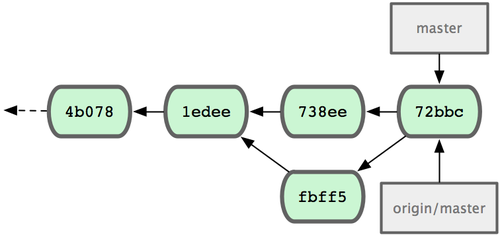
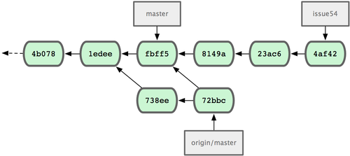
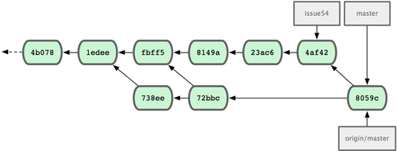
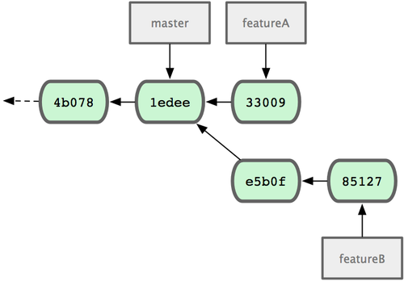
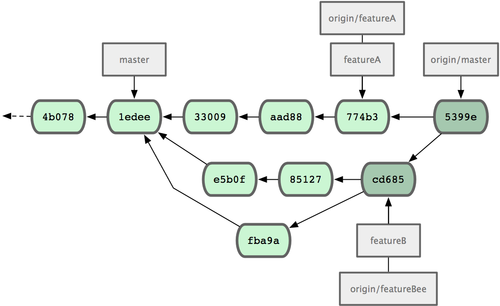
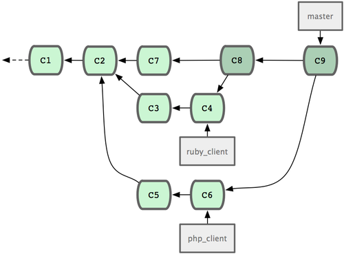
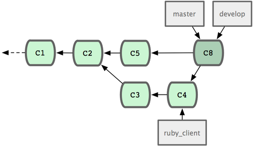

# Git での分散作業 #

リモート Git リポジトリを用意し、すべての開発者がコードを共有できるようになりました。また、ローカル環境で作業をする際に使う基本的な Git コマンドについても身についたことでしょう。次に、Git を使った分散作業の流れを見ていきましょう。

本章では、Git を使った分散環境での作業の流れを説明します。自分のコードをプロジェクトに提供する方法、そしてプロジェクトのメンテナーと自分の両方が作業を進めやすくする方法、そして多数の開発者からの貢献を受け入れるプロジェクトを運営する方法などを扱います。

## 分散作業の流れ ##

中央管理型のバージョン管理システム (Centralized Version Control System: CVCS) とは違い、Git は分散型だという特徴があります。この特徴を生かすと、プロジェクトの開発者間での共同作業をより柔軟に行えるようになります。中央管理型のシステムでは、個々の開発者は中央のハブに対するノードという位置づけとなります。しかし Git では、各開発者はノードであると同時にハブにもなり得ます。つまり、誰もが他のリポジトリに対してコードを提供することができ、誰もが公開リポジトリを管理して他の開発者の作業を受け入れることもできるということです。これは、みなさんのプロジェクトや開発チームでの作業の流れにさまざまな可能性をもたらします。本章では、この柔軟性を生かすいくつかの実例を示します。それぞれについて、利点だけでなく想定される弱点についても扱うので、適宜取捨選択してご利用ください。

### 中央集権型のワークフロー ###

中央管理型のシステムでは共同作業の方式は一つだけです。それが中央集権型のワークフローです。これは、中央にある一つのハブ (リポジトリ) がコードを受け入れ、他のメンバー全員がそこに作業内容を同期させるという流れです。多数の開発者がハブにつながるノードとなり、作業を一か所に集約します (図 5-1 を参照ください)。

図 5-1. 中央集権型のワークフロー

二人の開発者がハブからのクローンを作成して個々に変更をした場合、最初の開発者がそれをプッシュするのは特に問題なくできます。もう一人の開発者は、まず最初の開発者の変更をマージしてからサーバーへのプッシュを行い、最初の開発者の変更を消してしまわないようにします。この考え方は、Git 上でも Subversion (あるいはその他の CVCS) と同様に生かせます。そしてこの方式は Git でも完全に機能します。

小規模なチームに所属していたり、組織内で既に中央集権型のワークフローになじんでいたりなどの場合は、Git でその方式を続けることも簡単です。リポジトリをひとつ立ち上げて、チームのメンバー全員がそこにプッシュできるようにすればいいのです。Git は他のユーザーの変更を上書きしてしまうことはありません。誰かがクローンして手元で変更を加えた内容をプッシュしようとしたときに、もし既に他の誰かの変更がプッシュされていれば、サーバー側でそのプッシュは拒否されます。そして、直接プッシュすることはできないのでまずは変更内容をマージしなさいと教えてくれます。この方式は多くの人にとって魅力的なものでしょう。これまでにもなじみのある方式だし、今までそれでうまくやってきたからです。

### 統合マネージャー型のワークフロー ###

Git では複数のリモートリポジトリを持つことができるので、書き込み権限を持つ公開リポジトリを各自が持ち、他のメンバーからは読み込みのみのアクセスを許可するという方式をとることもできます。この方式には、「公式」プロジェクトを表す公式なリポジトリも含みます。このプロジェクトの開発に参加するには、まずプロジェクトのクローンを自分用に作成し、変更はそこにプッシュします。次に、メインプロジェクトのメンテナーに「変更を取り込んでほしい」とお願いします。メンテナーはあなたのリポジトリをリモートに追加し、変更を取り込んでマージします。そしてその結果をリポジトリにプッシュするのです。この作業の流れは次のようになります (図 5-2 を参照ください)。

1. プロジェクトのメンテナーが公開リポジトリにプッシュする
2. 開発者がそのリポジトリをクローンし、変更を加える
3. 開発者が各自の公開リポジトリにプッシュする
4. 開発者がメンテナーに「変更を取り込んでほしい」というメールを送る
5. メンテナーが開発者のリポジトリをリモートに追加し、それをマージする
6. マージした結果をメンテナーがメインリポジトリにプッシュする

図 5-2. 統合マネージャー型のワークフロー

これは GitHub のようなサイトでよく使われている流れです。プロジェクトを容易にフォークでき、そこにプッシュした内容をみんなに簡単に見てもらえます。この方式の主な利点の一つは、あなたはそのまま開発を続行し、メインリポジトリのメンテナーはいつでも好きなタイミングで変更を取り込めるということです。変更を取り込んでもらえるまで作業を止めて待つ必要はありません。自分のペースで作業を進められるのです。

### 独裁者と若頭型のワークフロー ###

これは、複数リポジトリ型のワークフローのひとつです。何百人もの開発者が参加するような巨大なプロジェクトで採用されています。有名どころでは Linux カーネルがこの方式です。統合マネージャーを何人も用意し、それぞれにリポジトリの特定の部分を担当させます。彼らは若頭 (lieutenant) と呼ばれます。そしてすべての若頭をまとめる統合マネージャーが「慈悲深い独裁者 (benevalent dictator)」です。独裁者のリポジトリが基準リポジトリとなり、すべてのメンバーはこれをプルします。この作業の流れは次のようになります (図 5-3 を参照ください)。

1. 一般の開発者はトピックブランチ上で作業を進め、master の先頭にリベースする。独裁者の master ブランチがマスターとなる
2. 若頭が各開発者のトピックブランチを自分の master ブランチにマージする
3. 独裁者が各若頭の master ブランチを自分の master ブランチにマージする
4. 独裁者が自分の master をリポジトリにプッシュし、他のメンバーがリベースできるようにする

図 5-3. 慈悲深い独裁者型のワークフロー

この手のワークフローはあまり一般的ではありませんが、大規模なプロジェクトや高度に階層化された環境では便利です。プロジェクトリーダー (独裁者) が大半の作業を委譲し、サブセット単位である程度まとまってからコードを統合することができるからです。

Git のような分散システムでよく使われるワークフローの多くは、実社会での何らかのワークフローにあてはめて考えることができます。これで、どのワークフローがあなたに合うかがわかったことでしょう (ですよね?)。次は、より特化した例をあげて個々のフローを実現する方法を見ていきましょう。

## プロジェクトへの貢献 ##

さまざまなワークフローの概要について説明しました。また、すでにみなさんは Git の基本的な使い方を身につけています。このセクションでは、何らかのプロジェクトに貢献する際のよくあるパターンについて学びましょう。

これは非常に説明しづらい内容です。というのも、ほんとうにいろいろなパターンがあるからです。Git は柔軟なシステムなので、いろいろな方法で共同作業をすることができます。そのせいもあり、どのプロジェクトをとってみても微妙に他とは異なる方式を使っているのです。違いが出てくる原因としては、アクティブな貢献者の数やプロジェクトで使用しているワークフロー、あなたのコミット権、そして外部からの貢献を受け入れる際の方式などがあります。

最初の要素はアクティブな貢献者の数です。そのプロジェクトに対してアクティブにコードを提供している開発者はどれくらいいるのか、そして彼らはどれくらいの頻度で提供しているのか。よくあるのは、数名の開発者が一日数回のコミットを行うというものです。休眠状態のプロジェクトなら、もう少し頻度が低くなるでしょう。大企業や大規模なプロジェクトでは、開発者の数が数千人になることもあります。数十から下手したら百を超えるようなパッチが毎日やってきます。開発者の数が増えれば増えるほど、あなたのコードをきちんと適用したり他のコードをマージしたりするのが難しくなります。あなたが手元で作業をしている間に他の変更が入って、手元で変更した内容が無意味になってしまったりあるいは他の変更を壊してしまう羽目になったり。そのせいで、手元の変更を適用してもらうための待ち時間が発生したり。手元のコードを常に最新の状態にし、正しいパッチを作るにはどうしたらいいのでしょうか。

次に考えるのは、プロジェクトが採用しているワークフローです。中央管理型で、すべての開発者がコードに対して同等の書き込みアクセス権を持っている状態? 特定のメンテナーや統合マネージャーがすべてのパッチをチェックしている? パッチを適用する前にピアレビューをしている? あなたはパッチをチェックしたりピアレビューに参加したりしている人? 若頭型のワークフローを使っており、まず彼らにコードを渡さなければならない?

次の問題は、あなたのコミット権です。あなたがプロジェクトへの書き込みアクセス権限を持っている場合は、プロジェクトに貢献するための作業の流れが変わってきます。書き込み権限がない場合、そのプロジェクトではどのような形式での貢献を推奨していますか? 何かポリシーのようなものはありますか? 一度にどれくらいの作業を貢献することになりますか? また、どれくらいの頻度で貢献することになりますか?

これらの点を考慮して、あなたがどんな流れでどのようにプロジェクトに貢献していくのかが決まります。単純なものから複雑なものまで、実際の例を見ながら考えていきましょう。これらの例を参考に、あなたなりのワークフローを見つけてください。

### コミットの指針 ###

個々の例を見る前に、コミットメッセージについてのちょっとした注意点をお話しておきましょう。コミットに関する指針をきちんと定めてそれを守るようにすると、Git での共同作業がよりうまく進むようになります。Git プロジェクトでは、パッチの投稿用のコミットを作成するときのヒントをまとめたドキュメントを用意しています。Git のソースの中にある `Documentation/SubmittingPatches` をごらんください。

まず、余計な空白文字を含めてしまわないように注意が必要です。Git には、余計な空白文字をチェックするための簡単な仕組みがあります。コミットする前に `git diff --check` を実行してみましょう。おそらく意図したものではないと思われる空白文字を探し、それを教えてくれます。例を示しましょう。端末上では赤で表示される箇所を `X` で置き換えています。

	$ git diff --check
	lib/simplegit.rb:5: trailing whitespace.
	+    @git_dir = File.expand_path(git_dir)XX
	lib/simplegit.rb:7: trailing whitespace.
	+ XXXXXXXXXXX
	lib/simplegit.rb:26: trailing whitespace.
	+    def command(git_cmd)XXXX

コミットの前にこのコマンドを実行すれば、余計な空白文字をコミットしてしまって他の開発者に嫌がられることもなくなるでしょう。

次に、コミットの単位が論理的に独立した変更となるようにしましょう。つまり、個々の変更内容を把握しやすくするということです。週末に五つの問題点を修正した大規模な変更を、月曜日にまとめてコミットするなどということは避けましょう。仮に週末の間にコミットできなかったとしても、ステージングエリアを活用して月曜日にコミット内容を調整することができます。修正した問題ごとにコミットを分割し、それぞれに適切なコメントをつければいいのです。もし別々の問題の修正で同じファイルを変更しているのなら、`git add --patch` を使ってその一部だけをステージすることもできます (詳しくは第 6 章で説明します)。すべての変更を同時に追加しさえすれば、一度にコミットしようが五つのコミットに分割しようがブランチの先端は同じ状態になります。あとから変更内容をレビューする他のメンバーのことも考えて、できるだけレビューしやすい状態でコミットするようにしましょう。こうしておけば、あとからその変更の一部だけを取り消したりするのにも便利です。第 6 章では、Git を使って歴史を書き換えたり対話的にファイルをステージしたりする方法を説明します。第 6 章で説明する方法を使えば、きれいでわかりやすい歴史を作り上げることができます。

最後に注意しておきたいのが、コミットメッセージです。よりよいコミットメッセージを書く習慣を身に着けておくと、Git を使った共同作業をより簡単に行えるようになります。一般的な規則として、メッセージの最初には変更の概要を一行 (50 文字以内) にまとめた説明をつけるようにします。その後に空行をひとつ置いてからより詳しい説明を続けます。Git プロジェクトでは、その変更の動機やこれまでの実装との違いなどのできるだけ詳しい説明をつけることを推奨しています。参考にするとよいでしょう。また、メッセージでは命令形、現在形を使うようにしています。つまり "私は○○のテストを追加しました (I added tests for)" とか "○○のテストを追加します (Adding tests for,)" ではなく "○○のテストを追加 (Add tests for.)" 形式にするということです。Tim Pope が tpope.net で書いたテンプレート (の日本語訳) を以下に示します。

	短い (50 文字以下での) 変更内容のまとめ

	必要に応じた、より詳細な説明。72文字程度で折り返します。最初の
	行がメールの件名、残りの部分がメールの本文だと考えてもよいでしょ
	う。最初の行と詳細な説明の間には、必ず空行を入れなければなりま
	せん (詳細説明がまったくない場合は空行は不要です)。空行がないと、
	rebase などがうまく動作しません。

	空行を置いて、さらに段落を続けることもできます。

	 - 箇条書きも可能

	 - 箇条書きの記号としては、主にハイフンやアスタリスクを使います。
	   箇条書き記号の前にはひとつ空白を入れ、各項目の間には空行を入
	   れます。しかし、これ以外の流儀もいろいろあります。

すべてのコミットメッセージがこのようになっていれば、他の開発者との作業が非常に進めやすくなるでしょう。Git プロジェクトでは、このようにきれいに整形されたコミットメッセージを使っています。`git log --no-merges` を実行すれば、きれいに整形されたプロジェクトの歴史がどのように見えるかがわかります。

これ以降の例を含めて本書では、説明を簡潔にするためにこのような整形を省略します。そのかわりに `git commit` の `-m` オプションを使います。本書での私のやり方をまねするのではなく、ここで説明した方式を使いましょう。

### 非公開な小規模のチーム ###

実際に遭遇するであろう環境のうち最も小規模なのは、非公開のプロジェクトで開発者が数名といったものです。ここでいう「非公開」とは、クローズドソースであるということ。つまり、チームのメンバー以外は見られないということです。チーム内のメンバーは全員、リポジトリへのプッシュ権限を持っています。

こういった環境では、今まで Subversion やその他の中央管理型システムを使っていたときとほぼ同じワークフローで作業を進めることができます。オフラインでコミットできたりブランチやマージが楽だったりといった Git ならではの利点はいかせますが、作業の流れ自体は今までとほぼ同じです。最大の違いは、マージが (コミット時にサーバー側で行われるのではなく) クライアント側で行われるということです。二人の開発者が共有リポジトリで開発を始めるときにどうなるかを見ていきましょう。最初の開発者 John が、リポジトリをクローンして変更を加え、それをローカルでコミットします (これ以降のメッセージでは、プロトコル関連のメッセージを `...` で省略しています)。

	# John のマシン
	$ git clone john@githost:simplegit.git
	Initialized empty Git repository in /home/john/simplegit/.git/
	...
	$ cd simplegit/
	$ vim lib/simplegit.rb
	$ git commit -am 'removed invalid default value'
	[master 738ee87] removed invalid default value
	 1 files changed, 1 insertions(+), 1 deletions(-)

もう一人の開発者 Jessica も同様に、リポジトリをクローンして変更をコミットしました。

	# Jessica のマシン
	$ git clone jessica@githost:simplegit.git
	Initialized empty Git repository in /home/jessica/simplegit/.git/
	...
	$ cd simplegit/
	$ vim TODO
	$ git commit -am 'add reset task'
	[master fbff5bc] add reset task
	 1 files changed, 1 insertions(+), 0 deletions(-)

Jessica が作業内容をサーバーにプッシュします。

	# Jessica のマシン
	$ git push origin master
	...
	To jessica@githost:simplegit.git
	   1edee6b..fbff5bc  master -> master

John も同様にプッシュしようとしました。

	# John のマシン
	$ git push origin master
	To john@githost:simplegit.git
	 ! [rejected]        master -> master (non-fast forward)
	error: failed to push some refs to 'john@githost:simplegit.git'

John はプッシュできませんでした。Jessica が先にプッシュを済ませていたからです。Subversion になじみのある人には特に注目してほしいのですが、ここで John と Jessica が編集していたのは別々のファイルです。Subversion ならこのような場合はサーバー側で自動的にマージを行いますが、Git の場合はローカルでマージしなければなりません。John は、まず Jessica の変更内容を取得してマージしてからでないと、自分の変更をプッシュできないのです。

	$ git fetch origin
	...
	From john@githost:simplegit
	 + 049d078...fbff5bc master     -> origin/master

この時点で、John のローカルリポジトリは図 5-4 のようになっています。

図 5-4. John のリポジトリ

John の手元に Jessica がプッシュした内容が届きましたが、さらにそれを彼自身の作業にマージしてからでないとプッシュできません。

	$ git merge origin/master
	Merge made by recursive.
	 TODO |    1 +
	 1 files changed, 1 insertions(+), 0 deletions(-)

マージがうまくいきました。John のコミット履歴は図 5-5 のようになります。

図 5-5. origin/master をマージした後の John のリポジトリ

自分のコードが正しく動作することを確認した John は、変更内容をサーバーにプッシュします。

	$ git push origin master
	...
	To john@githost:simplegit.git
	   fbff5bc..72bbc59  master -> master

最終的に、John のコミット履歴は図 5-6 のようになりました。

図 5-6. origin サーバーにプッシュした後の John の履歴

一方そのころ、Jessica はトピックブランチで作業を進めていました。`issue54` というトピックブランチを作成した彼女は、そこで 3 回コミットをしました。彼女はまだ John の変更を取得していません。したがって、彼女のコミット履歴は図 5-7 のような状態です。

図 5-7. Jessica のコミット履歴

Jessica は John の作業を取り込もうとしました。

	# Jessica のマシン
	$ git fetch origin
	...
	From jessica@githost:simplegit
	   fbff5bc..72bbc59  master     -> origin/master

これで、さきほど John がプッシュした内容が取り込まれました。Jessica の履歴は図 5-8 のようになります。

図 5-8. John の変更を取り込んだ後の Jessica の履歴

Jessica のトピックブランチ上での作業が完了しました。プッシュする前にどんな作業をマージしなければならないのかを知るため、彼女は `git log` コマンドを実行しました。

	$ git log --no-merges origin/master ^issue54
	commit 738ee872852dfaa9d6634e0dea7a324040193016
	Author: John Smith <jsmith@example.com>
	Date:   Fri May 29 16:01:27 2009 -0700

	    removed invalid default value

Jessica はトピックブランチの内容を自分の master ブランチにマージし、同じく John の作業 (`origin/master`) も自分の `master` ブランチにマージして再び変更をサーバーにプッシュすることになります。まずは master ブランチに戻り、これまでの作業を統合できるようにします。

	$ git checkout master
	Switched to branch "master"
	Your branch is behind 'origin/master' by 2 commits, and can be fast-forwarded.

`origin/master` と `issue54` のどちらからマージしてもかまいません。どちらも上流にあるので、マージする順序が変わっても結果は同じなのです。どちらの順でマージしても、最終的なスナップショットはまったく同じものになります。ただそこにいたる歴史が微妙に変わってくるだけです。彼女はまず `issue54` からマージすることにしました。

	$ git merge issue54
	Updating fbff5bc..4af4298
	Fast forward
	 README           |    1 +
	 lib/simplegit.rb |    6 +++++-
	 2 files changed, 6 insertions(+), 1 deletions(-)

何も問題は発生しません。ご覧の通り、単なる fast-forward です。次に Jessica は John の作業 (`origin/master`) をマージします。

	$ git merge origin/master
	Auto-merging lib/simplegit.rb
	Merge made by recursive.
	 lib/simplegit.rb |    2 +-
	 1 files changed, 1 insertions(+), 1 deletions(-)

こちらもうまく完了しました。Jessica の履歴は図 5-9 のようになります。

図 5-9. John の変更をマージした後の Jessica の履歴

これで、Jessica の `master` ブランチから `origin/master` に到達可能となります。これで自分の変更をプッシュできるようになりました (この作業の間に John は何もプッシュしていなかったものとします)。

	$ git push origin master
	...
	To jessica@githost:simplegit.git
	   72bbc59..8059c15  master -> master

各開発者が何度かコミットし、お互いの作業のマージも無事できました。図 5-10 をごらんください。

図 5-10. すべての変更をサーバーに書き戻した後の Jessica の履歴

これがもっとも単純なワークフローです。トピックブランチでしばらく作業を進め、統合できる状態になれば自分の master ブランチにマージする。他の開発者の作業を取り込む場合は、`origin/master` を取得してもし変更があればマージする。そして最終的にそれをサーバーの `master` ブランチにプッシュする。全体的な流れは図 5-11 のようになります。

図 5-11. 複数開発者での Git を使ったシンプルな開発作業のイベントシーケンス

### 非公開で管理されているチーム ###

次に扱うシナリオは、大規模な非公開のグループに貢献するものです。機能単位の小規模なグループで共同作業した結果を別のグループと統合するような環境での作業の進め方を学びましょう。

John と Jessica が共同でとある機能を実装しており、Jessica はそれとは別の件で Josie とも作業をしているものとします。彼らの勤務先は統合マネージャー型のワークフローを採用しており、各グループの作業を統合する担当者が決まっています。メインリポジトリの `master` ブランチを更新できるのは統合担当者だけです。この場合、すべての作業はチームごとのブランチで行われ、後で統合担当者がまとめることになります。

では、Jessica の作業の流れを追っていきましょう。彼女は二つの機能を同時に実装しており、それぞれ別の開発者と共同作業をしています。すでに自分用のリポジトリをクローンしている彼女は、まず `featureA` の作業を始めることにしました。この機能用に新しいブランチを作成し、そこで作業を進めます。

	# Jessica のマシン
	$ git checkout -b featureA
	Switched to a new branch "featureA"
	$ vim lib/simplegit.rb
	$ git commit -am 'add limit to log function'
	[featureA 3300904] add limit to log function
	 1 files changed, 1 insertions(+), 1 deletions(-)

自分の作業内容を John に渡すため、彼女は `featureA` ブランチへのコミットをサーバーにプッシュしました。Jessica には `master` ブランチへのプッシュをする権限はありません。そこにプッシュできるのは統合担当者だけなのです。そこで、John との共同作業用の別のブランチにプッシュします。

	$ git push origin featureA
	...
	To jessica@githost:simplegit.git
	 * [new branch]      featureA -> featureA

Jessica は John に「私の作業を `featureA` というブランチにプッシュしておいたので、見てね」というメールを送りました。John からの返事を待つ間、Jessica はもう一方の `featureB` の作業を Josie とはじめます。まず最初に、この機能用の新しいブランチをサーバーの `master` ブランチから作ります。

	# Jessica のマシン
	$ git fetch origin
	$ git checkout -b featureB origin/master
	Switched to a new branch "featureB"

そして Jessica は、`featureB` ブランチに何度かコミットしました。

	$ vim lib/simplegit.rb
	$ git commit -am 'made the ls-tree function recursive'
	[featureB e5b0fdc] made the ls-tree function recursive
	 1 files changed, 1 insertions(+), 1 deletions(-)
	$ vim lib/simplegit.rb
	$ git commit -am 'add ls-files'
	[featureB 8512791] add ls-files
	 1 files changed, 5 insertions(+), 0 deletions(-)

Jessica のリポジトリは図 5-12 のようになっています。

図 5-12. Jessica のコミット履歴

この変更をプッシュしようと思ったそのときに、Josie から「私の作業を `featureBee` というブランチにプッシュしておいたので、見てね」というメールがやってきました。Jessica はまずこの変更をマージしてからでないとサーバーにプッシュすることはできません。そこで、まず Josie の変更を `git fetch` で取得しました。

	$ git fetch origin
	...
	From jessica@githost:simplegit
	 * [new branch]      featureBee -> origin/featureBee

次に、`git merge` でこの内容を自分の作業にマージします。

	$ git merge origin/featureBee
	Auto-merging lib/simplegit.rb
	Merge made by recursive.
	 lib/simplegit.rb |    4 ++++
	 1 files changed, 4 insertions(+), 0 deletions(-)

ここでちょっとした問題が発生しました。彼女は、手元の `featureB` ブランチの内容をサーバーの `featureBee` ブランチにプッシュしなければなりません。このような場合は、`git push` コマンドでローカルブランチ名に続けてコロン (:) を書き、その後にリモートブランチ名を指定します。

	$ git push origin featureB:featureBee
	...
	To jessica@githost:simplegit.git
	   fba9af8..cd685d1  featureB -> featureBee

これは _refspec_ と呼ばれます。第 9 章で、Git の refspec の詳細とそれで何ができるのかを説明します。

さて、John からメールが返ってきました。「私の変更も `featureA` ブランチにプッシュしておいたので、確認よろしく」とのことです。彼女は `git fetch` でその変更を取り込みます。

	$ git fetch origin
	...
	From jessica@githost:simplegit
	   3300904..aad881d  featureA   -> origin/featureA

そして、`git log` で何が変わったのかを確認します。

	$ git log origin/featureA ^featureA
	commit aad881d154acdaeb2b6b18ea0e827ed8a6d671e6
	Author: John Smith <jsmith@example.com>
	Date:   Fri May 29 19:57:33 2009 -0700

	    changed log output to 30 from 25

確認を終えた彼女は、John の作業を自分の `featureA` ブランチにマージしました。

	$ git checkout featureA
	Switched to branch "featureA"
	$ git merge origin/featureA
	Updating 3300904..aad881d
	Fast forward
	 lib/simplegit.rb |   10 +++++++++-
	1 files changed, 9 insertions(+), 1 deletions(-)

Jessica はもう少し手を入れたいところがあったので、再びコミットしてそれをサーバーにプッシュします。

	$ git commit -am 'small tweak'
	[featureA 774b3ed] small tweak
	 1 files changed, 1 insertions(+), 1 deletions(-)
	$ git push origin featureA
	...
	To jessica@githost:simplegit.git
	   3300904..774b3ed  featureA -> featureA

Jessica のコミット履歴は、この時点で図 5-13 のようになります。

図 5-13. Jessica がブランチにコミットした後のコミット履歴

Jessica、Josie そして John は、統合担当者に「`featureA` ブランチと `featureBee` ブランチは本流に統合できる状態になりました」と報告しました。これらのブランチが本流に統合された後で本流を取得すると、マージコミットが新たに追加されて図 5-14 のような状態になります。

図 5-14. Jessica が両方のトピックブランチをマージしたあとのコミット履歴

Git へ移行するグループが続出しているのも、この「複数チームの作業を並行して進め、後で統合できる」という機能のおかげです。小さなグループ単位でリモートブランチを使った共同作業ができ、しかもそれがチーム全体の作業を妨げることがない。これは Git の大きな利点です。ここで見たワークフローをまとめると、図 5-15 のようになります。

図 5-15. 管理されたチームでのワークフローの基本的な流れ

### 小規模な公開プロジェクト ###

公開プロジェクトに貢献するとなると、また少し話が変わってきます。そのプロジェクトのブランチを直接更新できる権限はないでしょうから、何か別の方法でメンテナに接触する必要があります。最初の例では、フォークをサポートしている Git ホスティングサービスでフォークを使って貢献する方法を説明します。repo.or.cz と GitHub はどちらもフォークに対応しており、多くのメンテナはこの方式での協力を期待しています。そしてこの次のセクションでは、メールでパッチを送る形式での貢献について説明します。

まずはメインリポジトリをクローンしましょう。そしてパッチ用のトピックブランチを作り、そこで作業を進めます。このような流れになります。

	$ git clone (url)
	$ cd project
	$ git checkout -b featureA
	$ (作業)
	$ git commit
	$ (作業)
	$ git commit

`rebase -i` を使ってすべての作業をひとつのコミットにまとめたり、メンテナがレビューしやすいようにコミット内容を整理したりといったことも行うかもしれません。対話的なリベースの方法については第 6 章で詳しく説明します。

ブランチでの作業を終えてメンテナに渡せる状態になったら、プロジェクトのページに行って "Fork" ボタンを押し、自分用に書き込み可能なフォークを作成します。このリポジトリの URL をリモートとして追加しなければなりません。ここでは `myfork` という名前にしました。

	$ git remote add myfork (url)

自分の作業内容は、ここにプッシュすることになります。変更を master ブランチにマージしてからそれをプッシュするよりも、今作業中の内容をそのままリモートブランチにプッシュするほうが簡単でしょう。もしその変更が受け入れられなかったり一部だけが取り込まれたりした場合に、master ブランチを巻き戻す必要がなくなるからです。メンテナがあなたの作業をマージするかリベースするかあるいは一部だけ取り込むか、いずれにせよあなたはその結果をリポジトリから再度取り込むことになります。

	$ git push myfork featureA

自分用のフォークに作業内容をプッシュし終えたら、それをメンテナに伝えましょう。これは、よく「プルリクエスト」と呼ばれるもので、ウェブサイトから実行する (GutHub には "pull request" ボタンがあり、メンテナに自動的にメッセージを送ってくれます) こともできれば `git request-pull` コマンドの出力をプロジェクトのメンテナにメールで送ることもできます。

`request-pull` コマンドには、トピックブランチをプルしてもらいたい先のブランチとその Git リポジトリの URL を指定します。すると、プルしてもらいたい変更の概要が出力されます。たとえば Jessica が John にプルリクエストを送ろうとしたとしましょう。彼女はすでにトピックブランチ上で 2 回のコミットを済ませています。

	$ git request-pull origin/master myfork
	The following changes since commit 1edee6b1d61823a2de3b09c160d7080b8d1b3a40:
	  John Smith (1):
	        added a new function

	are available in the git repository at:

	  git://githost/simplegit.git featureA

	Jessica Smith (2):
	      add limit to log function
	      change log output to 30 from 25

	 lib/simplegit.rb |   10 +++++++++-
	 1 files changed, 9 insertions(+), 1 deletions(-)

この出力をメンテナに送れば「どのブランチからフォークしたのか、どういったコミットをしたのか、そしてそれをどこにプルしてほしいのか」を伝えることができます。

自分がメンテナになっていないプロジェクトで作業をする場合は、`master` ブランチでは常に `origin/master` を追いかけるようにし、自分の作業はトピックブランチで進めていくほうが楽です。そうすれば、パッチが拒否されたときも簡単にそれを捨てることができます。また、作業内容ごとにトピックブランチを分離しておけば、本流のリポジトリが更新されてパッチがうまく適用できなくなったとしても簡単にリベースできるようになります。たとえば、さきほどのプロジェクトに対して別の作業をすることになったとしましょう。その場合は、先ほどプッシュしたトピックブランチを使うのではなく、メインリポジトリの `master` ブランチから新たなトピックブランチを作成します。

	$ git checkout -b featureB origin/master
	$ (作業)
	$ git commit
	$ git push myfork featureB
	$ (メンテナにメールを送る)
	$ git fetch origin

これで、それぞれのトピックがサイロに入った状態になりました。お互いのトピックが邪魔しあったり依存しあったりすることなく、それぞれ個別に書き換えやリベースが可能となります。図 5-16 を参照ください。

図 5-16. featureB に関する作業のコミット履歴

プロジェクトのメンテナが、他の大量のパッチを適用したあとであなたの最初のパッチを適用しようとしました。しかしその時点でパッチはすでにそのままでは適用できなくなっています。こんな場合は、そのブランチを `origin/master` の先端にリベースして衝突を解決させ、あらためて変更内容をメンテナに送ります。

	$ git checkout featureA
	$ git rebase origin/master
	$ git push -f myfork featureA

これで、あなたの歴史は図 5-17 のように書き換えられました。

図 5-17. featureA の作業を終えた後のコミット履歴

ブランチをリベースしたので、プッシュする際には `-f` を指定しなければなりません。これは、サーバー上の `featureA` ブランチをその直系の子孫以外のコミットで上書きするためです。別のやり方として、今回の作業を別のブランチ (`featureAv2` など) にプッシュすることもできます。

もうひとつ別のシナリオを考えてみましょう。あなたの二番目のブランチを見たメンテナが、その考え方は気に入ったものの細かい実装をちょっと変更してほしいと連絡してきました。この場合も、プロジェクトの `master` ブランチから作業を進めます。現在の `origin/master` から新たにブランチを作成し、そこに `featureB` ブランチの変更を押し込み、もし衝突があればそれを解決し、実装をちょっと変更してからそれを新しいブランチとしてプッシュします。

	$ git checkout -b featureBv2 origin/master
	$ git merge --no-commit --squash featureB
	$ (実装をちょっと変更する)
	$ git commit
	$ git push myfork featureBv2

`--squash` オプションは、マージしたいブランチでのすべての作業をひとつのコミットにまとめ、それを現在のブランチの先頭にマージします。`--no-commit` オプションは、自動的にコミットを記録しないよう Git に指示しています。こうすれば、別のブランチのすべての変更を取り込んでさらに手元で変更を加えたものを新しいコミットとして記録できるのです。

そして、メンテナに「言われたとおりのちょっとした変更をしたものが `featureBv2` ブランチにあるよ」と連絡します (図 5-18 を参照ください)。

図 5-18. featureBv2 の作業を終えた後のコミット履歴

### 大規模な公開プロジェクト ###

多くの大規模プロジェクトでは、パッチを受け付ける手続きが確立されています。プロジェクトによっていろいろ異なるので、まずはそのプロジェクト固有のルールがないかどうか確認しましょう。しかし、大規模なプロジェクトの多くは開発者用メーリングリストへのパッチの投稿を受け付けています。そこで、ここではそれを例にとって話を進めます。

実際の作業の流れは先ほどとほぼ同じで、作業する内容ごとにトピックブランチを作成することになります。違うのは、パッチをプロジェクトに提供する方法です。プロジェクトをフォークし、自分用のリポジトリにプッシュするのではなく、個々のコミットについてメールを作成し、それを開発者用メーリングリストに投稿します。

	$ git checkout -b topicA
	$ (作業)
	$ git commit
	$ (作業)
	$ git commit

これで二つのコミットができあがりました。これらをメーリングリストに投稿します。`git format-patch` を使うと mbox 形式のファイルが作成されるので、これをメーリングリストに送ることができます。このコマンドは、コミットメッセージの一行目を件名、残りのコミットメッセージとコミット内容のパッチを本文に書いたメールを作成します。これのよいところは、`format-patch` で作成したメールからパッチを適用すると、すべてのコミット情報が適切に維持されるというところです。次のセクションで実際にパッチを適用するところになれば、よりはっきりと実感するでしょう。

	$ git format-patch -M origin/master
	0001-add-limit-to-log-function.patch
	0002-changed-log-output-to-30-from-25.patch

`format-patch` コマンドは、できあがったパッチファイルの名前を出力します。`-M` スイッチは、名前が変わったことを検出するためのものです。できあがったファイルは次のようになります。

	$ cat 0001-add-limit-to-log-function.patch
	From 330090432754092d704da8e76ca5c05c198e71a8 Mon Sep 17 00:00:00 2001
	From: Jessica Smith <jessica@example.com>
	Date: Sun, 6 Apr 2008 10:17:23 -0700
	Subject: [PATCH 1/2] add limit to log function

	Limit log functionality to the first 20

	---
	 lib/simplegit.rb |    2 +-
	 1 files changed, 1 insertions(+), 1 deletions(-)

	diff --git a/lib/simplegit.rb b/lib/simplegit.rb
	index 76f47bc..f9815f1 100644
	--- a/lib/simplegit.rb
	+++ b/lib/simplegit.rb
	@@ -14,7 +14,7 @@ class SimpleGit
	   end

	   def log(treeish = 'master')
	-    command("git log #{treeish}")
	+    command("git log -n 20 #{treeish}")
	   end

	   def ls_tree(treeish = 'master')
	--
	1.6.2.rc1.20.g8c5b.dirty

このファイルを編集して、コミットメッセージには書けなかったような情報をメーリングリスト用に追加することもできます。`--` の行とパッチの開始位置 (`lib/simplegit.rb` の行) の間にメッセージを書くと、メールを受信した人はそれを読むことができますが、パッチからは除外されます。

これをメーリングリストに投稿するには、メールソフトにファイルの内容を貼り付けるか、あるいはコマンドラインのプログラムを使います。ファイルの内容をコピーして貼り付けると「かしこい」メールソフトが勝手に改行の位置を変えてしまうなどの問題が起こりがちです。ありがたいことに Git には、きちんとしたフォーマットのパッチを IMAP で送ることを支援するツールが用意されています。これを使うと便利です。ここでは、パッチを Gmail で送る方法を説明しましょう。というのも、たまたま私が使ってるメールソフトが Gmail だからです。さまざまなメールソフトでの詳細なメール送信方法が、Git ソースコードにある `Documentation/SubmittingPatches` の最後に載っています。

まず。`~/.gitconfig` ファイルの imap セクションを設定します。それぞれの値を `git config` コマンドで順に設定してもかまいませんし、このファイルに手で書き加えてもかまいません。最終的に、設定ファイルは次のようになります。

	[imap]
	  folder = "[Gmail]/Drafts"
	  host = imaps://imap.gmail.com
	  user = user@gmail.com
	  pass = p4ssw0rd
	  port = 993
	  sslverify = false

IMAP サーバーで SSL を使っていない場合は、最後の二行はおそらく不要でしょう。そして host のところが `imaps://` ではなく `imap://` となります。ここまでの設定が終われば、`git send-email` を実行して IMAP サーバーの Drafts フォルダにパッチを置くことができるようになります。

	$ git send-email *.patch
	0001-added-limit-to-log-function.patch
	0002-changed-log-output-to-30-from-25.patch
	Who should the emails appear to be from? [Jessica Smith <jessica@example.com>]
	Emails will be sent from: Jessica Smith <jessica@example.com>
	Who should the emails be sent to? jessica@example.com
	Message-ID to be used as In-Reply-To for the first email? y

Git はその後、各パッチについてこのようなログ情報をはき出すはずです。

	(mbox) Adding cc: Jessica Smith <jessica@example.com> from
	  \line 'From: Jessica Smith <jessica@example.com>'
	OK. Log says:
	Sendmail: /usr/sbin/sendmail -i jessica@example.com
	From: Jessica Smith <jessica@example.com>
	To: jessica@example.com
	Subject: [PATCH 1/2] added limit to log function
	Date: Sat, 30 May 2009 13:29:15 -0700
	Message-Id: <1243715356-61726-1-git-send-email-jessica@example.com>
	X-Mailer: git-send-email 1.6.2.rc1.20.g8c5b.dirty
	In-Reply-To: <y>
	References: <y>

	Result: OK

あとは、Drafts フォルダに移動して To フィールドをメーリングリストのアドレスに変更し (おそらく CC には担当メンテなのアドレスを入れ)、送信できるようになりました。

### まとめ ###

このセクションでは、今後みなさんが遭遇するであろうさまざまな形式の Git プロジェクトについて、関わっていくための作業手順を説明しました。そして、その際に使える新兵器もいくつか紹介しました。次はもう一方の側、つまり Git プロジェクトを運営する側について見ていきましょう。慈悲深い独裁者、あるいは統合マネージャーとしての作業手順を説明します。

## プロジェクトの運営 ##

プロジェクトに貢献する方法だけでなく、プロジェクトを運営する方法についても知っておくといいでしょう。たとえば `format-patch` を使ってメールで送られてきたパッチを処理する方法や、別のリポジトリのリモートブランチでの変更を統合する方法などです。本流のリポジトリを保守するにせよパッチの検証や適用を手伝うにせよ、どうすれば貢献者たちにとってわかりやすくなるかを知っておくべきでしょう。

### トピックブランチでの作業 ###

新しい機能を組み込もうと考えている場合は、トピックブランチを作ることをおすすめします。トピックブランチとは、新しく作業を始めるときに一時的に作るブランチのことです。そうすれば、そのパッチだけを個別にいじることができ、もしうまくいかなかったとしてもすぐに元の状態に戻すことができます。ブランチの名前は、今からやろうとしている作業の内容にあわせたシンプルな名前にしておきます。たとえば `ruby_client` などといったものです。そうすれば、しばらく時間をおいた後でそれを廃棄することになったときに、内容を思い出しやすくなります。Git プロジェクトのメンテナは、ブランチ名に名前空間を使うことが多いようです。たとえば `sc/ruby_client` のようになり、ここでの `sc` はその作業をしてくれた人の名前を短縮したものとなります。自分の master ブランチをもとにしたブランチを作成する方法は、このようになります。

	$ git branch sc/ruby_client master

作成してすぐそのブランチに切り替えたい場合は、`checkout -b` コマンドを使います。

	$ git checkout -b sc/ruby_client master

受け取った作業はこのトピックブランチですすめ、長期ブランチに統合するかどうかを判断することになります。

### メールで受け取ったパッチの適用 ###

あなたのプロジェクトへのパッチをメールで受け取った場合は、まずそれをトピックブランチに適用して中身を検証します。メールで届いたパッチを適用するには `git apply` と `git am` の二通りの方法があります。

#### apply でのパッチの適用 ####

`git diff` あるいは Unix の `diff` コマンドで作ったパッチを受け取ったときは、`git apply` コマンドを使ってパッチを適用します。パッチが `/tmp/patch-ruby-client.patch` にあるとすると、このようにすればパッチを適用できます。

	$ git apply /tmp/patch-ruby-client.patch

これは、作業ディレクトリ内のファイルを変更します。`patch -p1` コマンドでパッチをあてるのとほぼ同じなのですが、それ以上に「これでもか」というほどのこだわりを持ってパッチを適用するので fuzzy マッチになる可能性が少なくなります。また、`git diff` 形式ではファイルの追加・削除やファイル名の変更も扱うことができますが、`patch` コマンドにはそれはできません。そして最後に、`git apply` は「全部適用するか、あるいは一切適用しないか」というモデルを採用しています。一方 `patch` コマンドの場合は、途中までパッチがあたった中途半端な状態になって困ることがあります。`git apply` のほうが、 `patch` よりもこだわりを持った処理を行うのです。`git apply` コマンドはコミットを作成するわけではありません。実行した後で、その変更をステージしてコミットする必要があります。

git apply を使って、そのパッチをきちんと適用できるかどうかを事前に確かめることができます。パッチをチェックするには `git apply --check` を実行します。

	$ git apply --check 0001-seeing-if-this-helps-the-gem.patch
	error: patch failed: ticgit.gemspec:1
	error: ticgit.gemspec: patch does not apply

何も出力されなければ、そのパッチはうまく適用できるということです。このコマンドは、チェックに失敗した場合にゼロ以外の値を返して終了します。スクリプト内でチェックしたい場合などにはこの返り値を使用します。

#### am でのパッチの適用 ####

コードを提供してくれた人が Git のユーザーで、`format-patch` コマンドを使ってパッチを送ってくれたとしましょう。この場合、あなたの作業はより簡単になります。パッチの中に、作者の情報やコミットメッセージも含まれているからです。「パッチを作るときには、できるだけ `diff` ではなく `format-patch` を使ってね」とお願いしてみるのもいいでしょう。昔ながらの形式のパッチが届いたときだけは `git apply` を使わなければならなくなります。

`format-patch` で作ったパッチを適用するには `git am` を使います。技術的なお話をすると、`git am` は mbox ファイルを読み込む仕組みになっています。mbox はシンプルなプレーンテキスト形式で、一通あるいは複数のメールのメッセージをひとつのテキストファイルにまとめるためのものです。中身はこのようになります。

	From 330090432754092d704da8e76ca5c05c198e71a8 Mon Sep 17 00:00:00 2001
	From: Jessica Smith <jessica@example.com>
	Date: Sun, 6 Apr 2008 10:17:23 -0700
	Subject: [PATCH 1/2] add limit to log function

	Limit log functionality to the first 20

先ほどのセクションでごらんいただいたように、format-patch コマンドの出力結果もこれと同じ形式で始まっていますね。これは、mbox 形式のメールフォーマットとしても正しいものです。git send-email を正しく使ったパッチが送られてきた場合、受け取ったメールを mbox 形式で保存して git am コマンドでそのファイルを指定すると、すべてのパッチの適用が始まります。複数のメールをまとめてひとつの mbox に保存できるメールソフトを使っていれば、送られてきたパッチをひとつのファイルにまとめて git am で一度に適用することもできます。

しかし、`format-patch` で作ったパッチがチケットシステム (あるいはそれに類する何か) にアップロードされたような場合は、まずそのファイルをローカルに保存して、それを `git am` に渡すことになります。

	$ git am 0001-limit-log-function.patch
	Applying: add limit to log function

どんなパッチを適用したのかが表示され、コミットも自動的に作られます。作者の情報はメールの `From` ヘッダと `Date` ヘッダから取得し、コミットメッセージは `Subject` とメールの本文 (パッチより前の部分) から取得します。たとえば、先ほどごらんいただいた mbox の例にあるパッチを適用した場合は次のようなコミットとなります。

	$ git log --pretty=fuller -1
	commit 6c5e70b984a60b3cecd395edd5b48a7575bf58e0
	Author:     Jessica Smith <jessica@example.com>
	AuthorDate: Sun Apr 6 10:17:23 2008 -0700
	Commit:     Scott Chacon <schacon@gmail.com>
	CommitDate: Thu Apr 9 09:19:06 2009 -0700

	   add limit to log function

	   Limit log functionality to the first 20

`Commit` には、そのパッチを適用した人と適用した日時が表示されます。`Author` には、そのパッチを実際に作成した人と作成した日時が表示されます。

しかし、パッチが常にうまく適用できるとは限りません。パッチを作成したときの状態と現在のメインブランチとが大きくかけ離れてしまっていたり、そのパッチが別の (まだ適用していない) パッチに依存していたりなどといったことがあり得るでしょう。そんな場合は `git am` は失敗し、次にどうするかを聞かれます。

	$ git am 0001-seeing-if-this-helps-the-gem.patch
	Applying: seeing if this helps the gem
	error: patch failed: ticgit.gemspec:1
	error: ticgit.gemspec: patch does not apply
	Patch failed at 0001.
	When you have resolved this problem run "git am --resolved".
	If you would prefer to skip this patch, instead run "git am --skip".
	To restore the original branch and stop patching run "git am --abort".

このコマンドは、何か問題が発生したファイルについて衝突マークを書き込みます。これは、マージやリベースに失敗したときに書き込まれるのとよく似たものです。問題を解決する方法も同じです。まずはファイルを編集して衝突を解決し、新しいファイルをステージし、`git am --resolved` を実行して次のパッチに進みます。

	$ (ファイルを編集する)
	$ git add ticgit.gemspec
	$ git am --resolved
	Applying: seeing if this helps the gem

Git にもうちょっと賢く働いてもらって衝突を回避したい場合は、`-3` オプションを使用します。これは、Git で三方向のマージを行うオプションです。このオプションはデフォルトでは有効になっていません。適用するパッチの元になっているコミットがあなたのリポジトリ上のものでない場合に正しく動作しないからです。パッチの元になっているコミットが手元にある場合は、`-3` オプションを使うと、衝突しているパッチをうまく適用できます。

	$ git am -3 0001-seeing-if-this-helps-the-gem.patch
	Applying: seeing if this helps the gem
	error: patch failed: ticgit.gemspec:1
	error: ticgit.gemspec: patch does not apply
	Using index info to reconstruct a base tree...
	Falling back to patching base and 3-way merge...
	No changes -- Patch already applied.

ここでは、既に適用済みのパッチを適用してみました。`-3` オプションがなければ、衝突が発生していたことでしょう。

たくさんのパッチが含まれる mbox からパッチを適用するときには、`am` コマンドを対話モードで実行することもできます。パッチが見つかるたびに処理を止め、それを適用するかどうかの確認を求められます。

	$ git am -3 -i mbox
	Commit Body is:
	--------------------------
	seeing if this helps the gem
	--------------------------
	Apply? [y]es/[n]o/[e]dit/[v]iew patch/[a]ccept all

これは、「大量にあるパッチについて、内容をまず一通り確認したい」「既に適用済みのパッチは適用しないようにしたい」などの場合に便利です。

トピックブランチ上でそのトピックに関するすべてのパッチの適用を済ませてコミットすれば、次はそれを長期ブランチに統合するかどうか (そしてどのように統合するか) を考えることになります。

### リモートブランチのチェックアウト ###

自前のリポジトリを持つ Git ユーザーが自分のリポジトリに変更をプッシュし、そのリポジトリの URL とリモートブランチ名だけをあなたにメールで連絡してきた場合のことを考えてみましょう。そのリポジトリをリモートとして登録し、それをローカルにマージすることになります。

Jessica から「すばらしい新機能を作ったので、私のリポジトリの `ruby-client` ブランチを見てください」といったメールが来たとします。これを手元でテストするには、リモートとしてこのリポジトリを追加し、ローカルにブランチをチェックアウトします。

	$ git remote add jessica git://github.com/jessica/myproject.git
	$ git fetch jessica
	$ git checkout -b rubyclient jessica/ruby-client

「この前のとは違う、別のすばらしい機能を作ったの!」と別のブランチを伝えられた場合は、すでにリモートの設定が済んでいるので単にそのブランチを取得してチェックアウトするだけで確認できます。

この方法は、誰かと継続的に共同作業を進めていく際に便利です。ちょっとしたパッチをたまに提供してくれるだけの人の場合は、パッチをメールで受け取るようにしたほうが時間の節約になるでしょう。全員に自前のサーバーを用意させて、たまに送られてくるパッチを取得するためだけに定期的にリモートの追加と削除を行うなどというのは時間の無駄です。ほんの数件のパッチを提供してくれる人たちを含めて数百ものリモートを管理することなど、きっとあなたはお望みではないでしょう。しかし、スクリプトやホスティングサービスを使えばこの手の作業は楽になります。つまり、どのような方式をとるかは、あなたや他のメンバーがどのような方式で開発を進めるかによって決まります。

この方式のもうひとつの利点は、コミットの履歴も同時に取得できるということです。マージの際に問題が起こることもあるでしょうが、そんな場合にも相手の作業が自分側のどの地点に基づくものなのかを知ることができます。適切に三方向のマージが行われるので、`-3` を指定したときに「このパッチの基点となるコミットにアクセスできればいいなぁ」と祈る必要はありません。

継続的に共同作業を続けるわけではないけれど、それでもこの方式でパッチを取得したいという場合は、リモートリポジトリの URL を `git pull` コマンドで指定することもできます。これは一度きりのプルに使うものであり、リモートを参照する URL は保存されません。

	$ git pull git://github.com/onetimeguy/project.git
	From git://github.com/onetimeguy/project
	 * branch            HEAD       -> FETCH_HEAD
	Merge made by recursive.

### 何が変わるのかの把握 ###

トピックブランチの中に、提供してもらった作業が含まれた状態になりました。次に何をすればいいのか考えてみましょう。このセクションでは、これまでに扱ったいくつかのコマンドを復習します。それらを使って、もしこの変更をメインブランチにマージしたらいったい何が起こるのかを調べていきましょう。

トピックブランチのコミットのうち、master ブランチに存在しないコミットの内容をひとつひとつレビューできれば便利でしょう。master ブランチに含まれるコミットを除外するには、ブランチ名の前に `--not` オプションを指定します。たとえば、誰かから受け取った二つのパッチを適用するために `contrib` というブランチを作成したとすると、

	$ git log contrib --not master
	commit 5b6235bd297351589efc4d73316f0a68d484f118
	Author: Scott Chacon <schacon@gmail.com>
	Date:   Fri Oct 24 09:53:59 2008 -0700

	    seeing if this helps the gem

	commit 7482e0d16d04bea79d0dba8988cc78df655f16a0
	Author: Scott Chacon <schacon@gmail.com>
	Date:   Mon Oct 22 19:38:36 2008 -0700

	    updated the gemspec to hopefully work better

このようなコマンドを実行すればそれぞれのコミットの内容を確認できます。`git log` に `-p` オプションを渡せば、コミットの後に diff を表示させることもできます。これも以前に説明しましたね。

このトピックブランチを別のブランチにマージしたときに何が起こるのかを完全な diff で知りたい場合は、ちょっとした裏技を使わないと正しい結果が得られません。おそらく「こんなコマンドを実行するだけじゃないの?」と考えておられることでしょう。

	$ git diff master

このコマンドで表示される diff は、誤解を招きかねないものです。トピックブランチを切った時点からさらに `master` ブランチが先に進んでいたとすると、これは少し奇妙に見える結果を返します。というのも、Git は現在のトピックブランチの最新のコミットのスナップショットと `master` ブランチの最新のコミットのスナップショットを直接比較するからです。トピックブランチを切った後に `master` ブランチ上であるファイルに行を追加したとすると、スナップショットを比較した結果は「トピックブランチでその行を削除しようとしている」状態になります。

`master` がトピックブランチの直系の先祖である場合は、これは特に問題とはなりません。しかし二つの歴史が分岐している場合には、diff の結果は「トピックブランチで新しく追加したすべての内容を追加し、`master` ブランチにしかないものはすべて削除する」というものになります。

本当に知りたいのはトピックブランチで変更された内容、つまりこのブランチを master にマージしたときに master に加わる変更です。これを知るには、Git に「トピックブランチの最新のコミット」と「トピックブランチと master ブランチの直近の共通の先祖」とを比較させます。

共通の先祖を見つけだしてそこからの diff を取得するには、このようにします。

	$ git merge-base contrib master
	36c7dba2c95e6bbb78dfa822519ecfec6e1ca649
	$ git diff 36c7db

しかし、これでは不便です。そこで Git には、同じことをより手短にやるための手段としてトリプルドット構文が用意されています。`diff` コマンドを実行するときにピリオドを三つ打った後に別のブランチを指定すると、「現在いるブランチの最新のコミット」と「指定した二つのブランチの共通の先祖」とを比較するようになります。

	$ git diff master...contrib

このコマンドは、master との共通の先祖から分岐した現在のトピックブランチで変更された内容のみを表示します。この構文は、覚えやすいので非常に便利です。

### 提供された作業の取り込み ###

トピックブランチでの作業をメインブランチに取り込む準備ができたら、どのように取り込むかを考えることになります。さらに、プロジェクトを運営していくにあたっての全体的な作業の流れはどのようにしたらいいでしょうか? さまざまな方法がありますが、ここではそのうちのいくつかを紹介します。

#### マージのワークフロー ####

シンプルなワークフローのひとつとして、作業を自分の `master` ブランチに取り込むことを考えます。ここでは、`master` ブランチで安定版のコードを管理しているものとします。トピックブランチでの作業が一段落したら (あるいは誰かから受け取ったパッチをトピックブランチ上で検証し終えたら)、それを master ブランチにマージしてからトピックブランチを削除し、作業を進めることになります。`ruby_client` および `php_client` の二つのブランチを持つ図 5-19 のようなリポジトリでまず `ruby_client` をマージしてから `php_client` もマージすると、歴史は図 5-20 のようになります。

図 5-19. いくつかのトピックブランチを含む履歴

図 5-20. トピックブランチをマージした後の状態

これがおそらく一番シンプルなワークフローでしょうが、大規模なリポジトリやプロジェクトで作業をしていると問題が発生することもあります。

多人数で開発していたり大規模なプロジェクトに参加していたりする場合は、二段階以上のマージサイクルを使うこともあるでしょう。ここでは、長期間運用するブランチが `master` と `develop` のふたつあるものとします。`master` が更新されるのは安定版がリリースされるときだけで、新しいコードはずべて `develop` ブランチに統合されるという流れです。これらのブランチは、両方とも定期的に公開リポジトリにプッシュすることになります。新しいトピックブランチをマージする準備ができたら (図 5-21)、それを `develop` にマージします (図 5-22)。そしてリリースタグを打つときに、`master` を現在の `develop` ブランチが指す位置に進めます (図 5-23)。

図 5-21. トピックブランチのマージ前

図 5-22. トピックブランチのマージ後

図 5-23. トピックブランチのリリース後

他の人があなたのプロジェクトをクローンするときには、master をチェックアウトすれば最新の安定版をビルドすることができ、その後の更新を追いかけるのも容易にできるようになります。一方 develop をチェックアウトすれば、さらに最先端の状態を取得することができます。この考え方を推し進めると、統合用のブランチを用意してすべての作業をいったんそこにマージするようにもできます。統合ブランチ上のコードが安定してテストを通過すれば、それを develop ブランチにマージします。そしてそれが安定していることが確認できたら master ブランチを先に進めるということになります。

#### 大規模マージのワークフロー ####

Git 開発プロジェクトには、常時稼働するブランチが四つあります。`master`、`next`、そして新しい作業用の `pu` (proposed updates) とメンテナンスバックポート用の `maint` です。新しいコードを受け取ったメンテナは、まず自分のリポジトリのトピックブランチにそれを格納します。先ほど説明したのと同じ方式です (図 5-24 を参照ください)。そしてその内容を検証し、安全に取り込める状態かさらなる作業が必要かを見極めます。だいじょうぶだと判断したらそれを `next` にマージします。このブランチをプッシュすれば、すべてのメンバーがそれを試せるようになります。

図 5-24. 複数のトピックブランチの並行管理

さらに作業が必要なトピックについては、`pu` にマージします。完全に安定していると判断されたトピックについては改めて `master` にマージされ、`next` にあるトピックのうちまだ `master` に入っていないものを再構築します。つまり、`master` はほぼ常に前に進み、`next` は時々リベースされ、`pu` はそれ以上の頻度でリベースされることになります (図 5-25 を参照ください)。

図 5-25. 常時稼働する統合用ブランチへのトピックブランチのマージ

最終的に `master` にマージされたトピックブランチは、リポジトリから削除します。Git 開発プロジェクトでは `maint` ブランチも管理しています。これは最新のリリースからフォークしたもので、メンテナンスリリースに必要なバックポート用のパッチを管理します。つまり、Git のリポジトリをクローンするとあなたは四つのブランチをチェックアウトすることができるということです。これらのブランチはどれも異なる開発段階を表し、「どこまで最先端を追いかけたいか」「どのように Git プロジェクトに貢献したいか」によって使い分けることになります。メンテナ側では、新たな貢献を受け入れるためのワークフローが整っています。

#### リベースとチェリーピックのワークフロー ####

受け取った作業を master ブランチにマージするのではなく、リベースやチェリーピックを使って master ブランチの先端につなげていく方法を好むメンテナもいます。そのほうがほぼ直線的な歴史を保てるからです。トピックブランチでの作業を終えて統合できる状態になったと判断したら、そのブランチで rebase コマンドを実行し、その変更を現在の master (あるいは `develop` などの) ブランチの先端につなげます。うまくいけば、`master` ブランチをそのまま前に進めてることでプロジェクトの歴史を直線的に進めることができます。

あるブランチの作業を別のブランチに移すための手段として、他にチェリーピック (つまみぐい) という方法があります。Git におけるチェリーピックとは、コミット単位でのリベースのようなものです。あるコミットによって変更された内容をパッチとして受け取り、それを現在のブランチに再適用します。トピックブランチでいくつかコミットしたうちのひとつだけを統合したい場合、あるいはトピックブランチで一回だけコミットしたけれどそれをリベースではなくチェリーピックで取り込みたい場合などにこの方法を使用します。図 5-26 のようなプロジェクトを例にとって考えましょう。

図 5-26. チェリーピック前の歴史

コミット `e43a6` を master ブランチに取り込むには、次のようにします。

	$ git cherry-pick e43a6fd3e94888d76779ad79fb568ed180e5fcdf
	Finished one cherry-pick.
	[master]: created a0a41a9: "More friendly message when locking the index fails."
	 3 files changed, 17 insertions(+), 3 deletions(-)

これは `e43a6` と同じ内容の変更を施しますが、コミットの SHA-1 値は新しくなります。適用した日時が異なるからです。これで、歴史は図 5-27 のように変わりました。

図 5-27. トピックブランチのコミットをチェリーピックした後の歴史

あとは、このトピックブランチを削除すれば取り込みたくない変更を消してしまうことができます。

### リリース用のタグ付け ###

いよいよリリースする時がきました。おそらく、後からいつでもこのリリースを取得できるようにタグを打っておくことになるでしょう。新しいタグを打つ方法は第 2 章で説明しました。タグにメンテナの署名を入れておきたい場合は、このようにします。

	$ git tag -s v1.5 -m 'my signed 1.5 tag'
	You need a passphrase to unlock the secret key for
	user: "Scott Chacon <schacon@gmail.com>"
	1024-bit DSA key, ID F721C45A, created 2009-02-09

タグに署名した場合、署名に使用した PGP 鍵ペアの公開鍵をどのようにして配布するかが問題になるかもしれません。Git 開発プロジェクトのメンテナ達がこの問題をどのように解決したかというと、自分たちの公開鍵を blob としてリポジトリに含め、それを直接指すタグを追加することにしました。この方法を使うには、まずどの鍵を使うかを決めるために `gpg --list-keys` を実行します。

	$ gpg --list-keys
	/Users/schacon/.gnupg/pubring.gpg
	---------------------------------
	pub   1024D/F721C45A 2009-02-09 [expires: 2010-02-09]
	uid                  Scott Chacon <schacon@gmail.com>
	sub   2048g/45D02282 2009-02-09 [expires: 2010-02-09]

鍵を直接 Git データベースにインポートするには、鍵をエクスポートしてそれをパイプで `git hash-object` に渡します。これは、鍵の中身を新しい blob として Git に書き込み、その blob の SHA-1 を返します。

	$ gpg -a --export F721C45A | git hash-object -w --stdin
	659ef797d181633c87ec71ac3f9ba29fe5775b92

鍵の中身を Git に取り込めたので、この鍵を直接指定するタグを作成できるようになりました。`hash-object` コマンドで知った SHA-1 値を指定すればいいのです。

	$ git tag -a maintainer-pgp-pub 659ef797d181633c87ec71ac3f9ba29fe5775b92

`git push --tags` を実行すると、`maintainer-pgp-pub` タグをみんなと共有できるようになります。誰かがタグを検証したい場合は、あなたの PGP 鍵が入った blob をデータベースから直接プルで取得し、それを PGP にインポートすればいいのです。

	$ git show maintainer-pgp-pub | gpg --import

この鍵をインポートした人は、あなたが署名したすべてのタグを検証できるようになります。タグのメッセージに検証手順の説明を含めておけば、`git show <tag>` でエンドユーザー向けに詳しい検証手順を示すことができます。

### ビルド番号の生成 ###

Git では、コミットごとに 'v123' のような単調な番号を振っていくことはありません。もし特定のコミットに対して人間がわかりやすい名前がほしければ、そのコミットに対して `git describe` を実行します。Git は、そのコミットに最も近いタグの名前とそのタグからのコミット数、そしてそのコミットの SHA-1 値の一部を使った名前を作成します。

	$ git describe master
	v1.6.2-rc1-20-g8c5b85c

これで、スナップショットやビルドを公開するときにわかりやすい名前をつけられるようになります。実際、Git そのもののソースコードを Git リポジトリからクローンしてビルドすると、`git --version` が返す結果はこの形式になります。タグが打たれているコミットを直接指定した場合は、タグの名前が返されます。

`git describe` コマンドは注釈付きのタグ (`-a` あるいは `-s` フラグをつけて作成したタグ) を使います。したがって、`git describe` を使うならリリースタグは注釈付きのタグとしなければなりません。そうすれば、describe したときにコミットの名前を適切につけることができます。この文字列を checkout コマンドや show コマンドでの対象の指定に使うこともできますが、これは末尾にある SHA-1 値の省略形に依存しているので将来にわたってずっと使えるとは限りません。たとえば Linux カーネルは、最近 SHA-1 オブジェクトの一意性を確認するための文字数を 8 文字から 10 文字に変更しました。そのため、古い `git describe` の出力での名前はもはや使えません。

### リリースの準備 ###

実際にリリースするにあたって行うであろうことのひとつに、最新のスナップショットのアーカイブを作るという作業があります。Git を使っていないというかわいそうな人たちにもコードを提供するために。その際に使用するコマンドは `git archive` です。

	$ git archive master --prefix='project/' | gzip > `git describe master`.tar.gz
	$ ls *.tar.gz
	v1.6.2-rc1-20-g8c5b85c.tar.gz

tarball を開けば、プロジェクトのディレクトリの下に最新のスナップショットが得られます。まったく同じ方法で zip アーカイブを作成することもできます。この場合は `git archive` で `--format=zip` オプションを指定します。

	$ git archive master --prefix='project/' --format=zip > `git describe master`.zip

これで、あなたのプロジェクトのリリース用にすてきな tarball と zip アーカイブができあがりました。これをウェブサイトにアップロードするなりメールで送ってあげるなりしましょう。

### 短いログ ###

そろそろメーリングリストにメールを送り、プロジェクトに何が起こったのかをみんなに知らせてあげましょう。前回のリリースから何が変わったのかの変更履歴を手軽に取得するには `git shortlog` コマンドを使います。これは、指定した範囲のすべてのコミットのまとめを出力します。たとえば、直近のリリースの名前が v1.0.1 だった場合は、次のようにすると前回のリリース以降のすべてのコミットの概要が得られます。

	$ git shortlog --no-merges master --not v1.0.1
	Chris Wanstrath (8):
	      Add support for annotated tags to Grit::Tag
	      Add packed-refs annotated tag support.
	      Add Grit::Commit#to_patch
	      Update version and History.txt
	      Remove stray `puts`
	      Make ls_tree ignore nils

	Tom Preston-Werner (4):
	      fix dates in history
	      dynamic version method
	      Version bump to 1.0.2
	      Regenerated gemspec for version 1.0.2

v1.0.1 以降のすべてのコミットの概要が、作者別にまとめて得られました。これをメーリングリストに投稿するといいでしょう。

## まとめ ##

Git を使っているプロジェクトにコードを提供したり、自分のプロジェクトに他のユーザーからのコードを取り込んだりといった作業を安心してこなせるようになりましたね。おめでとうございます。Git を使いこなせる開発者の仲間入りです! 次の章では、複雑な状況に対応するためのより強力なツールやヒントを学びます。これであなたは真の Git マスターとなることでしょう。
