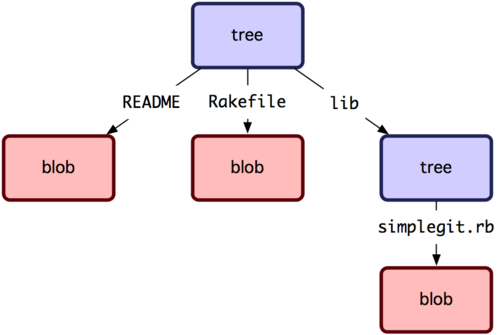
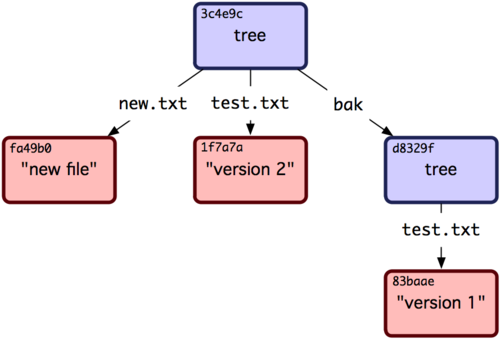
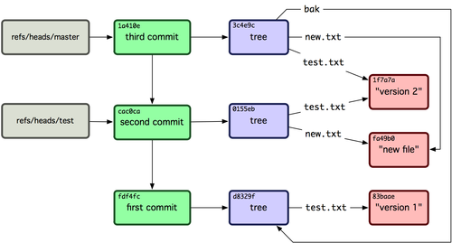

# Gitの内側 #

あなたは前の章を飛ばしてこの章に来たのでしょうか、あるいは、この本の他の部分を読んだ後で来たのでしょうか。いずれにせよ、この章ではGit の内部動作と実装を辿っていくことになります。内部動作と実装を学ぶことは、Git がどうしてこんなに便利で有効なのかを根本的に理解するのに重要です。しかし初心者にとっては不必要に複雑で混乱を招いてしまうという人もいました。そのため、遅かれ早かれ学習の仕方に合わせて読めるように、この話題を最後の章に配置しました。いつ読むかって？　それは読者の判断にお任せします。

もう既にあなたはこの章を読んでいますので、早速、開始しましょう。まず、基本的にGit は連想記憶ファイル・システム（content-addressable filesystem）であり、その上にVCS ユーザー・インターフェイスが記述されているのです。これが意味することを、もう少し見て行きましょう。

初期のGit（主として1.5以前）は、洗練されたVCS というよりもむしろファイル・システムであることを（Gitの特徴として）強調しており、それ故に、ユーザー・インターフェイスは今よりも複雑なものでした。ここ数年の間に、あらゆるシステムのユーザー・インターフェイスはシンプルで扱いが簡単になるまでに改良されました。しかしGit に対しては、複雑で学習するのが難しいという初期のGit がもつ固定観念に縛られているのがほとんどです。

連想記憶ファイル・システム層は驚くほど素晴らしいので、この章の最初にそれをカバーすることにします。その次に転送メカニズムと、今後あなたが行う必要があるかもしれないリポジトリの保守作業について学習することにします。

## 配管（Plumbing）と磁器（Porcelain） ##

本書は、`checkout` や `branch`、`remote` などの約30のコマンドを用いて、Git の使い方を説明しています。ですが、Git は元々、完全にユーザフレンドリーなバージョン管理システムというよりもむしろ、バージョン管理システムのためのツール類でした。そのため、下位レベルの仕事を行うためのコマンドが沢山あり、UNIXの形式（またはスクリプトから呼ばれる形式）と密に関わりながら設計されました。これらのコマンドは、通常は "配管（plumbing）" コマンドと呼ばれ、よりユーザフレンドリーなコマンドは "磁器（porcelain）" コマンドと呼ばれます。

本書のはじめの8つの章は、ほぼ例外なく磁器コマンドを取り扱いますが、本章では下位レベルの配管コマンドを専ら使用することになります。なぜなら、それらのコマンドは、Gitの内部動作にアクセスして、Gitの内部で、何を、どのように、どうして行うのかを確かめるのに役に立つからです。それらのコマンドは、コマンドラインから実行するのに使用されるのではなく、むしろ新規のツールとカスタムスクリプトのための構成要素（building blocks）として使用されます。

新規の、または既存のディレクトリで `git init` を実行すると、Git は `.git` というディレクトリを作ります。Git が保管して操作するほとんどすべてのものがそこに格納されます。もしもレポジトリをバックアップするかクローンを作りたいなら、この1つのディレクトリをどこかにコピーすることで、必要とするほとんどすべてのことが満たされます。この章では全体を通して、`.git` ディレクトリの中を基本的に取り扱います。その中は以下のようになっています。

	$ ls
	HEAD
	branches/
	config
	description
	hooks/
	index
	info/
	objects/
	refs/

これは `git init` を実行した直後のデフォルトのレポジトリです。それ以外の場合は、他にも幾つかのファイルがそこに見つかるかもしれません。`branches` ディレクトリは、新しいバージョンのGitでは使用されません。`description` ファイルは、GitWeb プログラムのみで使用します。そのため、それらについての配慮は不要です。`config` ファイルには、あなたのプロジェクト固有の設定オプションが含まれます。`info` ディレクトリは、追跡されている `.gitignore` ファイルには記述したくない無視パターンを書くための、グローバルレベルの除外設定ファイルを保持します。`hooks` ディレクトリには、あなたのクライアントサイド、または、サーバサイドのフックスクリプトが含まれます。それについての詳細は7章に記述されています。

残りの4つ（`HEAD` ファイルと `index` ファイル、また、`objects` ディレクトリと `refs` ディレクトリ）は重要なエントリです。これらは、Git の中核（コア）の部分に相当します。`objects` ディレクトリはあなたのデータベースのすべてのコンテンツを保管します。`refs` ディレクトリは、そのデータ（ブランチ）内のコミットオブジェクトを指すポインターを保管します。`HEAD` ファイルは、現在チェックアウトしているブランチを指します。`index` ファイルは、Git がステージングエリアの情報の保管する場所を示します。これから各セクションで、Git がどのような仕組みで動くのかを詳細に見ていきます。

## Gitオブジェクト ##

Git は連想記憶ファイル・システムです。素晴らしい。…で、それはどういう意味なのでしょう?それは、Git のコアの部分が単純なキーバリューから成り立つデータストアである、という意味です。`hash-object` という配管コマンドを使用することで、それを実際にお見せすることができます。そのコマンドはあるデータを取り出して、それを `.git` ディレクトリに格納し、そのデータが格納された場所を示すキーを返します。まずは、初期化された新しいGit レポジトリには `objects` ディレクトリが存在しないことを確認します。

	$ mkdir test
	$ cd test
	$ git init
	Initialized empty Git repository in /tmp/test/.git/
	$ find .git/objects
	.git/objects
	.git/objects/info
	.git/objects/pack
	$ find .git/objects -type f
	$

Git は `objects` ディレクトリを初期化して、その中に `pack` と `info` というサブディレクトリを作ります。しかし、ファイルはひとつも作られません。今から Git データベースに幾つかのテキストを格納してみます。

	$ echo 'test content' | git hash-object -w --stdin
	d670460b4b4aece5915caf5c68d12f560a9fe3e4

`-w` オプションは `hash-object` に、オブジェクトを格納するように伝えます。`-w` オプションを付けない場合、コマンドはただオブジェクトのキーが何かを伝えます。`--stdin` オプションは、標準入力からコンテンツを読み込むようにコマンドに伝えます。これを指定しない場合、`hash-object` はファイルパスを探そうとします。コマンドを実行すると、40文字から成るチェックサムのハッシュ値が出力されます。これは、SHA-1ハッシュです。（後ほど知ることになりますが、これは格納するコンテンツにヘッダーを加えたデータに対するチェックサムです）これでGitがデータをどのようにして格納するかを知ることができました。

	$ find .git/objects -type f
	.git/objects/d6/70460b4b4aece5915caf5c68d12f560a9fe3e4

ひとつのファイルが objectsディレクトリの中にあります。このようして Git は、最初にコンテンツを格納します。ひとつの部分のコンテンツにつき 1ファイルで、コンテンツとそのヘッダーに対する SHA-1のチェックサムを用いたファイル名で格納します。サブディレクトリは、SHA-1ハッシュのはじめの2文字で名付けられ、残りの38文字でファイル名が決まります。

`cat-file` コマンドを使って、コンテンツを Git の外に引き出すことができます。これは Git オブジェクトを調べることにおいて、`cat-file` は万能ナイフ（Swiss army knife）のような便利なコマンドです。`-p` オプションを付けると、`cat-file` コマンドはコンテンツのタイプをわかりやすく表示してくれます。

	$ git cat-file -p d670460b4b4aece5915caf5c68d12f560a9fe3e4
	test content

これであなたは Git にコンテンツを追加し、それを再び外に引き出すことができるようになりました。複数のファイルがあるコンテンツに対してもこれと同様のことを行うことができます。例えば、あるファイルに対して幾つかの簡単なバージョン管理行うことができます。まず、新規にファイルを作成し、あなたのデータベースにそのコンテンツを保存します。

	$ echo 'version 1' > test.txt
	$ git hash-object -w test.txt
	83baae61804e65cc73a7201a7252750c76066a30

それから、幾つか新しいコンテンツをそのファイルに書き込んで、再び保存します。

	$ echo 'version 2' > test.txt
	$ git hash-object -w test.txt
	1f7a7a472abf3dd9643fd615f6da379c4acb3e3a

データベースには、そこに格納した最初のコンテンツのバージョンに加えて、そのファイルの新しいバージョンが二つ追加されています。

	$ find .git/objects -type f
	.git/objects/1f/7a7a472abf3dd9643fd615f6da379c4acb3e3a
	.git/objects/83/baae61804e65cc73a7201a7252750c76066a30
	.git/objects/d6/70460b4b4aece5915caf5c68d12f560a9fe3e4

これで、そのファイルを最初のバージョンに復帰（revert）することができます。

	$ git cat-file -p 83baae61804e65cc73a7201a7252750c76066a30 > test.txt
	$ cat test.txt
	version 1

あるいは、二つ目のバージョンに。

	$ git cat-file -p 1f7a7a472abf3dd9643fd615f6da379c4acb3e3a > test.txt
	$ cat test.txt
	version 2

しかし、それぞれのファイルのバージョンの SHA-1キーを覚えることは実用的ではありません。加えて、あなたはコンテンツのみを格納していてファイル名はシステム内に格納していません。このオブジェクトタイプはブロブ（blob）と呼ばれます。`cat-file -t` コマンドに SHA-1キーを渡すことで、あなたは Git 内にあるあらゆるオブジェクトのタイプを問い合わせることができます。

	$ git cat-file -t 1f7a7a472abf3dd9643fd615f6da379c4acb3e3a
	blob

### ツリーオブジェクト ###

次のタイプはツリーオブジェクトです。これは、ファイル名の格納の問題を解決して、さらに、あるグループに属するファイル群を一緒に格納します。Git がコンテンツを格納する方法は、UNIXのファイルシステムに似ていますが少し簡略されています。すべてのコンテンツはツリーとブロブのオブジェクトとして格納されます。ツリーは UNIXのディレクトリエントリーに対応しており、ブロブは幾分かは iノード またはファイルコンテンツに対応しています。1つのツリーオブジェクトは1つ以上のツリーエントリーを含んでいて、またそれらのツリーは、それに関連するモード、タイプ、そしてファイル名と一緒に、ブロブまたはサブツリーへの SHA-1ポインターを含んでいます。例えば、最も単純なプロジェクトの最新のツリーはこのように見えるかもしれません。

	$ git cat-file -p master^{tree}
	100644 blob a906cb2a4a904a152e80877d4088654daad0c859      README
	100644 blob 8f94139338f9404f26296befa88755fc2598c289      Rakefile
	040000 tree 99f1a6d12cb4b6f19c8655fca46c3ecf317074e0      lib

`master^{tree}` のシンタックスは、`master` ブランチ上での最後のコミットによってポイントされたツリーオブジェクトを示します。`lib` サブディレクトリがブロブではなく、別のツリーへのポインタであることに注意してください。

	$ git cat-file -p 99f1a6d12cb4b6f19c8655fca46c3ecf317074e0
	100644 blob 47c6340d6459e05787f644c2447d2595f5d3a54b      simplegit.rb

概念的に、Git が格納するデータは図9-1のようなものです。

図9-1. Gitデータモデルの簡略版

独自のツリーを作ることも可能です。Git は通常、ステージングエリアもしくはインデックスの状態を取得することによってツリーを作成し、
そこからツリーオブジェクトを書き込みます。そのため、ツリーオブジェクトを作るには、まず幾つかのファイルをステージングしてインデックスをセットアップしなければなりません。
test.txt ファイルの最初のバージョンである単一エントリーのインデックスを作るには、`update-index` という配管コマンドを使います。
前バージョンの test.txt ファイルを新しいステージングエリアに人為的に追加するにはこのコマンドを使います。
ファイルはまだステージングエリアには存在しない（未だステージングエリアをセットアップさえしていない）ので、`--add` オプションを付けなければなりません。
また、追加しようとしているファイルはディレクトリには無くデータベースにあるので、`--cacheinfo`オプションを付ける必要があります。
その次に、モードと SHA-1、そしてファイル名を指定します。

	$ git update-index --add --cacheinfo 100644 \
	  83baae61804e65cc73a7201a7252750c76066a30 test.txt

この例では、`100644` のモードを指定しています。これは、それが通常のファイルであることを意味します。他には、実行可能ファイルであることを意味する `100755` や、シンボリックリンクであることを示す `120000` のオプションがあります。このモードは通常の UNIX モードから取り入れた概念ですが融通性はもっと劣ります。これら三つのモードは、（他のモードはディレクトリとサブモジュールに使用されますが）Git のファイル（ブロブ）に対してのみ有効です。

これであなたは `write-tree` コマンドを使って、ステージングエリアをツリーオブジェクトに書き出すことができます。`-w` オプションは一切必要とされません。`write-tree` コマンドを呼ぶことで、ツリーがまだ存在しない場合に、自動的にインデックスの状態からツリーオブジェクトを作ります。

	$ git write-tree
	d8329fc1cc938780ffdd9f94e0d364e0ea74f579
	$ git cat-file -p d8329fc1cc938780ffdd9f94e0d364e0ea74f579
	100644 blob 83baae61804e65cc73a7201a7252750c76066a30      test.txt

また、これがツリーオブジェクトであることを検証することができます。

	$ git cat-file -t d8329fc1cc938780ffdd9f94e0d364e0ea74f579
	tree

これから、二つ目のバージョンの test.txt に新しいファイルを加えて新しくツリーを作ります。

	$ echo 'new file' > new.txt
	$ git update-index test.txt
	$ git update-index --add new.txt

これでステージングエリアには、new.txt という新しいファイルに加えて、新しいバージョンの test.txt を持つようになります。（ステージングエリアまたはインデックスの状態を記録している）そのツリーを書き出してみると、以下のように見えます。

	$ git write-tree
	0155eb4229851634a0f03eb265b69f5a2d56f341
	$ git cat-file -p 0155eb4229851634a0f03eb265b69f5a2d56f341
	100644 blob fa49b077972391ad58037050f2a75f74e3671e92      new.txt
	100644 blob 1f7a7a472abf3dd9643fd615f6da379c4acb3e3a      test.txt

このツリーは両方のファイルエントリを持っていて、さらに、test.txt の SHA-1ハッシュは最初の文字（`1f7a7a`）から "バージョン2" の SHA-1ハッシュとなっていることに注意してください。ちょっと試しに、最初のツリーをサブディレクトリとしてこの中の1つに追加してみましょう。`read-tree` を呼ぶことで、ステージングエリアの中にツリーを読み込むことができます。このケースでは、`--prefix` オプションを付けて `read-tree` コマンド使用することで、ステージングエリアの中に既存のツリーを、サブツリーとして読み込むことができます。

	$ git read-tree --prefix=bak d8329fc1cc938780ffdd9f94e0d364e0ea74f579
	$ git write-tree
	3c4e9cd789d88d8d89c1073707c3585e41b0e614
	$ git cat-file -p 3c4e9cd789d88d8d89c1073707c3585e41b0e614
	040000 tree d8329fc1cc938780ffdd9f94e0d364e0ea74f579      bak
	100644 blob fa49b077972391ad58037050f2a75f74e3671e92      new.txt
	100644 blob 1f7a7a472abf3dd9643fd615f6da379c4acb3e3a      test.txt

先ほど書き込んだ新しいツリーから作業ディレクトリを作っていれば、二つのファイルが作業ディレクトリのトップレベルに見つかり、また、最初のバージョンの test.txt ファイルが含まれている `bak` という名前のサブディレクトリが見つかります。これらの構造のために Git がデータをどのように含めているかは、図9-2のようにイメージすることができます。

図9-2. 現在のGitデータのコンテンツ構造

### コミットオブジェクト ###

追跡（track）したいと思うプロジェクトの異なるスナップショットを特定するためのツリーが三つありますが、前の問題が残っています。スナップショットを呼び戻すためには3つすべての SHA-1 の値を覚えなければならない、という問題です。さらに、あなたはそれらのスナップショットがいつ、どのような理由で、誰が保存したのかについての情報を一切持っておりません。これはコミットオブジェクトがあなたのために保持する基本的な情報です。

コミットオブジェクトを作成するには、単一ツリーの SHA-1 と、もしそれに直に先行して作成されたコミットオブジェクトがあれば、それらを指定して `commit-tree` を呼びます。あなたが書き込んだ最初のツリーから始めましょう。

	$ echo 'first commit' | git commit-tree d8329f
	fdf4fc3344e67ab068f836878b6c4951e3b15f3d

これで `cat-file` コマンドを呼んで新しいコミットオブジェクトを見ることができます。

	$ git cat-file -p fdf4fc3
	tree d8329fc1cc938780ffdd9f94e0d364e0ea74f579
	author Scott Chacon <schacon@gmail.com> 1243040974 -0700
	committer Scott Chacon <schacon@gmail.com> 1243040974 -0700

	first commit

コミットオブジェクトの形式はシンプルです。それはプロジェクトのその時点のスナップショットに対して、トップレベルのツリーを指定します。その時点のスナップショットには、現在のタイムスタンプと共に `user.name` と `user.email` の設定から引き出された作者（author）／コミッター（committer）の情報、ブランクライン、そしてコミットメッセージが含まれます。

次に、あなたは二つのコミットオブジェクトを書き込みます。各コミットオブジェクトはその直前に来たコミットを参照しています。

	$ echo 'second commit' | git commit-tree 0155eb -p fdf4fc3
	cac0cab538b970a37ea1e769cbbde608743bc96d
	$ echo 'third commit'  | git commit-tree 3c4e9c -p cac0cab
	1a410efbd13591db07496601ebc7a059dd55cfe9

三つのコミットオブジェクトは、それぞれ、あなたが作成した三つのスナップショットのツリーのひとつを指し示しています。面白いことに、あなたは本物のGitヒストリーを持っており、`git log` コマンドによってログをみることができます。もしも最後のコミットの SHA-1ハッシュを指定して実行すると、

	$ git log --stat 1a410e
	commit 1a410efbd13591db07496601ebc7a059dd55cfe9
	Author: Scott Chacon <schacon@gmail.com>
	Date:   Fri May 22 18:15:24 2009 -0700

	    third commit

	 bak/test.txt |    1 +
	 1 files changed, 1 insertions(+), 0 deletions(-)

	commit cac0cab538b970a37ea1e769cbbde608743bc96d
	Author: Scott Chacon <schacon@gmail.com>
	Date:   Fri May 22 18:14:29 2009 -0700

	    second commit

	 new.txt  |    1 +
	 test.txt |    2 +-
	 2 files changed, 2 insertions(+), 1 deletions(-)

	commit fdf4fc3344e67ab068f836878b6c4951e3b15f3d
	Author: Scott Chacon <schacon@gmail.com>
	Date:   Fri May 22 18:09:34 2009 -0700

	    first commit

	 test.txt |    1 +
	 1 files changed, 1 insertions(+), 0 deletions(-)

驚くべきことです。あなたは Git ヒストリーを形成するために、フロントエンドにある何かを利用することせずに、ただ下位レベルのオペレーションを行っただけなのです。これは `git add` コマンドと `git commit` コマンドを実行するときに Git が行う本質的なことなのです。それは変更されたファイルに対応して、ブロブを格納し、インデックスを更新し、ツリーを書き出します。そして、トップレベルのツリーとそれらの直前に来たコミットを参照するコミットオブジェクトを書きます。これらの三つの主要な Git オブジェクト - ブロブとツリーとコミットは、`.git/object` ディレクトリに分割されたファイルとして最初に格納されます。こちらは、例のディレクトリに今あるすべてのオブジェクトであり、それらが何を格納しているのかコメントされています。

	$ find .git/objects -type f
	.git/objects/01/55eb4229851634a0f03eb265b69f5a2d56f341 # tree 2
	.git/objects/1a/410efbd13591db07496601ebc7a059dd55cfe9 # commit 3
	.git/objects/1f/7a7a472abf3dd9643fd615f6da379c4acb3e3a # test.txt v2
	.git/objects/3c/4e9cd789d88d8d89c1073707c3585e41b0e614 # tree 3
	.git/objects/83/baae61804e65cc73a7201a7252750c76066a30 # test.txt v1
	.git/objects/ca/c0cab538b970a37ea1e769cbbde608743bc96d # commit 2
	.git/objects/d6/70460b4b4aece5915caf5c68d12f560a9fe3e4 # 'test content'
	.git/objects/d8/329fc1cc938780ffdd9f94e0d364e0ea74f579 # tree 1
	.git/objects/fa/49b077972391ad58037050f2a75f74e3671e92 # new.txt
	.git/objects/fd/f4fc3344e67ab068f836878b6c4951e3b15f3d # commit 1

もしすべての内部のポインタを辿ってゆけば、図9-3のようなオブジェクトグラフを得られます。

図9-3. Gitレポジトリ内のすべてのオブジェクト

### オブジェクトストレージ ###

ヘッダはコンテンツと一緒に格納されることを、以前に述べました。少し時間を割いて、Git がどのようにしてオブジェクトを格納するのかを見ていきましょう。あなたはブロブオブジェクトがどのように格納されるのかを見ることになるでしょう。このケースでは "what is up, doc?" という文字列が Rubyスクリプト言語の中で対話的に格納されます。`irb` コマンドを使って対話的な Rubyモードを開始します。

	$ irb
	>> content = "what is up, doc?"
	=> "what is up, doc?"

Git はオブジェクトタイプで開始するヘッダを構成します。このケースではブロブのタイプです。そして、コンテンツのサイズに従ってスペースを追加して、最後にヌルバイトを追加します。

	>> header = "blob #{content.length}\0"
	=> "blob 16\000"

Git はヘッダとオリジナルのコンテンツとを結合して、その新しいコンテンツの SHA-1チェックサムを計算します。Rubyスクリプト内に書かれた文字列のSHA-1のハッシュ値は、`require` を使用して SHA1ダイジェストライブラリをインクルードし、文字列を引数にして `Digest::SHA1.hexdigest()` 関数を呼ぶことで求めることができます。

	>> store = header + content
	=> "blob 16\000what is up, doc?"
	>> require 'digest/sha1'
	=> true
	>> sha1 = Digest::SHA1.hexdigest(store)
	=> "bd9dbf5aae1a3862dd1526723246b20206e5fc37"

Gitは zlib を用いて新しいコンテンツを圧縮します。Rubyにある zlibライブラリをインクルードして使用します。まず、require を使用して zlib ライブラリをインクルードし、コンテンツに対して `Zlib::Deflate.deflate()` を実行します。

	>> require 'zlib'
	=> true
	>> zlib_content = Zlib::Deflate.deflate(store)
	=> "x\234K\312\311OR04c(\317H,Q\310,V(-\320QH\311O\266\a\000_\034\a\235"

最後に、zlibで圧縮された（zlib-deflated）コンテンツをディスク上のオブジェクトに書き込みます。オブジェクトの書き込み先のパスを決定します（SHA-1ハッシュ値の最初の2文字はサブディレクトリの名前で、残りの38文字はそのディレクトリ内のファイル名になります）。Rubyでは、`FileUtils.mkdir_p()` 関数を使用して（存在しない場合に）サブディレクトリを作成することができます。そして、`File.open()` によってファイルを開いて、前に zlib で圧縮された（zlib-compressed）コンテンツをファイルに書き出します。ファイルへの書き出しは、開いたファイルのハンドルに対して `write()` を呼ぶことで行います。

	>> path = '.git/objects/' + sha1[0,2] + '/' + sha1[2,38]
	=> ".git/objects/bd/9dbf5aae1a3862dd1526723246b20206e5fc37"
	>> require 'fileutils'
	=> true
	>> FileUtils.mkdir_p(File.dirname(path))
	=> ".git/objects/bd"
	>> File.open(path, 'w') { |f| f.write zlib_content }
	=> 32

これで終わりです。あなたは妥当な Git ブロブオブジェクトを作りました。ただタイプが異なるだけで、Git オブジェクトはすべて同じ方法で格納されます。ブロブの文字列ではない場合には、ヘッダはコミットまたはツリーから始まります。また、ブロブのコンテンツはほぼ何にでもなれるのに対して、コミットとツリーのコンテンツはかなり特定的に形式付けられています。

## Gitの参照 ##

すべての履歴をひと通り見るには `git log 1a410e` のように実行します。しかしそれでも履歴を辿りながらそれらすべてのオブジェクトを見つけるためには、`1a410e` が最後のコミットであることを覚えていなければなりません。SHA-1ハッシュ値を格納できるファイルが必要です。ファイル名はシンプルなもので、未加工（raw）の SHA-1ハッシュ値ではなくポインタを使用することができます。

Git では、これらは "参照（references）" ないしは "refs" と呼ばれます。SHA-1のハッシュ値を含んでいるファイルは `.git/refs` ディレクトリ内に見つけることができます。現在のプロジェクトでは、このディレクトリに何もファイルはありませんが、シンプルな構成を持っています。

	$ find .git/refs
	.git/refs
	.git/refs/heads
	.git/refs/tags
	$ find .git/refs -type f
	$

最後のコミットはどこにあるのかを覚えるのに役立つような参照を新しく作るには、これと同じぐらいシンプルなことを技術的にすることができます。

	$ echo "1a410efbd13591db07496601ebc7a059dd55cfe9" > .git/refs/heads/master

これであなたは、Git コマンドにある SHA-1のハッシュ値ではなく、たった今作成したヘッダの参照を使用することができます。

	$ git log --pretty=oneline  master
	1a410efbd13591db07496601ebc7a059dd55cfe9 third commit
	cac0cab538b970a37ea1e769cbbde608743bc96d second commit
	fdf4fc3344e67ab068f836878b6c4951e3b15f3d first commit

参照ファイルに対して直接、変更を行うことは推奨されません。Git はそれを行うためのより安全なコマンドを提供しています。もし参照を更新したければ `update-ref` というコマンドを呼びます。

	$ git update-ref refs/heads/master 1a410efbd13591db07496601ebc7a059dd55cfe9

Git にとって基本的にブランチとは何なのかをこれは示しているのです。すなわちそれはシンプルなポインタ、もしくは作業ライン（line of work）のヘッドへの参照なのです。二回目のコミット時にバックアップのブランチを作るには、次のようにします。

	$ git update-ref refs/heads/test cac0ca

これでブランチはそのコミットから下の作業のみを含むことになります。

	$ git log --pretty=oneline test
	cac0cab538b970a37ea1e769cbbde608743bc96d second commit
	fdf4fc3344e67ab068f836878b6c4951e3b15f3d first commit

いま、Git のデータベースは概念的には図9-4のように見えます。

図9-4. ブランチのヘッドへの参照を含むGitディレクトリオブジェクト

`git branch (ブランチ名)` のようにコマンドを実行すると基本的に Git は `update-ref` コマンドを実行します。そして、あなたが作りたいと思っている新しい参照は何であれ、いま自分が作業しているブランチ上のブランチの最後のコミットの SHA-1ハッシュを追加します。

### HEADブランチ ###

では、`git branch (ブランチ名)` を実行したときに、どこから Git は最後のコミットの SHA-1ハッシュを知ることができるでしょうか？ 答えは、HEADファイルです。HEADファイルは、あなたが現在作業中のブランチに対するシンボリック参照（symbolic reference）です。通常の参照と区別する意図でシンボリック参照と呼びますが、それは、一般的にSHA-1ハッシュ値を持たずに他の参照へのポインタを持ちます。通常は以下のファイルが見えるでしょう。

	$ cat .git/HEAD
	ref: refs/heads/master

`git checkout test` を実行すると、Git はこのようにファイルを更新します。

	$ cat .git/HEAD
	ref: refs/heads/test

`git commit` を実行すると、コミットオブジェクトが作られます。HEADにある参照先の SHA-1ハッシュ値が何であれ、そのコミットオブジェクトの親が参照先に指定されます。

このファイルを直に編集することもできますが、`symbolic-ref` と呼ばれる、それを安全に行うためのコマンドが存在します。このコマンドを使ってHEADの値を読み取ることができます。

	$ git symbolic-ref HEAD
	refs/heads/master

HEADの値を設定することもできます。

	$ git symbolic-ref HEAD refs/heads/test
	$ cat .git/HEAD
	ref: refs/heads/test

`refs` の形式以外では、シンボリック参照を設定することはできません。

	$ git symbolic-ref HEAD test
	fatal: Refusing to point HEAD outside of refs/

### タグ ###

これまで Git の主要な三つのオブジェクトを見てきましたが、タグという四つ目のオブジェクトがあります。タグオブジェクトはコミットオブジェクトにとても似ています。それには、タガー（tagger）、日付、メッセージ、そしてポインタが含まれます。主な違いは、タグオブジェクトはツリーではなくコミットを指し示すことです。タグオブジェクトはブランチの参照に似ていますが、決して変動しません。そのため常に同じコミットを示しますが、より親しみのある名前が与えられます。

2章で述べましたが、タグには二つのタイプがあります。軽量 (lightweight) 版と注釈付き (annotated) 版です。あなたは、次のように実行して軽量 (lightweight) 版のタグを作ることができます。

	$ git update-ref refs/tags/v1.0 cac0cab538b970a37ea1e769cbbde608743bc96d

これが軽量版のタグのすべてです。つまり決して変動しないブランチなのです。一方、注釈付き版のタグはもっと複雑です。注釈付き版のタグを作ろうとすると、Git はタグオブジェクトを作り、そして、コミットに対する直接的な参照ではなく、そのタグをポイントする参照を書き込みます。注釈付き版のタグを作ることで、これを見ることができます。（注釈付き版のタグを作るには `-a` オプションを指定して実行します）

	$ git tag -a v1.1 1a410efbd13591db07496601ebc7a059dd55cfe9 -m 'test tag'

これで、作られたオブジェクトの SHA-1ハッシュ値を見ることができます。

	$ cat .git/refs/tags/v1.1
	9585191f37f7b0fb9444f35a9bf50de191beadc2

ここで、そのSHA-1ハッシュ値に対して `cat-file` コマンドを実行します。

	$ git cat-file -p 9585191f37f7b0fb9444f35a9bf50de191beadc2
	object 1a410efbd13591db07496601ebc7a059dd55cfe9
	type commit
	tag v1.1
	tagger Scott Chacon <schacon@gmail.com> Sat May 23 16:48:58 2009 -0700

	test tag

オブジェクトエントリはあなたがタグ付けしたコミットの SHA-1 ハッシュ値をポイントすることに注意してください。またそれがコミットをポイントする必要がないことに注意してください。あらゆる Git オブジェクトに対してタグ付けをすることができます。例えば、Git のソースコードの保守では GPG 公開鍵をブロブオブジェクトとして追加して、それからタグ付けをします。Git ソースコードレポジトリで、以下のように実行することで公開鍵を閲覧することができます。

	$ git cat-file blob junio-gpg-pub

Linuxカーネルのリポジトリは、さらに、非コミットポインティング（non-commit-pointing）タグオブジェクトを持っています。このタグオブジェクトは、最初のタグが作られるとソースコードのインポートの最初のツリーをポイントします。

### リモート ###

これから見ていく三つ目の参照のタイプはリモート参照です。リモートを追加してそれにプッシュを実行すると、Git は追加したリモートにあなたが最後にプッシュした値をを格納します。そのリモートは `refs/remotes` ディレクトリにある各ブランチを参照します。例えば、`origin` と呼ばれるリモートを追加して、それを `master` ブランチにプッシュすることができます。

	$ git remote add origin git@github.com:schacon/simplegit-progit.git
	$ git push origin master
	Counting objects: 11, done.
	Compressing objects: 100% (5/5), done.
	Writing objects: 100% (7/7), 716 bytes, done.
	Total 7 (delta 2), reused 4 (delta 1)
	To git@github.com:schacon/simplegit-progit.git
	   a11bef0..ca82a6d  master -> master

そして、`origin` リモートに対してどの `master` ブランチが最後にサーバと通信したのかを、`refs/remotes/origin/master` ファイルをチェックすることで知ることができます。

	$ cat .git/refs/remotes/origin/master
	ca82a6dff817ec66f44342007202690a93763949

リモート参照は主にそれらがチェックアウトされ得ないという点において、ブランチ（`refs/heads` への参照）とは異なります。Git はそれらをブックマークとして、それらのブランチがかつてサーバー上に存在していた場所の最後に知られている状態に移し変えます。

## パックファイル ##

Git レポジトリ test のオブジェクトデータベースに戻りましょう。この時点で、あなたは11個のオブジェクトを持っています。4つのブロブ、3つのツリー、3つのコミット、そして1つのタグです。

	$ find .git/objects -type f
	.git/objects/01/55eb4229851634a0f03eb265b69f5a2d56f341 # tree 2
	.git/objects/1a/410efbd13591db07496601ebc7a059dd55cfe9 # commit 3
	.git/objects/1f/7a7a472abf3dd9643fd615f6da379c4acb3e3a # test.txt v2
	.git/objects/3c/4e9cd789d88d8d89c1073707c3585e41b0e614 # tree 3
	.git/objects/83/baae61804e65cc73a7201a7252750c76066a30 # test.txt v1
	.git/objects/95/85191f37f7b0fb9444f35a9bf50de191beadc2 # tag
	.git/objects/ca/c0cab538b970a37ea1e769cbbde608743bc96d # commit 2
	.git/objects/d6/70460b4b4aece5915caf5c68d12f560a9fe3e4 # 'test content'
	.git/objects/d8/329fc1cc938780ffdd9f94e0d364e0ea74f579 # tree 1
	.git/objects/fa/49b077972391ad58037050f2a75f74e3671e92 # new.txt
	.git/objects/fd/f4fc3344e67ab068f836878b6c4951e3b15f3d # commit 1

Git は zlib を使用してこれらのファイルのコンテンツを圧縮するため、多くを格納していません。これらすべてのファイルを集めても 925バイトにしかならないのです。Git の興味深い機能を実際に見るために、幾つか大きなコンテンツをレポジトリに追加してみましょう。前に作業したGritライブラリから `repo.rb` ファイルを追加します。これは約 12Kバイトのソースコードファイルです。

	$ curl https://raw.github.com/mojombo/grit/master/lib/grit/repo.rb > repo.rb
	$ git add repo.rb
	$ git commit -m 'added repo.rb'
	[master 484a592] added repo.rb
	 3 files changed, 459 insertions(+), 2 deletions(-)
	 delete mode 100644 bak/test.txt
	 create mode 100644 repo.rb
	 rewrite test.txt (100%)

結果のツリーを見ると、ブロブオブジェクトから取得した `repo.rb` ファイルの SHA-1ハッシュ値を見ることができます。

	$ git cat-file -p master^{tree}
	100644 blob fa49b077972391ad58037050f2a75f74e3671e92      new.txt
	100644 blob 9bc1dc421dcd51b4ac296e3e5b6e2a99cf44391e      repo.rb
	100644 blob e3f094f522629ae358806b17daf78246c27c007b      test.txt

それから､そのオブジェクトのディスク上のサイズがどのくらいか調べることもできます｡

	$ du -b .git/objects/9b/c1dc421dcd51b4ac296e3e5b6e2a99cf44391e
	4102	.git/objects/9b/c1dc421dcd51b4ac296e3e5b6e2a99cf44391e

ここで、ファイルに少し変更を加えたらどうなるのか見てみましょう。

	$ echo '# testing' >> repo.rb
	$ git commit -am 'modified repo a bit'
	[master ab1afef] modified repo a bit
	 1 files changed, 1 insertions(+), 0 deletions(-)

このコミットによって作られたツリーをチェックすると、興味深いことがわかります。

	$ git cat-file -p master^{tree}
	100644 blob fa49b077972391ad58037050f2a75f74e3671e92      new.txt
	100644 blob 05408d195263d853f09dca71d55116663690c27c      repo.rb
	100644 blob e3f094f522629ae358806b17daf78246c27c007b      test.txt

そのブロブは今では当初とは異なるブロブです。つまり、400行あるファイルの最後に1行だけ追加しただけなのに、Git はその新しいコンテンツを完全に新しいオブジェクトとして格納するのです。

	$ du -b .git/objects/05/408d195263d853f09dca71d55116663690c27c
	4109	.git/objects/05/408d195263d853f09dca71d55116663690c27c

これだとディスク上にほとんど同一の 4Kバイトのオブジェクトを二つ持つことになります。もし Git がそれらのひとつは完全に格納するが二つ目のオブジェクトはもうひとつとの差分（delta）のみを格納するのだとしたら、どんなに素晴らしいことかと思いませんか？

それが可能になったのです。Git がディスク上にオブジェクトを格納する初期のフォーマットは、緩いオブジェクトフォーマット（loose object format）と呼ばれます。しかし Git はこれらのオブジェクトの中の幾つかをひとつのバイナリファイルに詰め込む（pack up）ことがあります。そのバイナリファイルは、空きスペースを保存してより効率的にするための、パックファイル（packfile）と呼ばれます。あまりにたくさんの緩いオブジェクトがそこら中にあるときや、`git gc` コマンドを手動で実行したとき、または、リモートサーバにプッシュしたときに、Git はこれを実行します。何が起こるのかを知るには、`git gc` コマンドを呼ぶことで、Git にオブジェクトを詰め込むように手動で問い合わせることができます。

	$ git gc
	Counting objects: 17, done.
	Delta compression using 2 threads.
	Compressing objects: 100% (13/13), done.
	Writing objects: 100% (17/17), done.
	Total 17 (delta 1), reused 10 (delta 0)

オブジェクトディレクトリの中を見ると、大半のオブジェクトは消えて、新しいファイルのペアが現れていることがわかります。

	$ find .git/objects -type f
	.git/objects/71/08f7ecb345ee9d0084193f147cdad4d2998293
	.git/objects/d6/70460b4b4aece5915caf5c68d12f560a9fe3e4
	.git/objects/info/packs
	.git/objects/pack/pack-7a16e4488ae40c7d2bc56ea2bd43e25212a66c45.idx
	.git/objects/pack/pack-7a16e4488ae40c7d2bc56ea2bd43e25212a66c45.pack

残りのオブジェクトは、どのコミットにもポイントされていないブロブです。このケースでは、以前に作成した "what is up, doc?" の例と "test content" のブロブの例がそれにあたります。それらに対していかなるコミットも加えられてないので、それらは遊離（dangling）しているとみなされ新しいパックファイルに詰め込まれないのです。

他のファイルは新しいパックファイルとインデックスです。パックファイルは、ファイルシステムから取り除かれたすべてのオブジェクトのコンテンツを含んでいる単一のファイルです。インデックスは、特定のオブジェクトを速く探し出せるようにパックファイルの中にあるオフセットを含むファイルです。素晴らしいことに、`gc` を実行する前のディスク上のオブジェクトを集めると約 8Kバイトのサイズであったのに対して、新しいパックファイルは 4Kバイトになっています。オブジェクトをパックすることで、ディスクの使用量が半分になったのです。

Git はどうやってこれを行うのでしょうか？ Git はオブジェクトをパックするとき、似たような名前とサイズのファイルを探し出し、ファイルのあるバージョンから次のバージョンまでの増分のみを格納します。パックファイルの中を見ることで、スペースを確保するために Git が何を行ったのかを知ることができます。`git verify-pack` という配管コマンドを使用して、何が詰め込まれたのかを知ることができます。

	$ git verify-pack -v \
	  .git/objects/pack/pack-7a16e4488ae40c7d2bc56ea2bd43e25212a66c45.idx
	0155eb4229851634a0f03eb265b69f5a2d56f341 tree   71 76 5400
	05408d195263d853f09dca71d55116663690c27c blob   12908 3478 874
	09f01cea547666f58d6a8d809583841a7c6f0130 tree   106 107 5086
	1a410efbd13591db07496601ebc7a059dd55cfe9 commit 225 151 322
	1f7a7a472abf3dd9643fd615f6da379c4acb3e3a blob   10 19 5381
	3c4e9cd789d88d8d89c1073707c3585e41b0e614 tree   101 105 5211
	484a59275031909e19aadb7c92262719cfcdf19a commit 226 153 169
	83baae61804e65cc73a7201a7252750c76066a30 blob   10 19 5362
	9585191f37f7b0fb9444f35a9bf50de191beadc2 tag    136 127 5476
	9bc1dc421dcd51b4ac296e3e5b6e2a99cf44391e blob   7 18 5193 1 \
	  05408d195263d853f09dca71d55116663690c27c
	ab1afef80fac8e34258ff41fc1b867c702daa24b commit 232 157 12
	cac0cab538b970a37ea1e769cbbde608743bc96d commit 226 154 473
	d8329fc1cc938780ffdd9f94e0d364e0ea74f579 tree   36 46 5316
	e3f094f522629ae358806b17daf78246c27c007b blob   1486 734 4352
	f8f51d7d8a1760462eca26eebafde32087499533 tree   106 107 749
	fa49b077972391ad58037050f2a75f74e3671e92 blob   9 18 856
	fdf4fc3344e67ab068f836878b6c4951e3b15f3d commit 177 122 627
	chain length = 1: 1 object
	pack-7a16e4488ae40c7d2bc56ea2bd43e25212a66c45.pack: ok

ここで、`9bc1d` というブロブを覚えてますでしょうか、これは `repo.rb` ファイルの最初のバージョンですが、このブロブは二つ目のバージョンである `05408` というブロブを参照しています。出力にある三つ目のカラムはオブジェクトの実体のサイズを示しており、`05408` の実体は 12Kバイトを要しているが、`9bc1d` の実体はたったの 7バイトしか要していないことがわかります。さらに興味深いのは、最初のバージョンは増分として格納されているのに対して、二つ目のバージョンのファイルは完全な状態で格納されているということです。これは直近のバージョンのファイルにより速くアクセスする必要があるであろうことに因ります。

これに関する本当に素晴らしいことは、いつでも再パックが可能なことです。Git は時折データベースを自動的に再パックして、常により多くのスペースを確保しようと努めます。また、あなたはいつでも `git gc` を実行することによって手動で再パックをすることができるのです。

## 参照仕様（Refspec） ##

本書の全体に渡って、リモートブランチからローカルの参照へのシンプルなマッピングを使用してきました。しかし、それらはもっと複雑なものです。以下のようにリモートを追加したとしましょう。

	$ git remote add origin git@github.com:schacon/simplegit-progit.git

`.git/config` ファイルにセクションを追加して、リモート（`origin`）の名前、リモートレポジトリのURL、そしてフェッチするための参照仕様（refspec）を指定します。

	[remote "origin"]
	       url = git@github.com:schacon/simplegit-progit.git
	       fetch = +refs/heads/*:refs/remotes/origin/*

参照仕様はコロン（:）で分割した `<src>:<dst>` の形式で、オプションとして先頭に `+` を付けます。`<src>` はリモート側への参照に対するパターンで、`<dst>` はそれらの参照がローカル上で書かれる場所を示します。`+` の記号は Git にそれが早送り（fast-forward）でない場合でも参照を更新することを伝えます。

デフォルトのケースでは `git remote add` コマンドを実行することで自動的に書かれます。このコマンドを実行すると、Git はサーバ上の `refs/heads/` 以下にあるすべての参照をフェッチして、ローカル上の `refs/remotes/origin/` にそれらを書きます。そのため、もしもサーバ上に `master` ブランチがあると、ローカルからそのブランチのログにアクセスすることができます。

	$ git log origin/master
	$ git log remotes/origin/master
	$ git log refs/remotes/origin/master

これらはすべて同じ意味を持ちます。なぜなら、Git はそれら各々を `refs/remotes/origin/master` に拡張するからです。

その代わりに、Git に毎回 `master` ブランチのみを引き出して、リモートサーバ上のそれ以外のすべてのブランチは引き出さないようにしたい場合は、フェッチラインを以下のように変更します。

	fetch = +refs/heads/master:refs/remotes/origin/master

これはまさにリモートへの `git fetch` に対する参照仕様のデフォルトの振る舞いです。
もし何かを一度実行したければ、コマンドライン上の参照仕様を指定することもできます。
リモート上の `master` ブランチをプルして、ローカル上の `origin/mymaster` に落とすには、以下のように実行します。

	$ git fetch origin master:refs/remotes/origin/mymaster

複数の参照仕様を指定することも可能です。コマンドライン上で、幾つかのブランチをこのように引き落とす（pull down）ことができます。

	$ git fetch origin master:refs/remotes/origin/mymaster \
	   topic:refs/remotes/origin/topic
	From git@github.com:schacon/simplegit
	 ! [rejected]        master     -> origin/mymaster  (non fast forward)
	 * [new branch]      topic      -> origin/topic

このケースでは、master ブランチのプルは早送りの参照ではなかったため拒否されました。`+` の記号を参照仕様の先頭に指定することで、それを上書きすることができます。

さらに設定ファイルの中のフェッチ設定に複数の参照仕様を指定することができます。もし master と実験用のブランチを常にフェッチしたいならば、二行を追加します。

	[remote "origin"]
	       url = git@github.com:schacon/simplegit-progit.git
	       fetch = +refs/heads/master:refs/remotes/origin/master
	       fetch = +refs/heads/experiment:refs/remotes/origin/experiment

ブロブの一部をパターンに使用することはできません。これは無効となります。

	fetch = +refs/heads/qa*:refs/remotes/origin/qa*

しかし、似たようなことを達成するのに名前空間を使用することができます。もし一連のブランチをプッシュしてくれる QAチームがいて、master ブランチと QAチームのブランチのみを取得したいならば、設定ファイルのセクションを以下のように使用することができます。

	[remote "origin"]
	       url = git@github.com:schacon/simplegit-progit.git
	       fetch = +refs/heads/master:refs/remotes/origin/master
	       fetch = +refs/heads/qa/*:refs/remotes/origin/qa/*

QAチームと開発チームがローカルのブランチにプッシュして、結合チームがリモートのブランチ上でプッシュして、共同で開発するような、複雑なワークフローのプロセスであるならば、このように、名前空間によってそれらを簡単に分類することができます。

### 参照仕様へのプッシュ ###

その方法で名前空間で分類された参照をフェッチできることは素晴らしいことです。しかし、そもそもどうやって QAチームは、彼らのブランチを `qa/` という名前空間の中で取得できるのでしょうか?
参照仕様にプッシュすることによってそれが可能です。

QAチームが彼らの `master` ブランチをリモートサーバ上の `qa/master` にプッシュしたい場合、以下のように実行します。

	$ git push origin master:refs/heads/qa/master

もし彼らが `git push origin` を実行する都度、Git に自動的にそれを行なってほしいならば、設定ファイルに `push` の値を追加することで目的が達成されます。

	[remote "origin"]
	       url = git@github.com:schacon/simplegit-progit.git
	       fetch = +refs/heads/*:refs/remotes/origin/*
	       push = refs/heads/master:refs/heads/qa/master

再度、これは `git push origin` の実行をローカルの `master` ブランチに、リモートの `qa/master` ブランチに、デフォルトで引き起こします。

### 参照の削除 ###

また、リモートサーバから以下のように実行することによって、参照仕様を参照を削除する目的で使用することもできます。

	$ git push origin :topic

参照仕様は `<src>:<dst>` という形式であり、`<src>` の部分を取り除くことは、要するに何もないブランチをリモート上に作ることであり、それを削除することになるのです。

## トランスファープロトコル ##

Git は2つのレポジトリ間を二つの主要な方法によってデータを移行することができます。ひとつは HTTPによって、もうひとつは、`file://` や `ssh://`、また、`git://` によるトランスポートに使用される、いわゆるスマートプロトコルによって。このセクションでは、これらの主要なプロトコルがどのように機能するのかを駆け足で見ていきます。

### 無口なプロトコル ###

Git の over HTTPによる移行は、しばしば無口なプロトコル（dumb protocol）と言われます。なぜなら、トランスポートプロセスの最中に、サーバ側に関する Git 固有のコードは何も必要としないからです。フェッチプロセスは、一連の GET リクエストであり、クライアントはサーバ上の Gitレポジトリのレイアウトを推測することができます。simplegit ライブラリに対する `http-fetch` のプロセスを追ってみましょう。

	$ git clone http://github.com/schacon/simplegit-progit.git

最初にこのコマンドが行うことは `info/refs` ファイルを引き出す（pull down）ことです。このファイルは `update-server-info` コマンドによって書き込まれます。そのために、HTTPトランスポートが適切に動作するための `post-receive` フックとして、そのコマンドを有効にする必要があります。

	=> GET info/refs
	ca82a6dff817ec66f44342007202690a93763949     refs/heads/master

いまあなたはリモート参照と SHAのハッシュのリストを持っています。
次に、終了時に何をチェックアウトするのかを知るために、HEAD参照が何かを探します。

	=> GET HEAD
	ref: refs/heads/master

プロセスの完了時に、`master` ブランチをチェックアウトする必要があります。この時点で、あなたは参照を辿るプロセス（the walking process）を開始する準備ができています。開始時点はあなたが `info/refs` ファイルの中に見た `ca82a6` のコミットオブジェクトなので、それをフェッチすることによって開始します。

	=> GET objects/ca/82a6dff817ec66f44342007202690a93763949
	(179 bytes of binary data)

オブジェクトバック（object back）を取得します。それは、サーバ上の緩い形式のオブジェクトで、静的な HTTP GETリクエストを超えてそれをフェッチします。zlib-uncompress を使ってそれを解凍することができます。ヘッダを剥ぎ取り（strip off）それからコミットコンテンツを見てみます。

	$ git cat-file -p ca82a6dff817ec66f44342007202690a93763949
	tree cfda3bf379e4f8dba8717dee55aab78aef7f4daf
	parent 085bb3bcb608e1e8451d4b2432f8ecbe6306e7e7
	author Scott Chacon <schacon@gmail.com> 1205815931 -0700
	committer Scott Chacon <schacon@gmail.com> 1240030591 -0700

	changed the version number

次に、取り戻すためのオブジェクトがもう二つあります。それは、たった今取り戻したコミットがポイントするコンテンツのツリーである `cfda3b` と、親のコミットである `085bb3` です。

	=> GET objects/08/5bb3bcb608e1e8451d4b2432f8ecbe6306e7e7
	(179 bytes of data)

それは次のコミットオブジェクトを与えます。ツリーオブジェクトをつかみます。

	=> GET objects/cf/da3bf379e4f8dba8717dee55aab78aef7f4daf
	(404 - Not Found)

おっと、どうやらそのツリーオブジェクトはサーバ上の緩い形式には存在しないようです。そのため404のレスポンスを受け取っています。これには二つの理由があります。ひとつは、オブジェクトは代替のレポジトリ内に存在し得るため、もうひとつは、このレポジトリ内のパックファイルの中に存在し得るため。Git はまずリストにあるあらゆる代替の URLをチェックします。

	=> GET objects/info/http-alternates
	(empty file)

代替の URLのリストと一緒にこれが戻ってくるなら、Git はそこにある緩いファイルとパックファイルをチェックします。これは、ディスク上のオブジェクトを共有するために互いにフォークし合っているプロジェクトにとって素晴らしい機構（mechanism）です。しかし、このケースではリスト化された代替は存在しないため、オブジェクトはパックファイルの中にあるに違いありません。サーバー上の何のパックファイルが利用可能かを知るには、`objects/info/packs` のファイルを取得することが必要です。そのファイルには（さらに `update-server-info` によって生成された）それらの一覧が含まれています。

	=> GET objects/info/packs
	P pack-816a9b2334da9953e530f27bcac22082a9f5b835.pack

サーバー上にはパックファイルがひとつしかないので、あなたのオブジェクトは明らかにそこにあります。しかし念の為にインデックスファイルをチェックしてみましょう。これが便利でもあるのは、もしサーバー上にパックファイルを複数持つ場合に、どのパックファイルにあなたが必要とするオブジェクトが含まれているのかを知ることができるからです。

	=> GET objects/pack/pack-816a9b2334da9953e530f27bcac22082a9f5b835.idx
	(4k of binary data)

パックファイルのインデックスを持っているので、あなたのオブジェクトがその中にあるのかどうかを知ることができます。なぜならインデックスにはパックファイルの中にあるオブジェクトの SHAハッシュとそれらのオブジェクトに対するオフセットがリストされているからです。あなたのオブジェクトはそこにあります。さあ、すべてのパックファイルを取得してみましょう。

	=> GET objects/pack/pack-816a9b2334da9953e530f27bcac22082a9f5b835.pack
	(13k of binary data)

あなたはツリーオブジェクトを持っているのでコミットを辿ってみましょう。それらすべてはまた、あなたが丁度ダウンロードしたパックファイルの中にあります。そのため、もはやサーバーに対していかなるリクエストも不要です。Git は `master` ブランチの作業用コピーをチェックアウトします。そのブランチは最初にダウンロードした HEAD への参照によってポイントされています。

このプロセスのすべての出力はこのように見えます。

	$ git clone http://github.com/schacon/simplegit-progit.git
	Initialized empty Git repository in /private/tmp/simplegit-progit/.git/
	got ca82a6dff817ec66f44342007202690a93763949
	walk ca82a6dff817ec66f44342007202690a93763949
	got 085bb3bcb608e1e8451d4b2432f8ecbe6306e7e7
	Getting alternates list for http://github.com/schacon/simplegit-progit.git
	Getting pack list for http://github.com/schacon/simplegit-progit.git
	Getting index for pack 816a9b2334da9953e530f27bcac22082a9f5b835
	Getting pack 816a9b2334da9953e530f27bcac22082a9f5b835
	 which contains cfda3bf379e4f8dba8717dee55aab78aef7f4daf
	walk 085bb3bcb608e1e8451d4b2432f8ecbe6306e7e7
	walk a11bef06a3f659402fe7563abf99ad00de2209e6

### スマートプロトコル ###

HTTPメソッドはシンプルですが少し非効率です。スマートプロトコルを使用することはデータ移行のより一般的な手段です。これらのプロトコルは Git をよく知っているリモートエンド上にプロセスを持っています。そのリモートエンドは、ローカルのデータを読んで、クライアントが何を持っているか、または、必要としているか、そして、それに対するカスタムデータを生成するのか知ることができます。データを転送するためのプロセスが2セットあります。データをアップロードするペア、それと、ダウンロードするペアです。

#### データのアップロード ####

リモートプロセスにデータをアップロードするため、Git は `send-pack` と `receive-pack` のプロセスを使用します。`send-pack` プロセスはクライアント上で実行されリモートサイド上の `receive-pack` プロセスに接続します。

例えば、あなたのプロジェクトで `git push origin master` を実行したとしましょう。そして `origin` は SSHプロトコルを使用する URLとして定義されているとします。Git はあなたのサーバーへの SSHによる接続を開始する `send-pack` プロセスを実行します。リモートサーバ上で以下のようなSSHの呼び出しを介してコマンドを実行しようとします。

	$ ssh -x git@github.com "git-receive-pack 'schacon/simplegit-progit.git'"
	005bca82a6dff817ec66f4437202690a93763949 refs/heads/master report-status delete-refs
	003e085bb3bcb608e1e84b2432f8ecbe6306e7e7 refs/heads/topic
	0000

`git-receive-pack` コマンドは現在持っている各々の参照に対してひとつの行をすぐに返します。このケースでは、`master` ブランチとその SHAハッシュのみです。最初の行はサーバーの可能性（ここでは、`report-status` と `delete-refs`）のリストも持っています。

各行は 4バイトの 16進数で始まっており、その残りの行がどれくらいの長さなのかを示しています。最初の行は 005b で始まっていますが、これは16進数では 91 であり、その行には 91バイトが残っていることを意味します。次の行は 003e で始まっていて、これは 62 です。そのため残りの 62バイトを読みます。次の行は 0000 であり、サーバーはその参照のリスト表示を終えたことを意味します。

サーバーの状態がわかったので、あなたの `send-pack` プロセスはサーバーが持っていないのは何のコミットかを決定します。このプッシュが更新する予定の各参照に対して、`send-pack` プロセスは `receive-pack` プロセスにその情報を伝えます。例えば、もしもあなたが `master` ブランチを更新していて、さらに、`experiment` ブランチを追加しているとき、`send-pack` のレスポンスは次のように見えるかもしれません。

	0085ca82a6dff817ec66f44342007202690a93763949  15027957951b64cf874c3557a0f3547bd83b3ff6 refs/heads/master report-status
	00670000000000000000000000000000000000000000 cdfdb42577e2506715f8cfeacdbabc092bf63e8d refs/heads/experiment
	0000

すべてが `'0'` の SHA-1ハッシュ値は以前そこには何もなかったことを意味します。それはあなたが experiment の参照を追加しているためです。もしもあなたが参照を削除していたとすると、あなたは逆にすべての `'0'` が右側にあるのを見るでしょう。

Git はあなたが古い SHA1ハッシュで更新している各々の古い参照、新しい参照、そして更新されている参照に対して行を送信します。最初の行はまたクライアントの性能（capabilities）を持っています。次に、クライアントはサーバーが未だ持ったことのないすべてのオブジェクトのパックファイルをアップロードします。最後に、サーバーは成功（あるいは失敗）の表示を返します。

	000Aunpack ok

#### データのダウンロード ####

データをダウンロードするときには、`fetch-pack` と `upload-pack` プロセスが伴います。クライアントは `fetch-pack` プロセスを開始します。何のデータが移送されてくるのかを取り決める（negotiate）ため、それはリモートサイド上の `upload-pack` プロセスに接続します。

リモートリポジトリ上の `upload-pack` プロセスを開始する異なった方法があります。あなたは `receive-pack` プロセスと同様に SSH経由で実行することができます。さらに、Git デーモンを介してプロセスを開始することもできます。そのデーモンは、デフォルトではサーバ上の 9418ポートを使用します。`fetch-pack` プロセスはデータを送信します。そのデータは接続後のデーモンに対して、以下のように見えます。

	003fgit-upload-pack schacon/simplegit-progit.git\0host=myserver.com\0

どれくらい多くのデータが続いているのかを示す 4バイトから始まります。それから、ヌルバイトに続いて実行コマンド、そして最後のヌルバイトに続いてサーバーのホスト名が来ます。Git デーモンはコマンドが実行でき、レポジトリが存在して、それがパブリックのパーミッションを持っていることをチェックします。もしすべてが素晴らしいなら、`upload-pack` プロセスを発行して、それに対するリクエストを渡します。

もし SSHを介してフェッチを行っているとき、`fetch-pack` は代わりにこのように実行します。

	$ ssh -x git@github.com "git-upload-pack 'schacon/simplegit-progit.git'"

いずれケースでも、`fetch-pack` の接続のあと、`upload-pack` はこのように送り返します。

	0088ca82a6dff817ec66f44342007202690a93763949 HEAD\0multi_ack thin-pack \
	  side-band side-band-64k ofs-delta shallow no-progress include-tag
	003fca82a6dff817ec66f44342007202690a93763949 refs/heads/master
	003e085bb3bcb608e1e8451d4b2432f8ecbe6306e7e7 refs/heads/topic
	0000

これは `receive-pack` が返答する内容にとても似ていますが、性能は異なります。加えて、これがクローンの場合はクライアントが何をチェックアウトするのかを知るために HEAD への参照を送り返します。

この時点で、`fetch-pack` プロセスは何のオブジェクトがそれを持っているかを見ます。そして "want" とそれが求める SHA1ハッシュを送ることによって、それが必要なオブジェクトを返答します。"have" とその SHA1ハッシュで既に持っているオブジェクトすべてを送ります。このリストの最後で、それが必要とするデータのパックファイルを送信する `upload-pack` プロセスを開始するために "done" を書き込みます。

	0054want ca82a6dff817ec66f44342007202690a93763949 ofs-delta
	0032have 085bb3bcb608e1e8451d4b2432f8ecbe6306e7e7
	0000
	0009done

これはトランスファープロトコルのとても基本的なケースです。より複雑なケースでは、クライアントは `multi_ack` または `side-band` の性能をサポートします。しかしこの例ではスマートプロトコルのプロセスによって使用される基本の部分を示します。

## メインテナンスとデータリカバリ ##

時々、幾らかのお掃除をする必要があるかもしれません。つまり、レポジトリをよりコンパクトにすること、インポートしたリポジトリをクリーンアップすること、あるいは失った作業をもとに戻すことです。このセクションではこれらのシナリオの幾つかをカバーします。

### メインテナンス ###

Git は時々 "`auto gc`" と呼ばれるコマンドを自動的に実行します。大抵の場合、このコマンドは何もしません。もし沢山の緩いオブジェクト（パックファイルの中にないオブジェクト）があったり、あまりに多くのパックファイルがあると、Git は完全な（full-fledged）`git gc` コマンドを開始します。`gc` はガベージコレクト（garbage collect）を意味します。このコマンドは幾つものことを行います。まず、すべての緩いオブジェクトを集めてそれらをパックファイルの中に入れます。複数のパックファイルをひとつの大きなパックファイルに統合します。どのコミットからも到達が不可能なオブジェクトや数ヶ月の間何も更新がないオブジェクトを削除します。

次のように手動で `auto gc` を実行することができます。

	$ git gc --auto

繰り返しますが、これは通常は何も行いません。約 7,000個もの緩いオブジェクトがあるか、または50以上のパックファイルがないと、Gitは実際に gc コマンドを開始しません。これらのリミットは設定ファイルの `gc.auto` と `gc.autopacklimit` によってそれぞれ変更することができます。

他にも `gc` が行うこととしては、あなたが持つ参照を1つのファイルにまとめて入れることが挙げられます。あなたのレポジトリには、次のようなブランチとタグが含まれているとしましょう。

	$ find .git/refs -type f
	.git/refs/heads/experiment
	.git/refs/heads/master
	.git/refs/tags/v1.0
	.git/refs/tags/v1.1

`git gc` を実行すると、`refs` ディレクトリにはこれらのファイルはもはや存在しなくなります。効率性のために Git はそれらを、以下のような `.git/packed-refs` という名前のファイルに移します。

	$ cat .git/packed-refs
	# pack-refs with: peeled
	cac0cab538b970a37ea1e769cbbde608743bc96d refs/heads/experiment
	ab1afef80fac8e34258ff41fc1b867c702daa24b refs/heads/master
	cac0cab538b970a37ea1e769cbbde608743bc96d refs/tags/v1.0
	9585191f37f7b0fb9444f35a9bf50de191beadc2 refs/tags/v1.1
	^1a410efbd13591db07496601ebc7a059dd55cfe9

もし参照を更新すると、Git はこのファイルを編集せず、その代わりに `refs/heads` に新しいファイルを書き込みます。与えられた参照に対する適切な SHA1ハッシュを得るために、Git は `refs` ディレクトリ内でその参照をチェックし、それから予備（fallback）として `packed-refs` ファイルをチェックします。ところがもし `refs` ディレクトリ内で参照が見つけられない場合は、それはおそらく `packed-refs` ファイル内にあります。

ファイルの最後の行に注意してください。それは `^` という文字で始まっています。これはタグを意味し、そのすぐ上にあるのはアノテートタグ（annotated tag）であり、その行はアノテートタグがポイントするコミットです。

### データリカバリ ###

Git を使っていく過程のある時点で、誤ってコミットを失ってしまうことがあるかもしれません。これが起こるのは一般的には、作業後のブランチを `force-delete` して、その後結局そのブランチが必要になったとき、あるいはブランチを `hard-reset` したために、そこから何か必要とするコミットが破棄されるときです。これが起きたとしたら、あなたはどうやってコミットを元に戻しますか?

こちらの例では、あなたの test リポジトリ内の master ブランチを古いコミットに hard-reset して、それから失ったコミットを復元します。まず、ここであなたのレポジトリがどこにあるのか調べてみましょう。

	$ git log --pretty=oneline
	ab1afef80fac8e34258ff41fc1b867c702daa24b modified repo a bit
	484a59275031909e19aadb7c92262719cfcdf19a added repo.rb
	1a410efbd13591db07496601ebc7a059dd55cfe9 third commit
	cac0cab538b970a37ea1e769cbbde608743bc96d second commit
	fdf4fc3344e67ab068f836878b6c4951e3b15f3d first commit

ここで、`master` ブランチを移動させて、中間のコミットに戻します。

	$ git reset --hard 1a410efbd13591db07496601ebc7a059dd55cfe9
	HEAD is now at 1a410ef third commit
	$ git log --pretty=oneline
	1a410efbd13591db07496601ebc7a059dd55cfe9 third commit
	cac0cab538b970a37ea1e769cbbde608743bc96d second commit
	fdf4fc3344e67ab068f836878b6c4951e3b15f3d first commit

あなたはトップにある二つのコミットを手際よく失いました。それらのコミットからはどのブランチからも到達され得ません。最後のコミットの SHA1ハッシュを見つけて、それにポイントするブランチを追加する必要があります。その最後のコミットの SHA1ハッシュを見つけるコツは、記憶しておくことではないですよね？

大抵の場合、最も手っ取り早いのは、`git reflog` と呼ばれるツールを使う方法です。あなたが作業をしているとき、変更する度に Git は HEAD が何であるかを黙って記録します。ブランチをコミットまたは変更する度に `reflog` は更新されます。`reflog` はまた `git update-ref` コマンドによっても更新されます。このチャプターの前の "Gitの参照" のセクションでカバーしましたが、これは、`ref` ファイルに SHA1ハッシュ値を直に書くのではなくコマンドを使用する別の理由です。`git reflog` を実行することで自分がどこにいたのかをいつでも知ることができます。

	$ git reflog
	1a410ef HEAD@{0}: 1a410efbd13591db07496601ebc7a059dd55cfe9: updating HEAD
	ab1afef HEAD@{1}: ab1afef80fac8e34258ff41fc1b867c702daa24b: updating HEAD

ここでチェックアウトした2つのコミットを見つけることができますが、ここに多くの情報はありません。もっと有効な方法で同じ情報を見るためには、`git log -g` を実行することができます。これは reflog に対する通常のログ出力を提供してくれます。

	$ git log -g
	commit 1a410efbd13591db07496601ebc7a059dd55cfe9
	Reflog: HEAD@{0} (Scott Chacon <schacon@gmail.com>)
	Reflog message: updating HEAD
	Author: Scott Chacon <schacon@gmail.com>
	Date:   Fri May 22 18:22:37 2009 -0700

	    third commit

	commit ab1afef80fac8e34258ff41fc1b867c702daa24b
	Reflog: HEAD@{1} (Scott Chacon <schacon@gmail.com>)
	Reflog message: updating HEAD
	Author: Scott Chacon <schacon@gmail.com>
	Date:   Fri May 22 18:15:24 2009 -0700

	     modified repo a bit

一番下にあるコミットがあなたが失ったコミットのようです。そのコミットの新しいブランチを作成することでそれを復元することができます。例えば、そのコミット（ab1afef）から `recover-branch` という名前でブランチを開始することができます。

	$ git branch recover-branch ab1afef
	$ git log --pretty=oneline recover-branch
	ab1afef80fac8e34258ff41fc1b867c702daa24b modified repo a bit
	484a59275031909e19aadb7c92262719cfcdf19a added repo.rb
	1a410efbd13591db07496601ebc7a059dd55cfe9 third commit
	cac0cab538b970a37ea1e769cbbde608743bc96d second commit
	fdf4fc3344e67ab068f836878b6c4951e3b15f3d first commit

素晴らしい。`master` ブランチがかつて存在した場所に、最初の二つのコミットを再び到達可能にして、あなたはいま `recover-branch` という名前のブランチを持っています。次に、損失の原因は reflog の中にはないある理由によるものだったと想定しましょう。`recover-branch` を取り除いて reflog を削除することによって、それをシミュレートすることができます。最初の二つのコミットは今いかなるものからも到達不能な状態です。

	$ git branch -D recover-branch
	$ rm -Rf .git/logs/

なぜなら reflog データは `.git/logs/` ディレクトリに残っているため、あなたは効率的に reflog を持たない状態です。この時点でそのコミットをどうやって復元できるのでしょうか? ひとつの方法は `git fsck` ユティリティーを使用することです。それはあなたのデータベースの完全性（integrity）をチェックします。もし `--full` オプションを付けて実行すると、別のオブジェクトによってポイントされていないすべてのオブジェクトを表示します。

	$ git fsck --full
	dangling blob d670460b4b4aece5915caf5c68d12f560a9fe3e4
	dangling commit ab1afef80fac8e34258ff41fc1b867c702daa24b
	dangling tree aea790b9a58f6cf6f2804eeac9f0abbe9631e4c9
	dangling blob 7108f7ecb345ee9d0084193f147cdad4d2998293

このケースでは、あなたは浮遊コミットの後に見失ったコミットを見つけることができます。その SHA1ハッシュにポイントするブランチを加えることによって、同様にそれを復元することができます。

### オブジェクトの除去 ###

Git には素晴らしいものたくさんあります。しかし問題が生じる可能性がある機能がひとつあります。`git clone` がすべてのファイルのすべてのバージョンを含んだプロジェクトの履歴全体をダウンロードしてしまうということです。すべてがソースコードならこれは申し分のないことです。なぜなら Git はそのデータを効率良く圧縮することに高度に最適化されているからです。しかし、もし誰かがある時点であなたのプロジェクトの履歴に1つ非常に大きなファイルを加えると、すべてのクローンは以後ずっと、その大きなファイルのダウンロードを強いられることになります。たとえ、まさに次のコミットでそれをプロジェクトから取り除かれたとしても。なぜなら常にそこに存在して、履歴から到達可能だからです。

Subversion または Perforce のレポジトリを Git に変換するときに、これは大きな問題になり得ます。なぜなら、それらのシステムではすべての履歴をダウンロードする必要がないため、非常に大きなファイルを追加してもほとんど悪影響がないからです。もし別のシステムからインポートを行った場合、あるいはあなたのレポジトリがあるべき状態よりもずっと大きくなっている場合、大きなオブジェクトを見つけて取り除く方法があります。

注意:	このテクニックはあなたのコミット履歴を壊すことになります。大きなファイルへの参照を取り除くために修正が必要な一番前のツリーからすべての下流のコミットオブジェクトに再書き込みをします。もしインポートした後そのコミット上での作業を誰かが開始する前にすぐにこれを行った場合は問題ないです。その他の場合は、あなたの新しいコミット上に作業をリベースしなければならないことをすべての関係者（contributors）に知らせる必要があります。

実演するために、あなたの `test` リポジトリに大きなファイルを追加して、次のコミットでそれを取り除き、それを見つけて、そしてレポジトリからそれを永久に取り除きます。まず、あなたの履歴に大きなオブジェクトを追加します。

	$ curl http://kernel.org/pub/software/scm/git/git-1.6.3.1.tar.bz2 > git.tbz2
	$ git add git.tbz2
	$ git commit -am 'added git tarball'
	[master 6df7640] added git tarball
	 1 files changed, 0 insertions(+), 0 deletions(-)
	 create mode 100644 git.tbz2

おっと、誤ってプロジェクトに非常に大きなターボールを追加してしまいました。取り除いたほうがいいでしょう。

	$ git rm git.tbz2
	rm 'git.tbz2'
	$ git commit -m 'oops - removed large tarball'
	[master da3f30d] oops - removed large tarball
	 1 files changed, 0 insertions(+), 0 deletions(-)
	 delete mode 100644 git.tbz2

ここで、データベースに対して `gc` を実行して、どれくらい多くのスペースを使用しているのかを見てみます。

	$ git gc
	Counting objects: 21, done.
	Delta compression using 2 threads.
	Compressing objects: 100% (16/16), done.
	Writing objects: 100% (21/21), done.
	Total 21 (delta 3), reused 15 (delta 1)

`count-objects` コマンドを実行してどれくらい多くのスペースを使用しているのかをすぐに見ることができます。

	$ git count-objects -v
	count: 4
	size: 16
	in-pack: 21
	packs: 1
	size-pack: 2016
	prune-packable: 0
	garbage: 0

`size-pack` エントリにはパックファイルのサイズがキロバイトで記されていて、2MB使用していることがわかります。最後のコミットの前は、2KB近くを使用していました。明らかに前のコミットからファイルが取り除かれましたが、そのファイルは履歴からは取り除かれませんでした。このレポジトリを誰かがクローンする都度、彼らはこの小さなプロジェクトを取得するだけに 2MBすべてをクローンする必要があるでしょう。なぜならあなたは誤って大きなファイルを追加してしまったからです。それを取り除きましょう。

最初にあなたはそれを見つけなければなりません。このケースでは、あなたはそれが何のファイルかを既に知っています。しかし、もし知らなかったとします。その場合どうやってあなたは多くのスペースを占めているファイルを見分けるのでしょうか？ もし `git gc` を実行したとき、すべてのプロジェクトはパックファイルのなかにあります。大きなオブジェクトは別の配管コマンドを実行することで見分けることができます。それは `git verify-pack` と呼ばれ、ファイルサイズを意味する三つ目の出力フィールドに対して並び替えを行います。それを `tail` コマンドと通してパイプすることもできます。なぜなら最後の幾つかの大きなファイルのみが関心の対象となるからです。

	$ git verify-pack -v .git/objects/pack/pack-3f8c0...bb.idx | sort -k 3 -n | tail -3
	e3f094f522629ae358806b17daf78246c27c007b blob   1486 734 4667
	05408d195263d853f09dca71d55116663690c27c blob   12908 3478 1189
	7a9eb2fba2b1811321254ac360970fc169ba2330 blob   2056716 2056872 5401

大きなオブジェクトは一番下の 2MBのものです。それが何のファイルなのかを知るには7章で少し使用した `rev-list` コマンドを使用します。`--objects` を `rev-list` に渡すと、すべてのコミットの SHA1ハッシュとブロブの SHA1ハッシュをそれらに関連するファイルパスと一緒にリストします。ブロブの名前を見つけるためにこれを使うことができます。

	$ git rev-list --objects --all | grep 7a9eb2fb
	7a9eb2fba2b1811321254ac360970fc169ba2330 git.tbz2

ここで、あなたは過去のすべてのツリーからこのファイルを取り除く必要があります。このファイルを変更したのは何のコミットなのか知ることは簡単です。

	$ git log --pretty=oneline --branches -- git.tbz2
	da3f30d019005479c99eb4c3406225613985a1db oops - removed large tarball
	6df764092f3e7c8f5f94cbe08ee5cf42e92a0289 added git tarball

Git レポジトリから完全にこのファイルを取り除くためには、`6df76` から下流のすべてのコミットを書き直さなければなりません。そのためには、6章で使用した `filter-branch` を使用します。

	$ git filter-branch --index-filter \
	   'git rm --cached --ignore-unmatch git.tbz2' -- 6df7640^..
	Rewrite 6df764092f3e7c8f5f94cbe08ee5cf42e92a0289 (1/2)rm 'git.tbz2'
	Rewrite da3f30d019005479c99eb4c3406225613985a1db (2/2)
	Ref 'refs/heads/master' was rewritten

`--index-filter` オプションは、ディスク上のチェックアウトされたファイルを変更するコマンドを渡すのではなく、ステージングエリアまたはインデックスを毎度変更することを除けば、6章で使用した `--tree-filter` オプションに似ています。特定のファイルに対して `rm file` を実行するように取り除くよりもむしろ、`git rm --cached` を実行して取り除かなければなりません。つまりディスクではなくインデックスからそれを取り除くのです。このようにする理由はスピードです。Git はあなたの除去作業の前にディスク上の各リビジョンをチェックアウトする必要がないので、プロセスをもっともっと速くすることができます。同様のタスクを `--tree-filter` を使用することで達成することができます。`git rm` に渡す `--ignore-unmatch` オプションは取り除こうとするパターンがそこにない場合にエラーを出力しないようにします。最後に、`filter-branch` に `6df7640` のコミットから後の履歴のみを再書き込みするように伝えます。なぜならこれが問題が生じた場所であることをあなたは知っているからです。さもなければ、最初から開始することになり不必要に長くかかるでしょう。

履歴にはもはやそのファイルへの参照が含まれなくなります。しかしあなたの reflog と `.git/refs/original` の下で `filter-branch` を行ったときに Git が追加した新しいセットの refs には、参照はまだ含まれているので、それらを取り除いてそしてデータベースを再パックしなければなりません。再パックの前にそれら古いコミットへのポインタを持ついかなるものを取り除く必要があります。

	$ rm -Rf .git/refs/original
	$ rm -Rf .git/logs/
	$ git gc
	Counting objects: 19, done.
	Delta compression using 2 threads.
	Compressing objects: 100% (14/14), done.
	Writing objects: 100% (19/19), done.
	Total 19 (delta 3), reused 16 (delta 1)

どれくらいのスペースが節約されたかを見てみましょう。

	$ git count-objects -v
	count: 8
	size: 2040
	in-pack: 19
	packs: 1
	size-pack: 7
	prune-packable: 0
	garbage: 0

パックされたレポジトリのサイズは 7KBに下がりました。当初の 2MBよりもずっとよくなりました。サイズの値から大きなオブジェクトが未だ緩いオブジェクトの中にあることがわかります。そのため、それは無くなったわけではないのです。ですが、それはプッシュや後続するクローンで移送されることは決してありません。これは重要なことです。本当にそれを望んでいたのなら、`git prune --expire` を実行することでオブジェクトを完全に取り除くことができました。

## 要約 ##

Git がバックグラウンドで何を行うのかについて、また、ある程度までの Git の実装の方法について、かなり良い理解が得られたことでしょう。この章では幾つかの配管コマンドを取り扱いました。このコマンドは、本書の残りで学んだ磁器コマンドよりもシンプルでもっと下位レベルのコマンドです。下位レベルで Git がどのように機能するのかを理解することは、なぜ行うのか、何を行うのかを理解して、さらに、あなた自身でツールを書いて、あなた固有のワークフローが機能するようにスクリプト利用することをより容易にします。

連想記憶ファイル・システムとしての Git は単なるバージョン管理システム（VCS）以上のものとして簡単に使用できる、とても強力なツールです。望むらくは、あなたが Git の内側で見つけた新しい知識を使うことです。その知識は、このテクノロジーを利用するあなた自身の素晴らしいアプリケーションを実装するための知識、また、より進歩した方法で Git を使うことをより快適に感じるための知識です。
